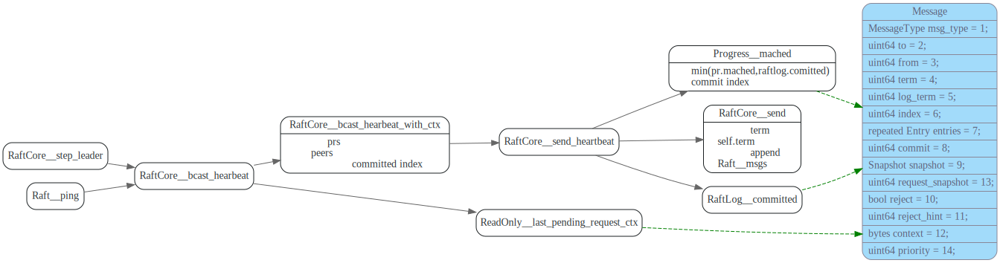
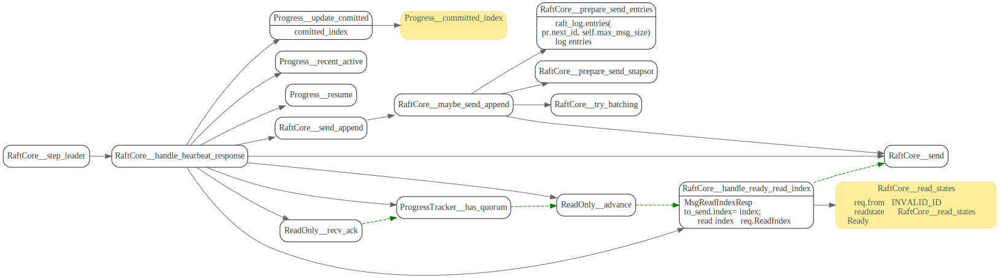

# Hearbeat

<!-- toc -->

hearbeat是leader向follower发送自己还活着，重置follower的election timer, 
同步commit和term.

hearbeat 同时用来实现ReadIndex功能, leader通过hearbeat的ack来确认自己是leader.
readIndex相关实现细节，将在后面readindex 章节专门讲述。

## tick

定时触发leader发送heartbeat消息.

## leader send heartbeat

send hearbeat消息中会把read context带上发给follower, follower的hearbeat resp会把这个context 回传回来。

## follower `handle_hearbeat`

重置`election_elapse`= 0, follower 根据Msg中的commit 更新自己的raftlog comitted

如果candidate收到了比自己更高的term的心跳消息，会成为它的follower，并且会
重置自己的 `randomized_election_timeout`为`min_election_timeout`到`max_election_timeout`
之间的一个随机值，这样降低了多个candidate同时发起election,导致split vote概率.

follower发送给leader的MsgHeartbeatResponse中会将heatBeat消息中的context 带上，然后
加上自己的commit index.

## leader `handle_heartbeat_response`

在处理follower HeartbeatResp时，首先将resp中的commit信息保存到follower对应的progress.
然后如果需要的话，发送log entries, 从`pr.next_idx`开始发送，发送`max_msg_size`
个消息，或者发送给snapshot给follower.

leader根据resp中context信息来更新readindex中的`recv_ack`
如果收到了quorum的回应，就将该context对应的read state 发送给ReadIndex的发起者（如果是leader
自己就放到`RaftCore::read_states`中，如果是follower发来的ReadIndexReq, 就发送ReadIndexResp
给follower.

在代码中没找到`Progress::comitted_index`被使用的地方，不知道这个功能是干什么用的。

