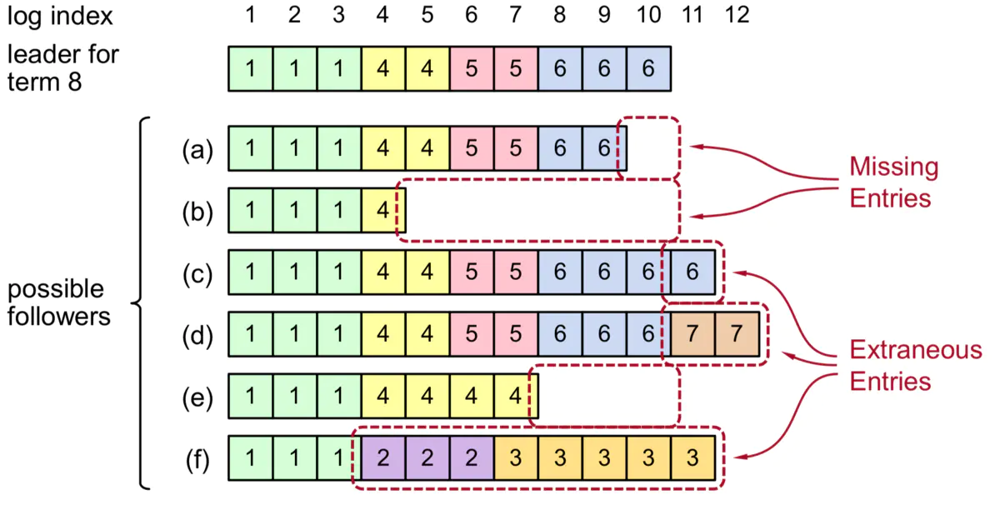

# LogEntry

<!-- toc -->



日志复制要点：

1. 不同的服务器上面的提交的相同的索引和任期的日志项的command一定相同，而且这个日志项之前的所有日志项都相同。
2. 如果一个日志项被提交，则它之前索引的所有日志项也肯定已经提交。
3. Leader从来都不覆盖自己的日志。其他状态节点如果出现与当前Leader日志不一致，则需要更新日志，包括写入新的日志和删除不一致的日志。
4. Leader提交过的日志一定会出现将来新的Leader中。
5. Leader要保证安全的提交日志，必须满足这两个提交规则(见4.3中不安全的情况和4.4安全的情况)：
  1. 日志条目已经复制到大多数Follower节点。
  2. Leader当前任期的新日志条目至少有一个复制到了大多数Follower节点。

## propose

收到Propose, append到自己的Log 上，然后`bcast_send`, 发送Appendmsg给所有的follower.

从`pr.next_idx`发送`max_msg_size`个log entry给follower, 发送的log entry可能和
follower的不匹配，follower在AppendResp中会reject，并给出`reject_hint`,

leader`Progress::maybe_decr_to`重新调整发送的`next_idx`，然后重新发送AppendMsg给follower


## follower: `handle_append_entries`


关键函数为`RaftLog::maybe_append`, 检查term是否一致


`RaftLog::find_conflict`, 找到和leader log entry冲突的地方，清理掉和leader不一致的log entry


## leader: `handle_append_response`

如果`Progress::next_idx`不对，follower在AppendRespMsg中会reject,然后leader会尝减小`Progress::next_idx`，重新
发送log entries给follower。


`RaftLog::maybe_commit`

leader 只能提交自己任期内的Log entry.
```rust
/// Attempts to commit the index and term and returns whether it did.
pub fn maybe_commit(&mut self, max_index: u64, term: u64) -> bool {
    if max_index > self.committed && self.term(max_index).map_or(false, |t| t == term) {
        debug!(
            self.unstable.logger,
            "committing index {index}",
            index = max_index
        );
        self.commit_to(max_index);
        true
    } else {
        false
    }
}
```

TODO: 这个地方贴一个如果leader 提交了非自己任期内的log entry的问题图


## 参考资料
1. [Raft算法分析与实现](https://www.jianshu.com/p/1f5cb602dc71)
