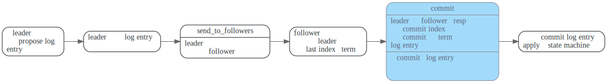
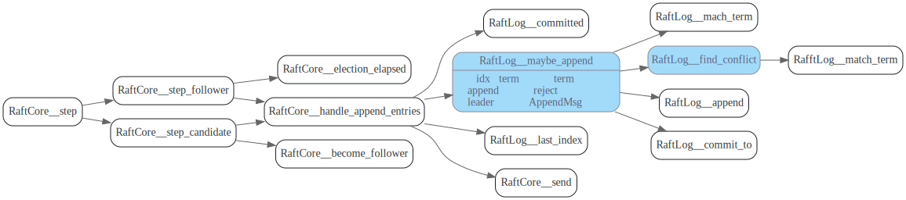
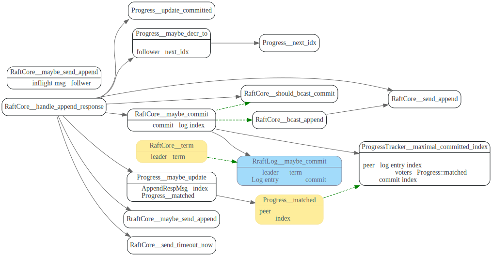
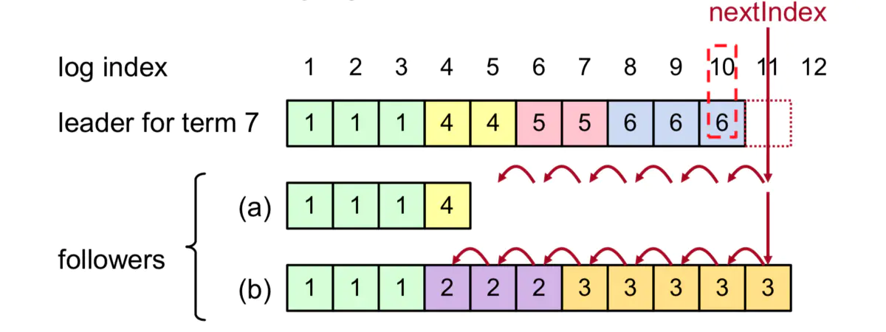

# LogEntry

> * 只要term ,index相同，则log entry内容一定相同
> * 当log entry被复制到大多节点时，log entry才能被commit.
> * leader只能commit <b>包含当前term的</b>log entry.
> * 只有raft log (拥有最大term, 最长Log index)的最新的candidate 才能当选leader.
> * 当follower log entry和leader冲突时，以leader为准,清理掉和leader log不一致的log。

<!-- toc -->
## Raft log 处理过程

在raft中，一条日志从propose到最后apply到sate machine流程如下




## propose

收到Propose, append到自己的Log 上，然后`bcast_send`, 发送Appendmsg给所有的follower.

从`pr.next_idx`发送`max_msg_size`个log entry给follower, 发送的log entry可能和
follower的不匹配，follower在AppendResp中会reject，并给出`reject_hint`,

leader`Progress::maybe_decr_to`重新调整发送的`next_idx`，然后重新发送AppendMsg给follower


## follower: `handle_append_entries`



关键函数为`RaftLog::maybe_append`, 检查term是否一致


`RaftLog::find_conflict`, 找到和leader log entry冲突的地方，清理掉和leader不一致的log entry


## leader: `handle_append_response`



如果`Progress::next_idx`不对，follower在AppendRespMsg中会reject，然后leader调用`Progress::maybe_decr_to`来尝试减小`Progress::next_idx`，然后重新
发送log entries给follower



另外收到follower的append resp之后，leader会计算committed index。由函数`ProgressTracker::maximal_comitted_index`来根据incoming votes和outging votes中，
已经复制到大部分节点的log entry 最大index，作为`maximal_commit_index`。


为了安全提交old leader的Log entry.  leader只能commit当前任期Log entry，`RaftLog::maybe_commit` 会检查计算出来的`max_index`的term
是否是当前leader的。

如果不是，则不能提交commit index.  所以leader一当选，就会发送一个空的NoOp AppendMsg给所有的follower，
尽快使自己term内log entry达到commit 状态。


```rust
/// Attempts to commit the index and term and returns whether it did.
pub fn maybe_commit(&mut self, max_index: u64, term: u64) -> bool {
    if max_index > self.committed && self.term(max_index).map_or(false, |t| t == term) {
        debug!(
            self.unstable.logger,
            "committing index {index}",
            index = max_index
        );
        self.commit_to(max_index);
        true
    } else {
        false
    }
}
```

比如在下图<b>c</b>中，重新当选的s1 commit了日志`(term=2,idx=2)`, 然后此时它挂了的话，
出现情况<b>d</b>中 S5重新被选为leader
会出现该被commit的日志被覆盖掉的情况, 此时就出现了不一致情况。

因此要达到图<b>e</b>, 重新当选的s1,在term 4中已经由log entry达到了commit状态，它才能将之前的
日志`(term=2,idx=2)` commit.


## 参考资料
1. [Raft算法分析与实现](https://www.jianshu.com/p/1f5cb602dc71)
