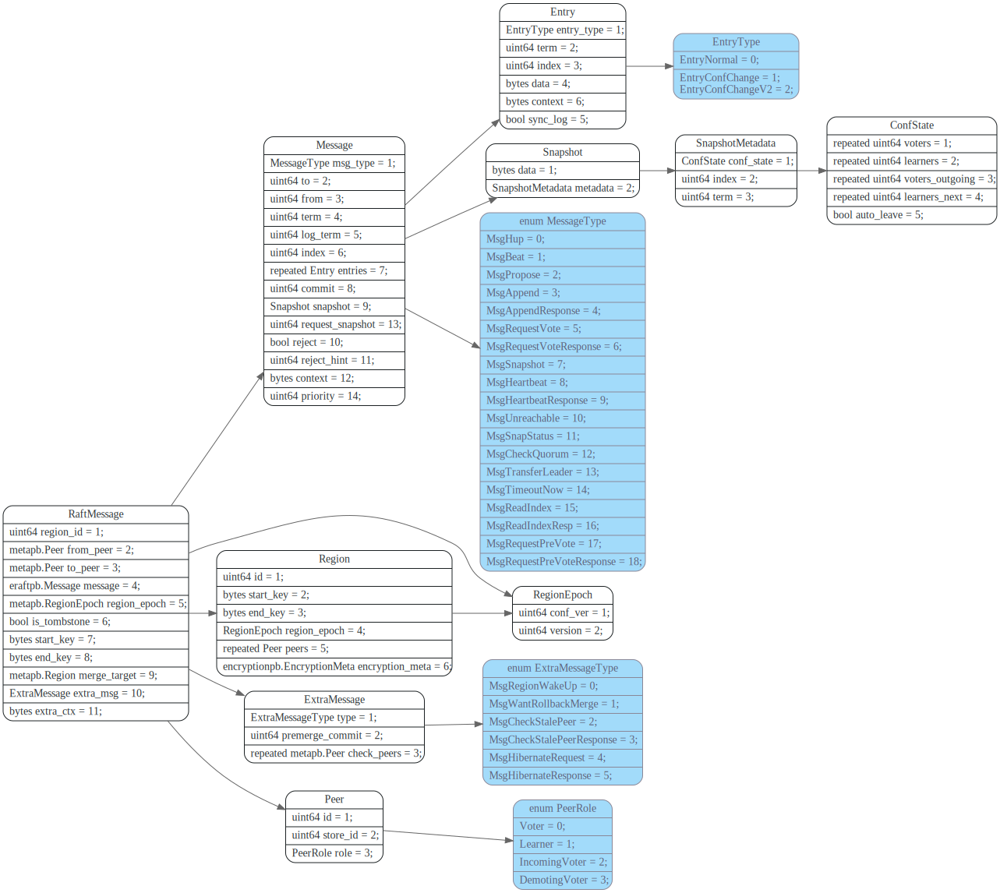
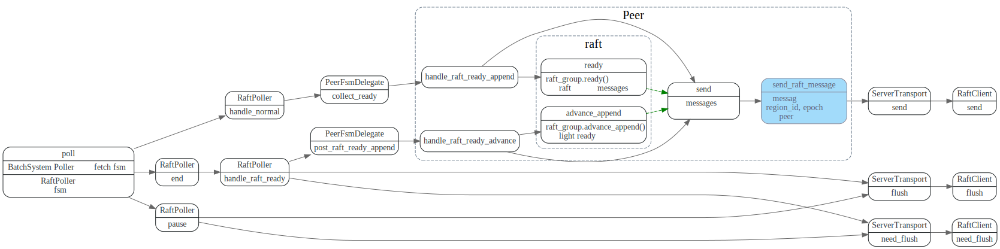
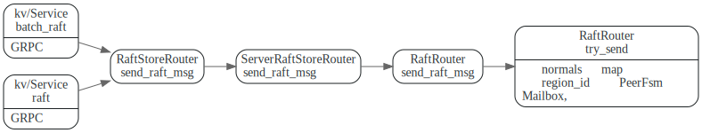
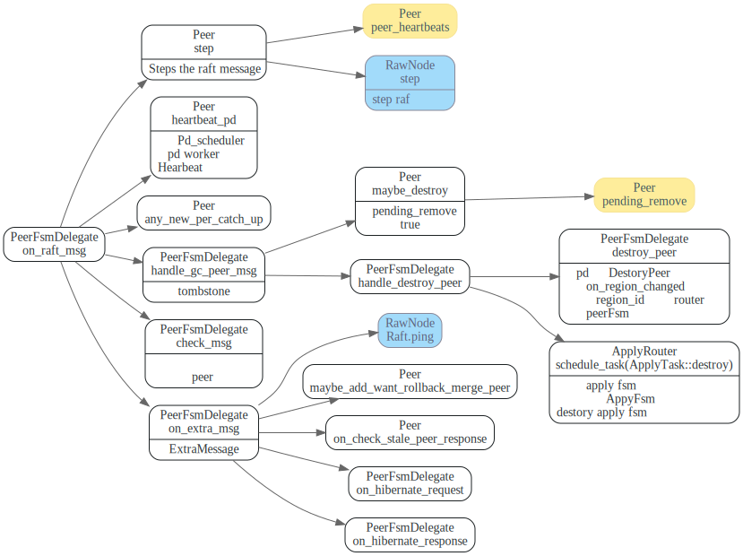

# RaftMessage

<!-- toc -->

## proto

## `send_raft_message`
在PeerFsmDelegate `handle_msg`之后，会调用`collect_ready`
获取raft中可以发送的raft messages. 在`RaftPoller::end`将
`handle_msg`中产生的write batch写入磁盘，然后更新完PeerStorage状态后，
会再Raft的`advance_append`获取要发送的raft message.

这些raft message 都会通过调用`RaftClient::send` 先将消息缓存到队列里面，
在最后`RaftPoller::end`或者`RaftPoller::pause`时，会调用`RaftClient::flush`,
将raft message真正的发送出去。

## grpc 接口: `raft`/`batch_raft`

## `on_raft_message`

peer收到RaftMessage后处理流程

