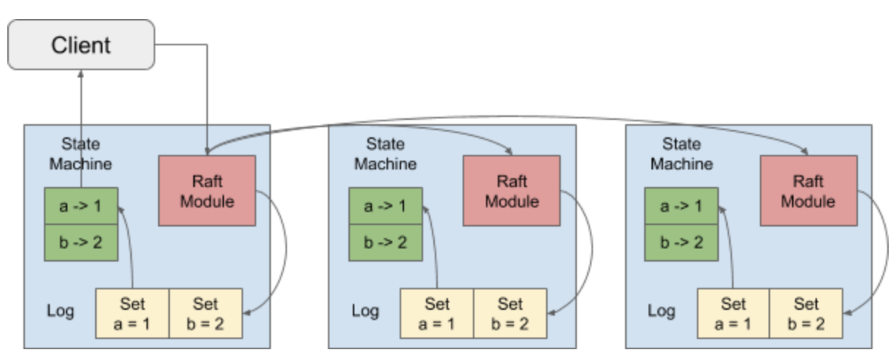
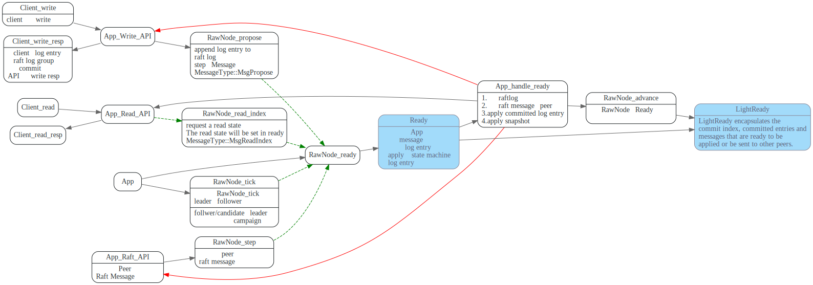
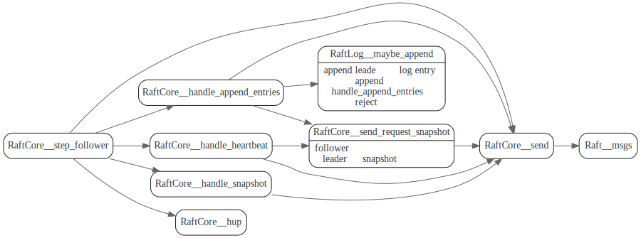
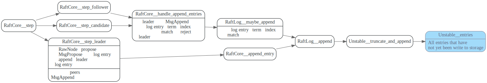
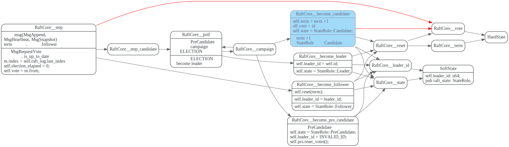
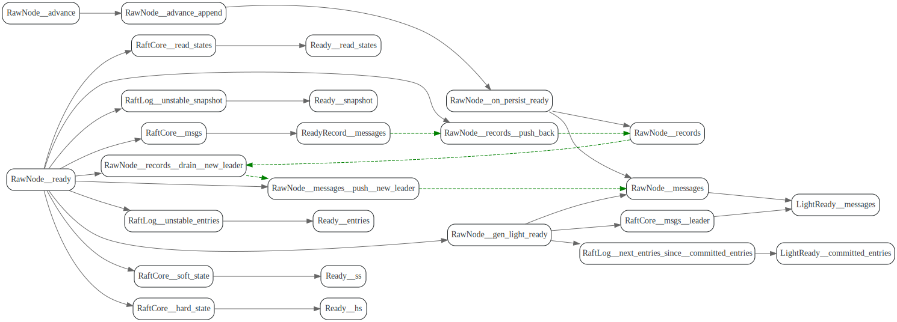

# RawNode

<!-- toc -->



上图摘自[How TiKV Reads and Writes](https://en.pingcap.com/blog/how-tikv-reads-and-writes)


raft对外暴露的接口为RawNode，它和App关系如下图所示:



App在处理client write操作时候，调用Raft Propose 将writes数据作为log entry写入
到raft log。 等该log entry在raft group中达到commit状态时，Client write操作就可以返回了。

App通过RawNode的tick 来驱动raft的logical时钟，调用RawNode::step将message发给
raft处理。

然后调用RawNode Ready获取需要发送给raft peer的Message, 需要持久化保存的log 
entries, 以及需要apply 到state machine的log entries.

最后app将Ready中信息处理完毕后，调用RawNode的advance，在更新完raft一些状态后，
准备处理App下一次调用。


## tick, step

`RawNode::tick` 定时时钟，用来驱动leader的定期的向follower/candidate 发送
heartbeat, 而follower/candidate 如果发现heartbeat timeout了，则会发起
campaign.

```rust
/// Tick advances the internal logical clock by a single tick.
///
/// Returns true to indicate that there will probably be some readiness which
/// needs to be handled.
pub fn tick(&mut self) -> bool
```

App会调用RawNode::step来处理它收到的其他peer发来的Message(比如Leader的heartbeat)

```rust
/// Step advances the state machine using the given message.
pub fn step(&mut self, m: Message) -> Result<()>
```

## propose, `propose_conf_change`, `read_index`

App 通过`RawNode::propose`来write data到raft log.

```rust
/// Propose proposes data be appended to the raft log.
pub fn propose(&mut self, context: Vec<u8>, data: Vec<u8>) -> Result<()> 
```

App调用`RawNode::propose_conf_change`来修改raft集群的conf
```rust
/// ProposeConfChange proposes a config change.
///
/// If the node enters joint state with `auto_leave` set to true, it's
/// caller's responsibility to propose an empty conf change again to force
/// leaving joint state.
#[cfg_attr(feature = "cargo-clippy", allow(clippy::needless_pass_by_value))]
pub fn propose_conf_change(&mut self, context: Vec<u8>, cc: impl ConfChangeI) -> Result<()> {
```

App调用`RawNode::read_index` 来获取`read_index`

> 对于读请求，我们只需要确认此时 leader 是否真的是 leader 即可，一个较为轻量的方法是发送一次心跳，再检查是否收到了过半的响应，这在 raft-rs 中被称为 ReadIndex

TODO: 想下这块该怎么描述才能更清楚。

```rust
/// ReadIndex requests a read state. The read state will be set in ready.
/// Read State has a read index. Once the application advances further than the read
/// index, any linearizable read requests issued before the read request can be
/// processed safely. The read state will have the same rctx attached.
pub fn read_index(&mut self, rctx: Vec<u8>) {
```


## 从step 到Ready

### Raft::msgs

发送的消息都会暂存在Raft::msgs数组中,在RawNode::ready被调用时，
会先放到RawNode::records中，等entries都保存完后，
app再取到这些消息，将消息发送给对应的peers.

#### leader

leader会主动定期的发送Heartbeat给follower。
在处理follower的heartbeat resp和Append resp中
会发送AppendEntry(MsgSnapshot, MsgAppend)消息给follower


#### follower

follower 处理leader发送的heartbeat消息和Append消息，然后
发送HeartBeatResp和AppendResp给leader



#### candiate

如果在投票期间收到了其他leader的消息，并且验证（比较term)Ok的话，
就成为follower，处理heartbeat, appendEntry等消息,流程和上面的follwer一样。

如果没有其他leader的消息，就处理peer发来的投票resp，
如果只是赢得了`PRE_ELECTION` 就接着发起`ELECTION`,如果赢了`ELECTION`,就成为新的leader,
然后立刻`bcast_append` 发送消息所有peers.


### entries



### snapshot


### hardState and softState

hardstate:
1. term:当前任期, 
2. vote: 给谁投票了。
3. commit: 当前的commit index

softstate 则包含leaderId是谁，当前node的角色是什么


term 扮演逻辑时钟的角色.




### read states

在处理读请求时，从Leader节点读数据，leader节点需要确认自己是否还是leader
，如果从follower节点读数据，follower节点要知道当前leader节点的committed index, 
等自己的state machine apply到这个committed index后，再回复数据给client.

Raft提供了两种方法一个是ReadIndex，ReadIndex就是leader节点广播一次心跳，确认自己是leader.

另外一种是LeaseRead,  他假设leader 的 lease 有效期可以到 start + election timeout / clock drift bound 
这个时间点。需要各个服务器之间的clock频率是准的,在lease有效期内，不用发送心跳。

ReadState 负责记录每个客户端读请求状态，

1. `request_ctx`: 客户端唯一标识
2. `index`: committed index


## ready

RaftCore::step之后，raft会产生一系列的状态更新，比如要发送raft message, 
有些committed log entry 需要apply到state machine上, 有些log entry 需要保存等.

App通过调用RawNode::ready 返回的struct Ready来获取这些更新

```rust
/// Returns the outstanding work that the application needs to handle.
///
/// This includes appending and applying entries or a snapshot, updating the HardState,
/// and sending messages. The returned `Ready` *MUST* be handled and subsequently
/// passed back via advance() or its families.
///
/// `has_ready` should be called first to check if it's necessary to handle the ready.
pub fn ready(&mut self) -> Ready
```

`Ready` struct如下:


其中主要字段如下：

* `hs`: Raft 相关的元信息更新，如当前的term，投票结果，committed index 等等。
* `LightReady::committed_entries`: 最新被 commit 的日志，需要apply到state machine上。
* `LightReady::messages`: 需要发送给其他 peer的Message。
* `Ready::snapshot`: 需要apply到state machine 的snapshot。
* `Ready::entries`: 需要保存的 log entries。
* `Ready::ReadState`: `read_index`?

解释下ReadyRecord, `max_number`, records的作用。

需要注意的是，Raft需要把entries持久化，才能把message发出去。
所以这个地方用了ReadyRecord先把message 保存起来，
等RawNode::advance之后，才会把message放到RawNode::messages数组。




## advance

应用在保存完ready中的entries, apply完snapshot， 发送完messages之后，
调用RawNode::advance更新raft一些状态。

主要会更新

1. `RaftLog::persisted`: 表示已经持久化保存日志的index
2. `RaftLog::committed_index`： 由ProgressTracker的votes来计算committed index
3. `RaftLog::applied`: 已经apply 到state machine的index


## 参考文献

1. [raft-rs proposal 示例情景分析](https://pingcap.com/zh/blog/tikv-source-code-reading-2)
2. [etcd-raft的线性一致读方法一：ReadIndex](https://zhuanlan.zhihu.com/p/31050303)
