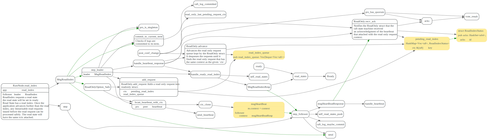

# ReadIndex

### data struct

### ReadIndex

根据[线性一致性和Raft][线性一致性和raft]中描述,Leader上ReadIndex流程如下:

leader节点在处理读请求时，首先需要与集群多数节点确认自己依然是Leader，然后读取已经被应用到应用状态机的最新数据。

1. 记录当前的commit index，称为 ReadIndex
2. 向 Follower 发起一次心跳，如果大多数节点回复了，那就能确定现在仍然是 Leader
3. 等待状态机至少应用到 ReadIndex 记录的 Log
4. 执行读请求，将结果返回给 Client

#### leader: MsgReadIndex

#### leader: handler heartbeat resp

### follower: handler MsgReadIndexResp

follower收到`MsgReadIndexResp`后，会将ReadState
放入自己的`read_states`中，在RawNode.ready时候
会返回给上层应用。

### LeaseRead
