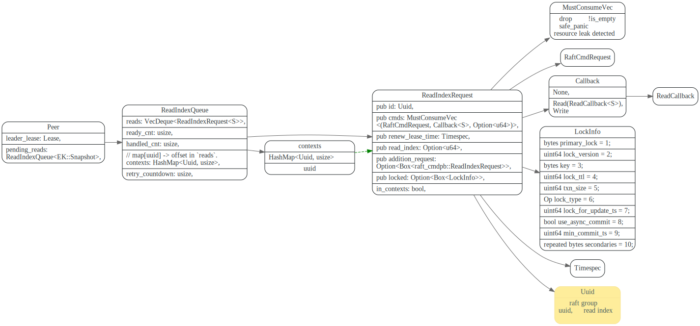
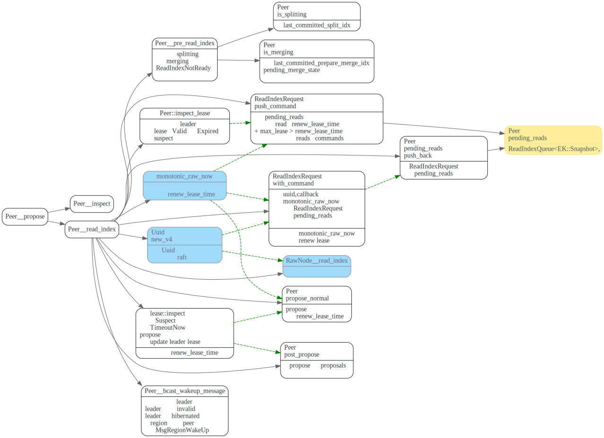

# Read Index


> 1. 弄明白replica memory lock机制
> 2. 弄明白为啥leader只等待`apply_current_term?`
> 3. 为什么要send ?

<!-- toc -->

## data struct

主要有个ReadIndexQueue 等待队列，每个ReadIndexRequest都有一个Uuid唯一标识，
ReadIndexQueue中的context 则记录了从Uuid到reads队列中index的映射。
这样方便根据uuid来找到reads对应的ReadIndexRequest。

在调用raft接口时，uuid会传过去，raft ready时，会将uuid 和commit index带回来。




## Peer `read_index`

如果region正在splitting，或者merging 则会返回ReadIndexNotReady错误。

`Peer::read_index` 主要流程是生成一个`uuid`, 然后调用raft RawNode的`read_index`方法，并传入该`uuid`
然后将请求放入`pending_reads`队列中, 等后面raft ready, 拿到commit index了，
再从`pending_reads`队列中找到该请求，然后调用它的callback。



此外Tikv对lease和`hibernate_state`做了一些特殊处理。

在TiKV中，每次`read_index`时候，还会加上当前`monotonic_raw_now`时间戳，在后面raft ready时，Peer
会使用该时间戳来renew leader lease.

如果当节点为leader, 并且pending reads中最后一个请求的`renew_lease_time + max_lease` > `monotonic_raw_now`
则直接将req,cb,和当前store的`commit_index` push 到最后一个请求的cmds数组中，不用走后面raft的read index了。

如果当前节点为follower, 并且follower不知道自的leader是谁，leader可能出于hibernated状态，
follower需要广播WakeUP消息，唤醒region中所有peer. 并且向PD询问当前leader是谁。
然后返回NotLeader错误。

## leader `apply_reads`

Peer `apply_reads`时， leader和follower节点的逻辑有些不同

leader 节点raft ready返回的read states 顺序和leader的`pending_reads`队列中的顺序是一致的。
因此可以直接遍历reads队列。


leader节点的`ready_to_handle_read` 方法如下, 要等到leader当前
term的log entry已被applied, 并且当前不在splitting或者merging时，
才能准备`response_read`

在[线性一致性和 Raft](https://pingcap.com/zh/blog/linearizability-and-raft) 中说明了原因

> 新选举产生的 Leader，它虽然有全部 committed Log，但它的状态机可能落后于之前的 Leader，状态机应用到当前 term 的 Log 就保证了新 Leader 的状态机一定新于旧 Leader，之后肯定不会出现 stale read。

这个地方让我疑惑的是为什么不像follower节点那样，等到`applied_index` >= `read_index` ?

在[TiDB 新特性漫谈：从 Follower Read 说起](https://pingcap.com/zh/blog/follower-read-the-new-features-of-tidb) 中也谈到了这个问题

> 因为 TiKV 的异步 Apply 机制，可能会出现一个比较诡异的情况：破坏线性一致性，本质原因是由于 Leader 虽然告诉了 Follower 最新的 Commit Index，但是 Leader 对这条 Log 的 Apply 是异步进行的，在 Follower 那边可能在 Leader Apply 前已经将这条记录 Apply 了，这样在 Follower 上就能读到这条记录，但是在 Leader 上可能过一会才能读取到。
> 这个并不会破坏TiKV的事务隔离级别.(TODO: 想下为什么不会)


```rust
fn ready_to_handle_read(&self) -> bool {
    // TODO: It may cause read index to wait a long time.

    // There may be some values that are not applied by this leader yet but the old leader,
    // if applied_index_term isn't equal to current term.
    self.get_store().applied_index_term() == self.term()
        // There may be stale read if the old leader splits really slow,
        // the new region may already elected a new leader while
        // the old leader still think it owns the split range.
        && !self.is_splitting()
        // There may be stale read if a target leader is in another store and
        // applied commit merge, written new values, but the sibling peer in
        // this store does not apply commit merge, so the leader is not ready
        // to read, until the merge is rollbacked.
        && !self.is_merging()
}
```


## follower `apply_reads`

follower apply reads时，为什么要`send_read_command` ?


follower节点要等到`applied_index` >= `read_index`, 并且没在apply snapshot才能ready。

```rust
fn ready_to_handle_unsafe_replica_read(&self, read_index: u64) -> bool {
    // Wait until the follower applies all values before the read. There is still a
    // problem if the leader applies fewer values than the follower, the follower read
    // could get a newer value, and after that, the leader may read a stale value,
    // which violates linearizability.
    self.get_store().applied_index() >= read_index
        // If it is in pending merge state(i.e. applied PrepareMerge), the data may be stale.
        // TODO: Add a test to cover this case
        && self.pending_merge_state.is_none()
        // a peer which is applying snapshot will clean up its data and ingest a snapshot file,
        // during between the two operations a replica read could read empty data.
        && !self.is_applying_snapshot()
}
```

## memory locks on replica read


[check memory locks in replica read #8926](https://github.com/tikv/tikv/issues/8926)

> This PR changes the read index context from a UUID to something more complex. Now the context may contain the range to check and also may contain the lock returned by the leader. When a leader receives a read index context with key ranges, it will check the in-memory lock table and see if there is any lock blocking this read. If any, it will send the lock back to the follower or learner via the read index context.


leader节点收到follower的ReadIndex请求后，会调用`ConcurrencyManager::read_range_check`
放到ReadIndexContext的lock字段中返回给follower


在follower的`Peer::response_read`中，如果有lock，会将LockInfo 返回给`cb.invoke_read`
返回给上层调用。

```rust
fn response_read<T>(
    &self,
    read: &mut ReadIndexRequest<EK::Snapshot>,
    ctx: &mut PollContext<EK, ER, T>,
    replica_read: bool,
  ){
  //...
  for (req, cb, mut read_index) in read.cmds.drain(..) {
      // leader reports key is locked
      if let Some(locked) = read.locked.take() {
          let mut response = raft_cmdpb::Response::default();
          response.mut_read_index().set_locked(*locked);
          let mut cmd_resp = RaftCmdResponse::default();
          cmd_resp.mut_responses().push(response);
          cb.invoke_read(ReadResponse {
              response: cmd_resp,
              snapshot: None,
              txn_extra_op: TxnExtraOp::Noop,
          });
          continue;
      }
}
```


1. 为什么要加个memory lock ?
2. follower怎么处理这个lock ?
3. 上层callback收到这个resp后，会怎么处理？

## retry

retry时，需要注意哪些问题 ？


## 参考文献

1. [线性一致性和 Raft](https://pingcap.com/zh/blog/linearizability-and-raft)
2. [TiDB 新特性漫谈：从 Follower Read 说起](https://pingcap.com/zh/blog/follower-read-the-new-features-of-tidb)

# Questions

1. read index这个为什么不像raft论文中描述那样，等到commit index被applied才返回值?
2. follower read 和leader read在处理流程上有什么不同？
3. 为什么role变了，要清理掉 在等待的read index ？
4. 这块怎么会有个lock info ?
5. memory check locking的作用是什么？
6. TiDB,TiKV怎么开启follower read ? coprocessor 会走follower read吗？
