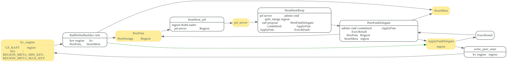
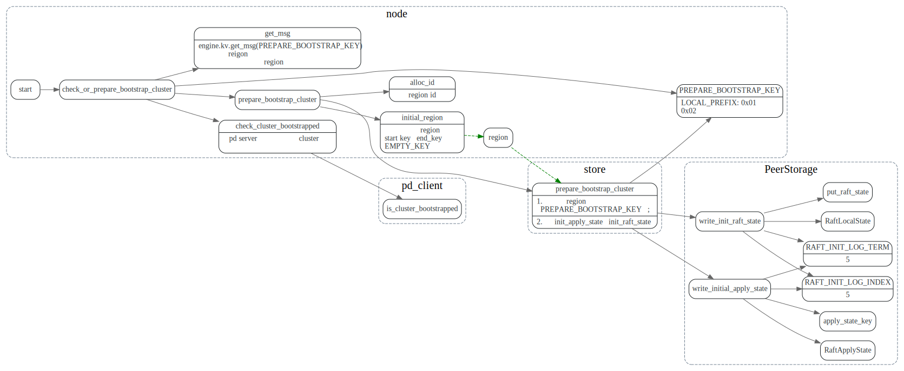
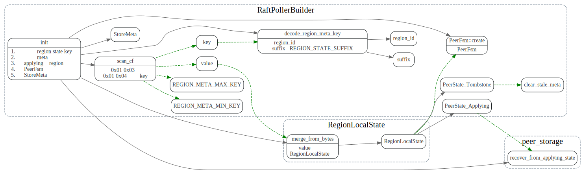

# Region

<!-- toc -->

Region 主要存放在几个地方：

1. kv engine的CF_RAFT, 从REGION_META_MIN_KEY到REGION_META_MAX_KEY。
2. pd server: 由region leader 的region heartbeat 来更新.
3. 内存中： StoreMeta， StoreMeta为Tikv全局可见的
4. 内存中： PeerFsm
5. 内存中:  ApplyFsmDelegate

Region信息的加载更新关系如下：



## 数据结构之间关系


## Region 元数据读写

### bootstrap region: 第一个region的创建

不知道这个地方init log term和index为啥是5？

```
// When we create a region peer, we should initialize its log term/index > 0,
// so that we can force the follower peer to sync the snapshot first.
```




### Region信息加载: RaftPollerBuilder::init

扫描kv engine中的所有RegionLocalState, 将该store的
所有region信息，放入StoreMeta中。然后给每个Region创建PeerFsm，
并根据PeerState做些恢复或者stale metadata 清理的工作。



### Region信息保存：write_peer_state


PeerFsm::create 传进去的Region是引用


write_peer_state 将Region, PeerState, MergeState打包成RegionLocalState，写入kv engine.
写入了CF_RAFT column family中。


### write_peer_state caller
只有在执行admin command时，才会去修改region信息，
在写完region信息后，ApplyFsmDelegate更新自己内存中的region成员变量,
然后将最新的Region信息，包装为ExecResult，发送给PeerFsm。


### PeerFsmDelegate::on_ready_result

收到ExecResult消息后，更新PeerStorage和StoreMeta中的Region信息.
并向pd server上报自己的region信息。


## hearbeat pd

region raft leader 通过Region heartbeat, 向pd server发送region相关信息

```rust
pub fn heartbeat_pd<T>(&mut self, ctx: &PollContext<EK, ER, T>) {
  let task = PdTask::Heartbeat(HeartbeatTask {
      term: self.term(),
      region: self.region().clone(),
      peer: self.peer.clone(),
      down_peers: self.collect_down_peers(ctx.cfg.max_peer_down_duration.0),
      pending_peers: self.collect_pending_peers(ctx),
      written_bytes: self.peer_stat.written_bytes,
      written_keys: self.peer_stat.written_keys,
      approximate_size: self.approximate_size.unwrap_or_default(),
      approximate_keys: self.approximate_keys.unwrap_or_default(),
      replication_status: self.region_replication_status(),
    });
    //...
}
```

### draft questions
PeerFsm和ApplyFs中这些Region是指向同一块区域的指针吗？还是clone?

StoreMeta是region的owner
传过去的是引用, 谁是region的owner?

ApplyFsm中的region是clone的。

那么ApplyFsm和StoreMeta中的region是怎么保持一致的呢？

StoreMeta中的rgion由PeerFsm来更新。

region中的epoch和conf_ver还有term这三者之间是啥关系
