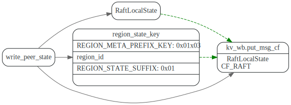
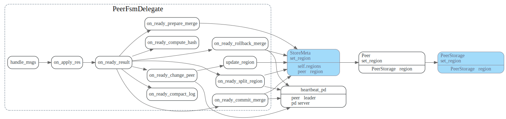
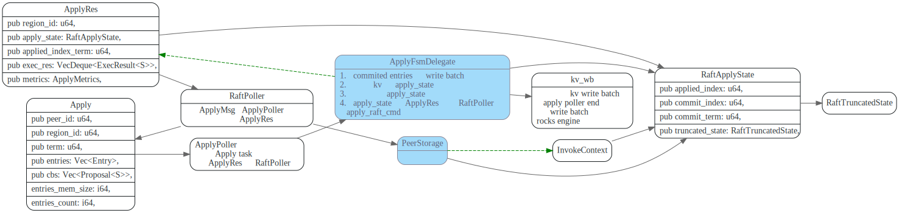
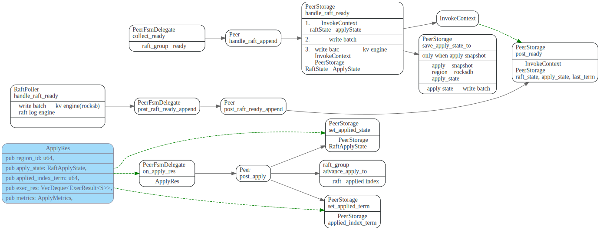

# Region

<!-- toc -->

## proto: Region


## bootstrap region

`Node::check_or_prepare_bootstrap_cluster`, 创建第一个region.

```rust
pub const LOCAL_PREFIX: u8 = 0x01;
pub const PREPARE_BOOTSTRAP_KEY: &[u8] = &[LOCAL_PREFIX, 0x02];

const MAX_CHECK_CLUSTER_BOOTSTRAPPED_RETRY_COUNT: u64 = 60;
const CHECK_CLUSTER_BOOTSTRAPPED_RETRY_SECONDS: u64 = 3;

```


### 初始化raft state和apply state

store::`prepare_bootstrap_cluster` 写入初始的raft state和apply state 到raft engine和kv engine.

`region_id`的`raft_state_key`为 `` 0x010x02region_id0x02 ``， `apply_state_key`为 `` 0x010x02region_id0x03``

```rust
pub const LOCAL_PREFIX: u8 = 0x01;
// When we create a region peer, we should initialize its log term/index > 0,
// so that we can force the follower peer to sync the snapshot first.
pub const RAFT_INIT_LOG_TERM: u64 = 5;
pub const RAFT_INIT_LOG_INDEX: u64 = 5;

pub const REGION_STATE_SUFFIX: u8 = 0x01;
pub const RAFT_STATE_SUFFIX: u8 = 0x02;
```


## Region数据结构关系

region信息在内存中会三处,`StoreMeta`, `ApplyFsmDelegate`, `PeerStorage`,

StoreMeta 包含了该store的所有region 信息，每个region的ApplyFsm和PeerFsm也都有一份。


### region信息保存

region信息(RegionLocalState) 存在Kv Engine，`regioin_id` 对应的key为`region_state_key`，
`0x01x03region_id0x01`, 由函数`write_peer_state`负责将REgionLocalState写入write batch中。

在ApplyPoller end时候，会将write batch数据写入kv engine对应的Rocksdb.




### region 信息加载

在初始化时，会扫描KV engine的`0x010x03`到`ox010x04`之间的所有key, 创建PeerFsm,
并将region信息 添加到StoreMeta.


### region 信息更改流程

在执行admin cmd时(比如change peer, split region, merge region) 会
更改region信息。ApplyFsmDelegate会先将数据写入write batch中。
然后在更新自己的region 信息。


ApplyPolle线程在write batch 写入rocksdb后，会发消息个RaftPoller, 
RaftPoller负责更新StoreMeta中的region信息，PeerStorage 中的
region信息，并且如果peer是leader的话，还会将region信息通过
heartbeat 上报给Pd server.



## RaftApplyState

RaftApplyState的作用是啥？主要记录了当前`applied_index`是多少。


在内存中有四处引用了RaftApplyState, 其中ApplyFsmDelegate和PeerStorage是长期持有，
而ApplyRes和InvokeContext则是短暂的，他们之间关系如下:

为什么ApplyFsmDelegate和PeerStorage都写了raftApplyState ?




ApplyFsm 中RaftApplyState更新流程如下:

1. 收到raft log entries后，ApplyFsmDelegate使用最后一个log entry 更新自己的`commit_index`
和`commit_term`, 
2. 在处理每一条raft normal log entry时，根据entry中的cmd 将修改操作写入kv write batch中，并更新`applied_index`, 
3. 处理完毕后，会将`apply_state` 也写入kv write batch, 最后整个kv write batch会一起写入kv engine.

注意此处将apply state和raft log entry 是放在同一write batch中写入kv engine的。这样写入是原子性的，
避免了可能出现不一致的情况。


PeerStorage中RaftApplyState更新流程如下:




简单看了下,`read_index`, `conf_change`, 判断是否merging和spliting用到了这个.

`applied_index`作用

`applied_index` 起了哪些作用?

## RaftLocalState

