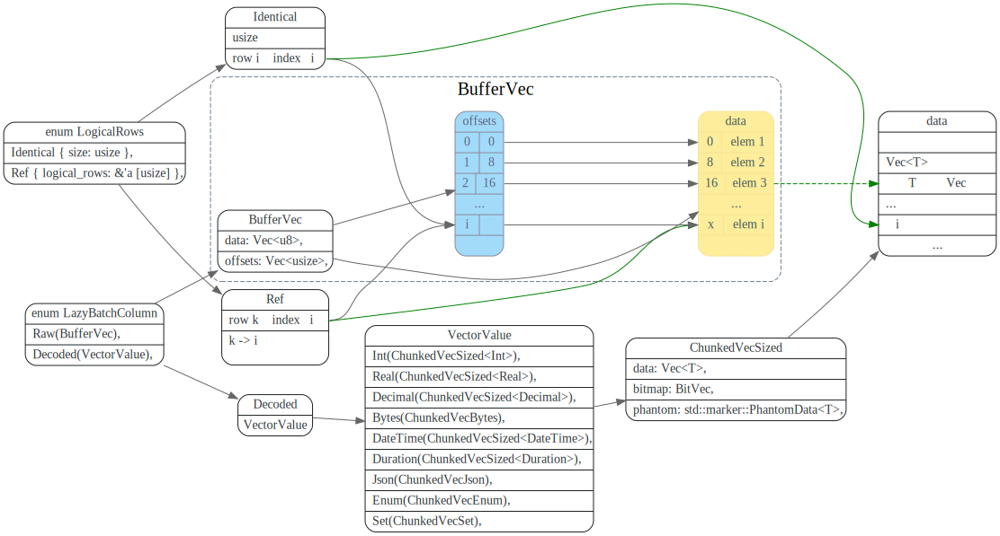
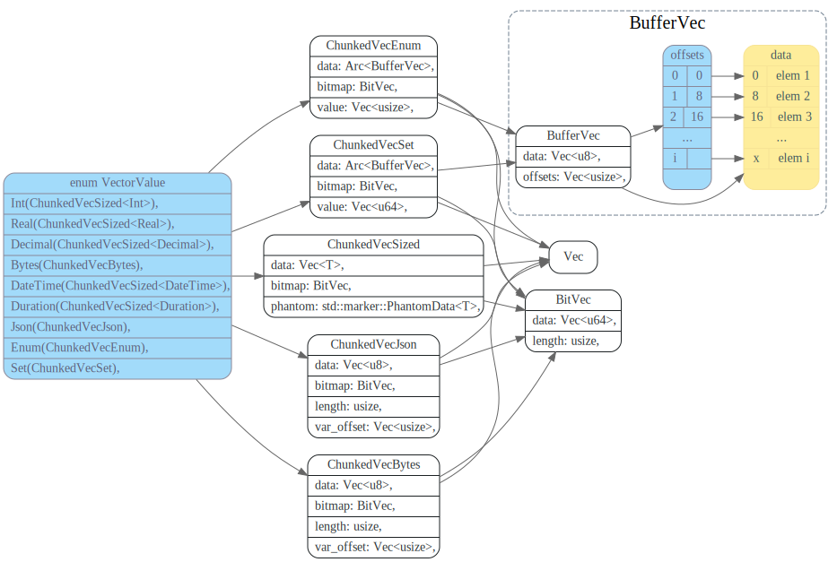
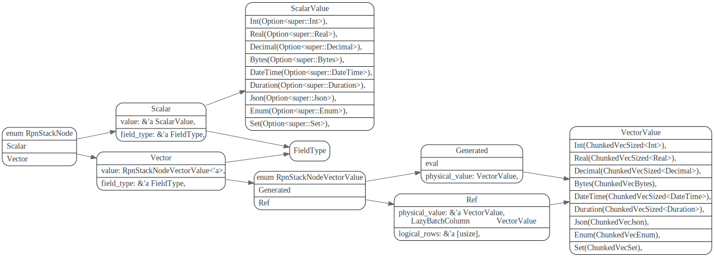
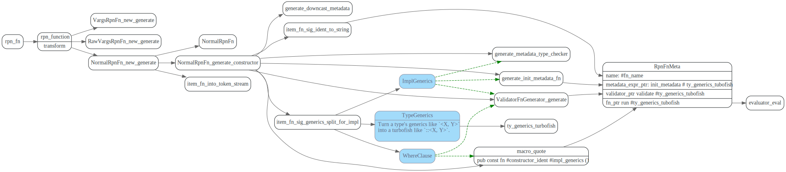

# RpnExpression

<!-- toc -->

## RpnExpressionBuilder


Expr 定义在tipb repo的`proto/expression.proto`文件中。

```proto
// Evaluators should implement evaluation functions for every expression type.
message Expr {
	optional ExprType tp = 1 [(gogoproto.nullable) = false];
	optional bytes val = 2;
	repeated Expr children = 3;
	optional uint32 rpn_args_len = 6;
	optional ScalarFuncSig sig = 4 [(gogoproto.nullable) = false];
	optional FieldType field_type = 5;
	optional bool has_distinct = 7 [(gogoproto.nullable) = false];
}
```

ExprType主要分为三类，value类型的，agg函数，scalar函数。
scalar函数，在TiKV中会build对应的`RpnFnMeta`
agg函数也对应的AggregateFunction和AggregateState.


`RpnExpressionBuilder` 将expr tree转换为RpnExpression, 
在handle_node_fn_call, 处理ScalarFunc时候，会使用后续遍历方式，先递归
处理ScalarFunc的args,最后再处理ScalarFunc节点。

其中比较重要的是调用`map_expr_node_to_rpn_func`，
生成函数对应的RpnFnMeta.


```rust
fn map_expr_node_to_rpn_func(expr: &Expr) -> Result<RpnFnMeta> {
    let value = expr.get_sig();
    let children = expr.get_children();
    let ft = expr.get_field_type();
    Ok(match value {
        // impl_arithmetic
        ScalarFuncSig::PlusInt => map_int_sig(value, children, plus_mapper)?,
        ScalarFuncSig::PlusIntUnsignedUnsigned => arithmetic_fn_meta::<UintUintPlus>(),
        //...
    }
}
```


### 过程宏 rpn_fn

> Coprocessor 直接实现了向量与标量的运算，rpn_expr_codegen 提供了过程宏 #[rpn_fn] ，我们只需定义标量逻辑，过程宏将自动生成剩下带有向量的逻辑。

rpn 代码生成

```rust
/// The `rpn_fn` attribute.
#[proc_macro_attribute]
pub fn rpn_fn(attr: TokenStream, input: TokenStream) -> TokenStream {
    match rpn_function::transform(attr.into(), input.into()) {
        Ok(tokens) => TokenStream::from(tokens),
        Err(e) => TokenStream::from(e.to_compile_error()),
    }
}
```

生成对应vector代码调用地方如下, 循环的调用scalar函数, 生成vector版本的rpn function.

```rust
//...
let chunked_push = if self.writer {
    quote! {
        let writer = result.into_writer();
        let guard = #fn_ident #ty_generics_turbofish ( #(#captures,)* #(#call_arg),* , writer)?;
        result = guard.into_inner();
    }
} else {
    quote! {
        result.push( #fn_ident #ty_generics_turbofish ( #(#captures,)* #(#call_arg),* )?);
    }
};

//循环loop调用标量的func
let nullable_loop = quote! {
    for row_index in 0..output_rows {
        #(let (#extract, arg) = arg.extract(row_index));*;
        #chunked_push
    }
};
```

## RpnExpression struct

RpnExpression是逆波兰表达式，比如 `2 + a` 的RPN表达式为`2 a +` ，RpnExpressionNodeNode有三种类型: `Const`和`Column Ref`, `Fn` 
比如对于表达式 `2 a + `，其中2为Const, a 为ColumnRef，+ 为Fn。


ColumnRef只记录了一个offset, 表示引用了input_physical_columns index为offset的列.

## LazyBatchColumn decode

在eval之前需要对column数据做解码，从`Vec<8>` decode对应的`field_type` 类型的数据。

`LazyBatchColumn` 中`Raw` 存放了原始数据，`Decode` 存放了解码后的数据。

```rust
#[derive(Clone, Debug)]
pub enum LazyBatchColumn {
//原始数据
    Raw(BufferVec),
//Decode之后的数据
    Decoded(VectorValue),
}
```

`LazyBatchColumn::ensure_decoded` 会根据传进来的LogicalRows 对需要的rows做解码



## VectorValue

VectorValue包含各种具体type的enum. LazyBatchColumn decode后，会从原始的
vec<8> 数据，`decode`为`field_type`对应的具体类型。




## RpnStackNode 

RpnExpression eval时候，会使用一个stack, stack中的元素即为`RpnStackNode`
有两种类型，`scalar`表示标量，`vector`表示向量.  比如上面表达式`2 + a` 中2就是标量， 
a为向量(column a 那一列值)




## RpnExpression eval
RpnExpression eval时，会对遍历RpnExpressionNode, 遇到const或者column ref就压入stack，
遇到`Fn`节点的，就从stack顶上pop出N个args。

执行完Fn后将结果再push到stack中，stack中最后元素即为RpnExpression的结果。


## draft

### rpn 宏相关代码分析




