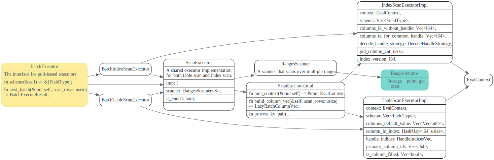
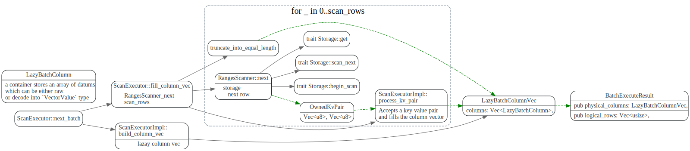
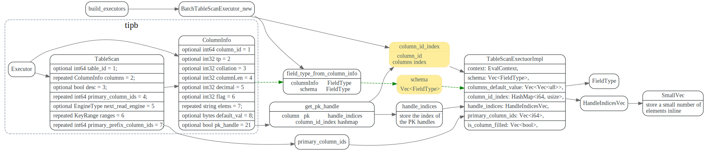
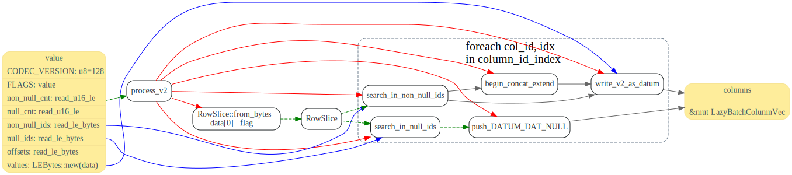
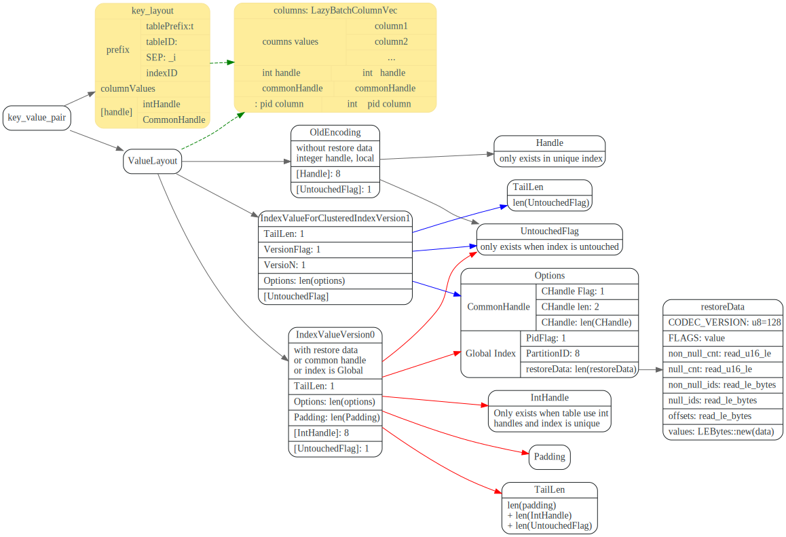
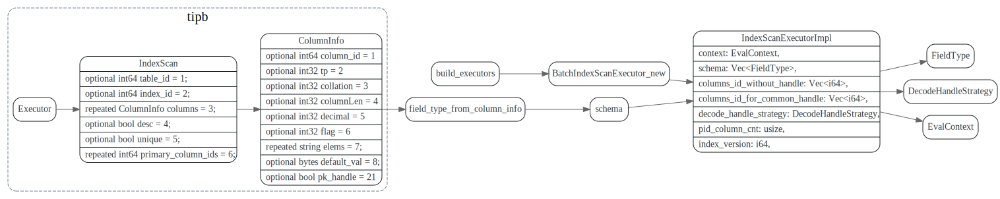
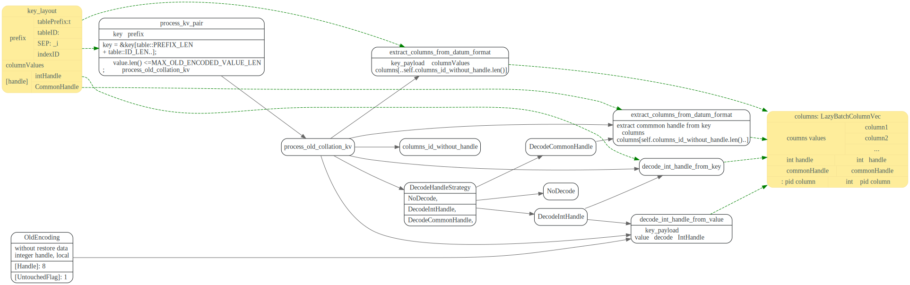

# ScanExecutor

<!-- toc -->

ScanExecutor 使用RangesScanner从底层的Storage，扫描读取Ranges内的key, value Pair,
然后由`TableScanExectuorImpl`或者`IndexScanExecutorImpl`
根据ColumnInfo信息，将key,value pair, 组装成 LazyBatchColumnVec, 
供上层Executor 使用。

对于TableScan来说， key中包含了intHandle或者commonHandle, 而value则是一些columns Id和column的值

value有两种编码方式v1版本的，是普通的datum方式, `col_id1 value1 col_id2 value2`. 
V2版本的是`RowSlice`, 具体格式信息见下文.

对于IndexScan来说，key中包含了建索引的columns的columnsValues(编码方式为datum), 如果是unique index的话，key 中则还
包含了intHandle或者commonHandle 信息。



## ScanExecutor::next_batch

迭代读取`scan_rows`行数据，每次调用`RangesScanner::next`从
`Storage`中读取kv数据, 然后调用impl的`process_kv_pair`处理kv数据.
放入`LazyBatchColumnVec`中，返回给上层Executor。



## TableScanExectuorImpl

### primary key

primary key可能是两个column compose起来才是primary key, 比如这样：

multi column compose的primay key 应该有个unique index吧.

primay index在column之上又搞了啥？

```sql
CREATE TABLE table_name(
    primary_key_column datatype PRIMARY KEY,
    --...
);

CREATE TABLE IF NOT EXISTS tasks (
    task_id INT AUTO_INCREMENT PRIMARY KEY,
    title VARCHAR(255) NOT NULL,
    start_date DATE,
    --...
)  ENGINE=INNODB;


CREATE TABLE
    product (
        category INT NOT NULL,
        id INT NOT NULL,
        price DECIMAL,
        PRIMARY KEY(category, id)
    );
```


handle_indices 和primary column 这两个是什么概念？

### TableScanExecutor 输入输出

不明白的的是为什么要handle_indices push 同一个handle值


###  TableScanExecutor 数据结构关系




### 处理key

解析key中的intHandle或者commonHandle.


### v1版本value


### v2版本value



## IndexScanExecutorImpl


### IndexScanExecutor的输入输出

TiKV中 index 的key layout布局如下：


Unique index

> Key: tablePrefix_tableID_indexPrefixSep_indexID_indexedColumnsValue
> Value: value

非unique index

> Key: tablePrefix_idxPrefix_tableID_indexID_ColumnsValue_handle, value: null

其中的handle可以为IntHandle或者commonHandle

IndexScanExecutor的输入输出如下:




其中输出的columns 是在`IndexScanExecutorImpl::build_column_vec`
方法中创建的。

### IndexScan 数据结构关系




### process_old_collation_kv




### process_kv_general


## RangesScanner::next

从storage中读取数据
