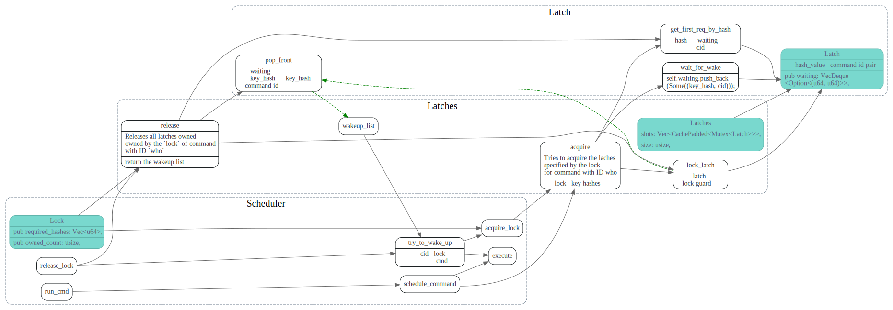
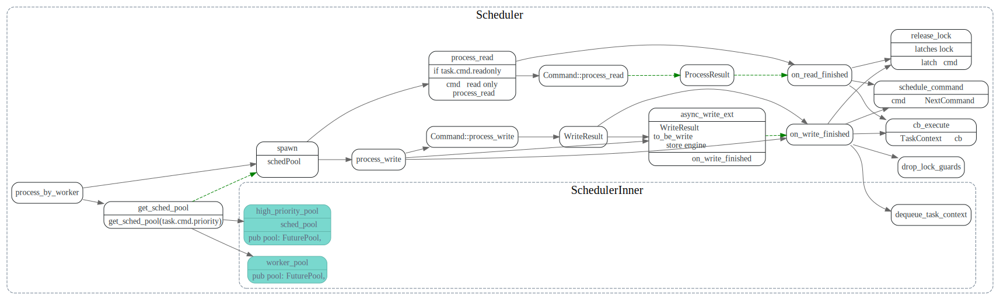
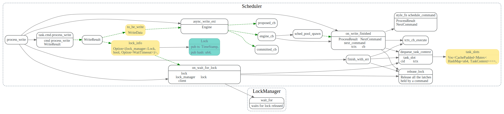

# Scheduler

<!-- toc -->

## run_cmd

首先获得task的cid, 然后获得taskContext
task slot用来分配TaskContext
如获得了cmd所需的所有的Lock,则执行cmd
否则就把cmd放到wakeup_list中，在lock被释放的时候
会重新去调度cmd.

## Latches

schedule cmd执行完毕后，唤醒等待队列中的cmd

## execute

## process_by_worker

## process_write

这里两种lock，一个是latches，另外一个是事务的lock

### WriteResult

## release_lock

## LockManager

在事务`Commit`或者`Rollback`之后，会清理掉事务的lock，
会通知lock的等待队列中的waiters WriteConflict了，
让client重试。队首的waiter会被立刻通知到，其他的waiter
会等个timeout再通知。这样队首的waiter重试时，会优先获得lock。

