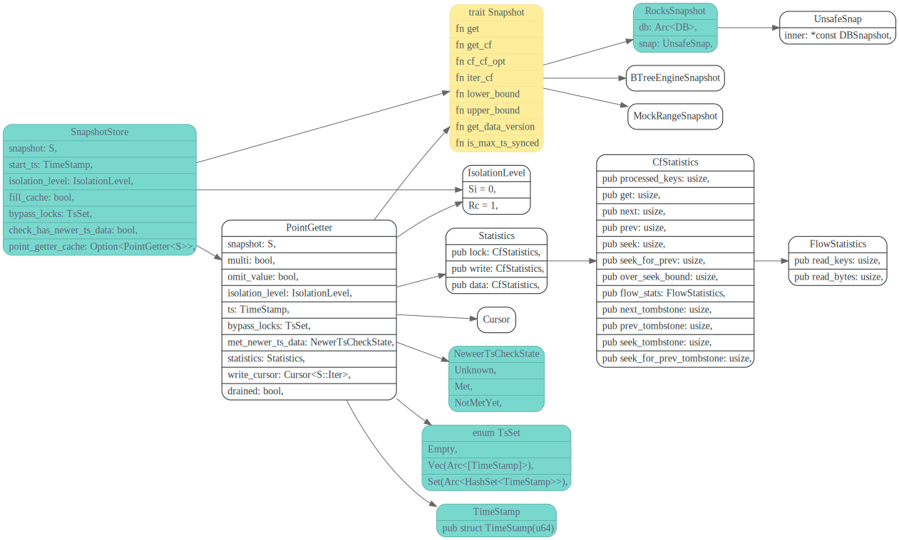

# SnapshotStore

<!-- toc -->

## Data struct



* si 可能表示Serializalbe
* rc 表示 read committed

PointGetter

```rust
/// This struct can be used to get the value of user keys. Internally, rollbacks are ignored and
/// smaller version will be tried. If the isolation level is Si, locks will be checked first.
///
/// Use `PointGetterBuilder` to build `PointGetter`.
pub struct PointGetter<S: Snapshot> {
```

`point_getter_cache`的作用是什么 ?

[IsolationLevel](https://tikv.org/deep-dive/distributed-transaction/isolation-level/)

### PointGetter::get

```
CF_DEFAULT: (key, start_ts) -> value
CF_LOCK: key -> lock_info
CF_WRITE: (key, commit_ts) -> write_info
```

multi是啊干吗用的

start_ts是从future_get，客户端那边传过来的

```rust
    let v = storage.get(
        req.take_context(),
        Key::from_raw(req.get_key()),
        req.get_version().into(),
    );
```


#参考

[TiKV 事务模型概览，Google Spanner 开源实现](https://pingcap.com/blog-cn/tidb-transaction-model/)
