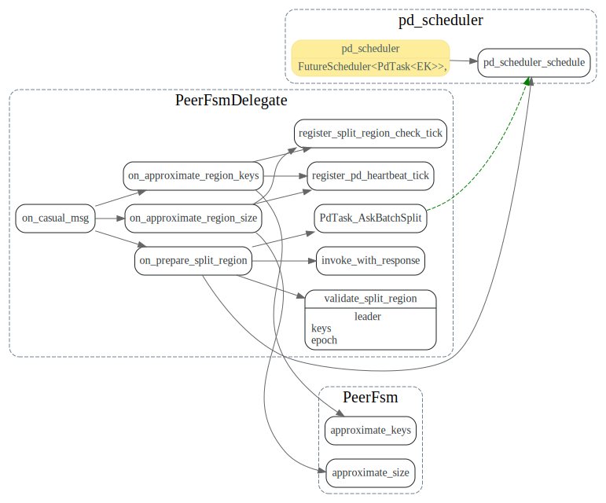

# Split Region

<!-- toc -->

## check split


```rust
impl<EK, ER> CasualRouter<EK> for RaftRouter<EK, ER>
where
    EK: KvEngine,
    ER: RaftEngine,
{
    #[inline]
    fn send(&self, region_id: u64, msg: CasualMessage<EK>) -> Result<()> {
        match self.router.send(region_id, PeerMsg::CasualMessage(msg)) {
            Ok(()) => Ok(()),
            Err(TrySendError::Full(_)) => Err(Error::Transport(DiscardReason::Full)),
            Err(TrySendError::Disconnected(_)) => Err(Error::RegionNotFound(region_id)),
        }
    }
}
```


### SplitChecker

## PeerFsmDelegate::on_casual_msg




## worker::pd::Runable


## ApplyDelegate::exec_admin_cmd

AdminRequest经过raft发到各个peer，可以commit事后，
调用ApplyDelegate::exec_admin_cmd 开始保存region
的元信息。

> 对每个 Split 出来的新 Region 调用 write_peer_state 与 write_initial_apply_state 创建元数据。

PeerState和ApplyState分别代表了什么？


## PeerFsmDelegate::on_ready_split_region

> 如果是 leader，上报 PD 自己以及新 Region 的 meta 信息（包含范围，Region epoch 等等一系列信息）。

> 依次创建新 Region 的 PeerFsm 和 ApplyFsm，做一些注册的工作。

> 更新 PeerFsm 的 Region epoch。

>等到原 Region 大多数的 Peer 都完成了 Split 的工作后，新 Region 就可以成功选出 leader 并且提供服务了。


