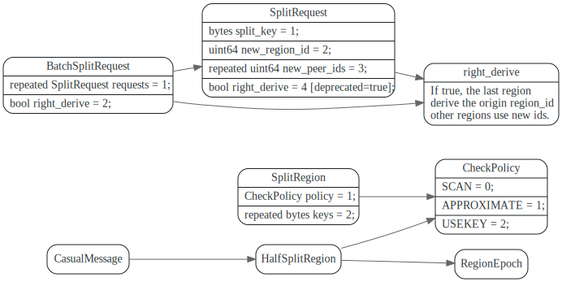
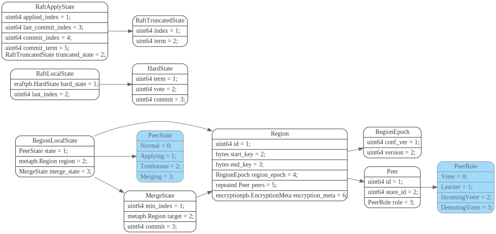

# Split Region

<!-- toc -->

## data struct



region相关信息如下：




## Split Check

## 执行Split操作

Split操作是在当前region raft group的各个节点上原地进行的，
Split 操作被当做一条Proposal 通过 Raft 达成共识，
然后各自的Peer分别执行 Split。

Split操作会修改region epoch中的version字段。

### 准备和propose split

向pd server发送`ask_batch_split`请求获取新的`region_ids`和以及每个region对应的`peer_ids`
然后发送AdminCmdType为BatchSplit的raft cmd给PeerFsm。


然后PeerFsmDelegate在处理BatchSplit RaftCmdRequest时，会像正常的log entry那样,propose到raft, 然后有
leader 复制到各个peer, 等达到commit状态时，ApplyFsm开始执行`exec_batch_split`.


### `ApplyDelegate::exec_batch_split`: 保存split region state

SplitRequest会被转换为SplitBatchRequest, 然后执行`ApplyDelegate::exec_batch_split`


分裂后的region epoch中的version会更新。

```rust
// fn exec_batch_split<W: WriteBatch<EK>>(
let mut derived = self.region.clone();

// 更新region epoch.version
let new_version = derived.get_region_epoch().get_version() + new_region_cnt as u64;
derived.mut_region_epoch().set_version(new_version);
```

新的region复用之前region的peers信息，会根据SplitRequest中更新new region的 `region_id`以及region的`peer_ids`.

```rust
for req in split_reqs.get_requests() {
    let mut new_region = Region::default();
    new_region.set_id(req.get_new_region_id());
    new_region.set_region_epoch(derived.get_region_epoch().to_owned());
    new_region.set_start_key(keys.pop_front().unwrap());
    new_region.set_end_key(keys.front().unwrap().to_vec());
    new_region.set_peers(derived.get_peers().to_vec().into());
    for (peer, peer_id) in new_region
        .mut_peers()
        .iter_mut()
        .zip(req.get_new_peer_ids())
    {
        peer.set_id(*peer_id);
    }
    new_split_regions.insert(
        new_region.get_id(),
        NewSplitPeer {
            peer_id: util::find_peer(&new_region, ctx.store_id).unwrap().get_id(),
            result: None,
        },
    )
    regons.push(new_region)
}
```


最后调用`write_peer_state`将split 后的`new_region` RegionLocalState写入WriteBatch

`pending_create_peers`


### `PeerFsmDelegate::on_ready_split_region`

创建新的region对应的PeerFsm并且注册到RaftRouter, 创建ApplyFsm
并且注册到ApplyRouter. 然后更新StoreMeta中的`readers`, 
`regions`, `region_ranges`等元信息。

如果是leader会向PD 上报自己和新的region的元信息。只有leader节点，在执行split时，
可以开始new region的campaign操作，其他非leader节点，
要等选举超时之后，才能开始选举操作。


`last_committed_split_idx`


## Spliting期间的一致性


在split时，会更改region epoch，split期间对于原有region的写操作会返回EpochNotMatch错误。

下面分几种情况讨论

1. leader节点还没apply BatchSplit.

`is_splitting`
在split期间，不会renew leader lease, 


## 参考文献

1. [Region Split 源码解析](https://pingcap.com/zh/blog/tikv-source-code-reading-20)


## Questions

1. 在splitting 期间是怎么处理读写的？
2. region A分裂为 region A, B， B的成员和A的一样吗？
