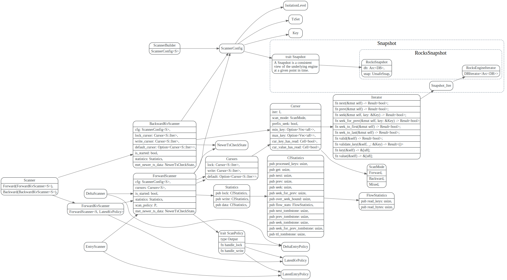
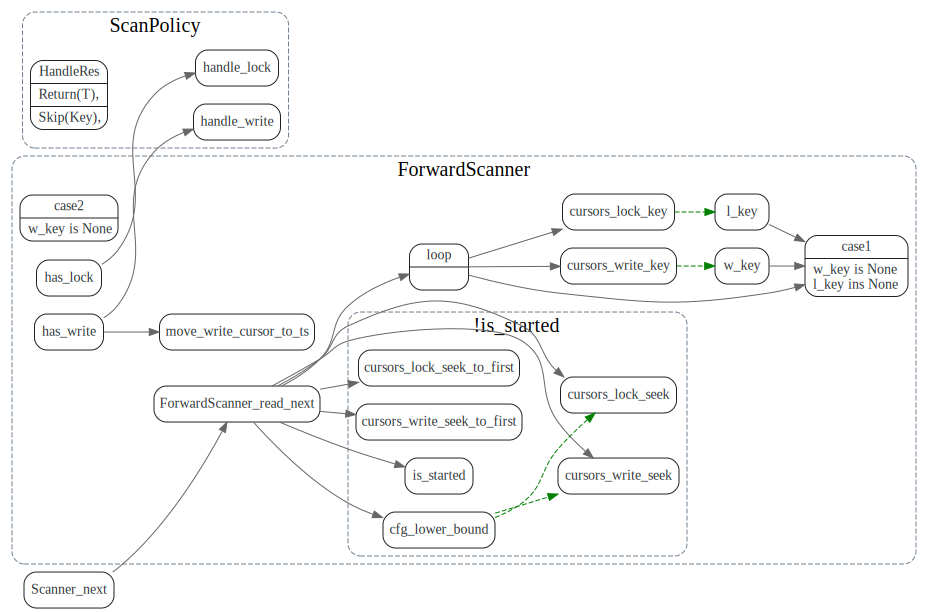

# scanner

## PointGetter


## draft



### cursor

在iter上加了一个near_seek结合和scan_mode，每次Key,value 
会加一些key, value的统计。


## ForwardScanner

```
CF_DEFAULT: (key, start_ts) -> value
CF_LOCK: key -> lock_info
CF_WRITE: (key, commit_ts) -> write_info
```
>An instance of RocksDB may have multiple CFs, and each CF is a separated key namespace and has its own LSM-Tree. However different CFs in the same RocksDB instance uses a common WAL, providing the ability to write to different CFs atomically.


#### read_next

case1: w_key == None, l_key == None, 没数据
case2: w_key == None, l_key != None, RCmo




## 参考

1. [percolator-in-tokv](https://tikv.org/deep-dive/distributed-transaction/percolator/#percolator-in-tikv)
