# TiDB 事务

> * TiDB在Pecolator基础上增加了并发Prewrite, AsyncCommit和OnePC提交，实现了悲观事务。
> * TiDB的Mutations(key的put/delete)会先保存在MemDB中, 在2PC中分region, 分批, 并发的提交这些修改。
> * TiKV返回RegionError时，TiDB要重新按照region 做分组，分批，然后重新提交。
> * TiKV在lock冲突时，会等待一段时间或者等key release了, 再返回client，key conflict或者deadlock错误。避免client无效的重试。

<!-- toc -->
## 数据流程

TiDB中乐观事务提交流程如下(摘自[TiDB 新特性漫谈：悲观事务][6]):


1. 首先Begin 操作会去TSO服务获取一个timestamp，作为事务的`startTS`.
2. DML阶段先KVTxn将写(Set, Delete)操作保存在MemDB中。
3. 悲观事务会在DML 阶段去TiKV获取悲观lock。
4. 2PC提交阶段 在`KVTxn::Commit`时创建`twoPhaseCommitter`, 并调用它的`initKeysAndMutations`
遍历`MemDB`, 初始化`memBufferMutations`.

在`twoPhaseCommitter::execute`中，首先对`memBufferMutations`先按照region做分组，
然后每个分组内，按照size limit分批。最后每批mutations,调用对应的action
的`handleSignleBatch`，发送相应命令到TiKV.


## 事务提交协议

### startTS

在执行start transaction时，会去TimmStamp Oracle服务获取时间戳，作为事务的startTS,
startTs会保存在TransactionContext中
startTS 是单调递增的，这样startT标识事务, 也可以用来表示事务之间的先后关系。


### NormalCommit

像pecolator论文中描述的协议一样，两阶段提交步骤如下：

1. 先Prewrite，和论文中按顺序prewrite，不同的是，TiDB中可以并发的prewrite。
2. 去TSO 服务获取commit ts， 
3. commit primary key, 提交完primary key后，就可以返回给client，事务提交成功了。
4. 其它剩下的keys由go routine在后台异步提交。

下图摘自[Async Commit 原理介绍][async-commit]


对应代码调用流程如下:


在`doActionOnGroupMutations`中，先对每个group的进行分批，
然后对于actionCommit，先提交primary key 所在的batch
其它的key由go routine在后台异步提交。

```go
func (c *twoPhaseCommitter) doActionOnGroupMutations(bo *Backoffer, action twoPhaseCommitAction, groups []groupedMutations) error {
  // 1.每个分组内的再分批
	for _, group := range groups {
		batchBuilder.appendBatchMutationsBySize(group.region, group.mutations, sizeFunc, txnCommitBatchSize)
  }

  //2.commit先同步的提交primary key所在的batch
	if firstIsPrimary &&
		((actionIsCommit && !c.isAsyncCommit()) || actionIsCleanup || actionIsPessimiticLock) {
		// primary should be committed(not async commit)/cleanup/pessimistically locked first
		err = c.doActionOnBatches(bo, action, batchBuilder.primaryBatch())
    //...
		batchBuilder.forgetPrimary()
	}
  //...

  //3. 其它的key由go routine后台异步的提交
	// Already spawned a goroutine for async commit transaction.
	if actionIsCommit && !actionCommit.retry && !c.isAsyncCommit() {
    //..
		go func() {
      //其它的action异步提交
			e := c.doActionOnBatches(secondaryBo, action, batchBuilder.allBatches())
    }
  }else {
		err = c.doActionOnBatches(bo, action, batchBuilder.allBatches())
  }
//...
```

#### Prewrite

tries to send a signle request to as single region.

ttlManager会定期的向TiKV发送txnHeartbeat, 更新lock的ttl.


#### TiKV端处理Prewrite


#### TiKV端处理TxnHeartBeat

直接更新primary key lock的ttl.

```rust
//txn_heart_beat.rs
impl<S: Snapshot, L: LockManager> WriteCommand<S, L> for TxnHeartBeat {
    fn process_write(self, snapshot: S, context: WriteContext<'_, L>) -> Result<WriteResult> {
    //...
    let lock = match reader.load_lock(&self.primary_key)? {
        Some(mut lock) if lock.ts == self.start_ts => {
           if lock.ttl < self.advise_ttl {
              lock.ttl = self.advise_ttl;
              txn.put_lock(self.primary_key.clone(), &lock);
            }
            lock
        }
```

#### Commit


#### TiKV端处理commit

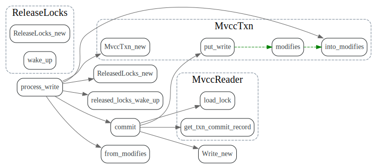


### AsyncCommit

AsyncCommit 等所有的key prewrite之后，就算成功了，TiDB即可返回告诉client事务提交成功了。
primary key 可以异步的commit.其流程如下(摘自[Async Commit 原理介绍][async-commit])


对应代码流程如下, 关键是minCommitTS的更新。


#### minCommitTS

PreWrite前从TSO获取ts, 更新成员变量`minCommitTS`

```go
func (c *twoPhaseCommitter) execute(ctx context.Context) (err error) {
//...
	if commitTSMayBeCalculated && c.needLinearizability() {
		latestTS, err := c.store.oracle.GetTimestamp(ctx, &oracle.Option{TxnScope: oracle.GlobalTxnScope})
    //...
		// Plus 1 to avoid producing the same commit TS with previously committed transactions
		c.minCommitTS = latestTS + 1
	}
//...
}
```

TiDB发送给TiKV的prewrite请求中带上minCommitTS.

```go
func (c *twoPhaseCommitter) buildPrewriteRequest(batch batchMutations, txnSize uint64) *tikvrpc.Request {
 //...
	c.mu.Lock()
	minCommitTS := c.minCommitTS
	c.mu.Unlock()
	if c.forUpdateTS > 0 && c.forUpdateTS >= minCommitTS {
		minCommitTS = c.forUpdateTS + 1
	} else if c.startTS >= minCommitTS {
		minCommitTS = c.startTS + 1
	}
  //...
```

根据prewriteResp.minCommitTS 更新commiter的`minCommitTS`

```go
func (action actionPrewrite) handleSingleBatch(c *twoPhaseCommitter, bo *Backoffer, batch batchMutations) error {
//...
			if c.isAsyncCommit() {
				if prewriteResp.MinCommitTs == 0 {
        // fallback到normal commit
        }else {
					c.mu.Lock()
					if prewriteResp.MinCommitTs > c.minCommitTS {
						c.minCommitTS = prewriteResp.MinCommitTs
					}
					c.mu.Unlock()
        }
```


#### TiKV端计算min_commit_ts

每次TiDB的prewrite请求，TiKV都会返回一个minCommitTS, minCommitTS流程如下


关键函数在`async_commit_timestamps`， 这个地方为什么要lock_key ?

```rust
// The final_min_commit_ts will be calculated if either async commit or 1PC is enabled.
// It's allowed to enable 1PC without enabling async commit.
fn async_commit_timestamps(/*...*/) -> Result<TimeStamp> {
    // This operation should not block because the latch makes sure only one thread
    // is operating on this key.
    let key_guard = CONCURRENCY_MANAGER_LOCK_DURATION_HISTOGRAM.observe_closure_duration(|| {
        ::futures_executor::block_on(txn.concurrency_manager.lock_key(key))
    });

    let final_min_commit_ts = key_guard.with_lock(|l| {
        let max_ts = txn.concurrency_manager.max_ts();
        fail_point!("before-set-lock-in-memory");
        let min_commit_ts = cmp::max(cmp::max(max_ts, start_ts), for_update_ts).next();
        let min_commit_ts = cmp::max(lock.min_commit_ts, min_commit_ts);

        lock.min_commit_ts = min_commit_ts;
        *l = Some(lock.clone());
        Ok(min_commit_ts)
    }
    ...
}
```

> TiDB 的每一次快照读都会更新 TiKV 上的 Max TS。Prewrite 时，Min Commit TS 会被要求至少比当前的 Max TS 大，也就是比所有先前的快照读的时间戳大，所以可以取 Max TS + 1 作为 Min Commit TS

每次读操作，都会更新`concurrency_manager.max_ts`


值得注意的是replica read 也会更新max_ts。replica reader 在read之前会发readIndex消息给leader（
TODO:不确定是否是这样）

发送ReadIndex 请求会附带上事务的start_ts, leader在处理reader index消息时，
会回调`ReplicaReadLockChecker::on_step` 更新`concurrency_manager.max_ts`。


相关commit见[check memory locks in replica read #8926]


### OnePC(一阶段提交)

只涉及一个region，且一个batch就能完成的事务，不使用分布式提交协议，只使用一阶段完成事务，
和AsyncCommit相比， 省掉了后面的commit步骤。


对于batchCount > 1的事务不会使用OnePC.

```go
func (c *twoPhaseCommitter) checkOnePCFallBack(action twoPhaseCommitAction, batchCount int) {
	if _, ok := action.(actionPrewrite); ok {
		if batchCount > 1 {
			c.setOnePC(false)
		}
	}
}
```

#### Tikv端 处理OnePC

在TiKV端，OnePC 直接向Write Column 写write record, 提交事务，
省掉了写lock, 以及后续commit时候cleanup lock这些操作了。


## 悲观事务

悲观事务将上锁时机从prewrite阶段提前到进行DML阶段,如下图所示(摘自[TiDB 新特性漫谈：悲观事务][6])


实现细节如下图所示(摘自[TiDB 悲观锁实现原理][1])


在DML阶段，多了获取从TSO服务for_update_ts和获取悲观锁步骤。

具体步骤如下：(摘自[TiDB 悲观锁实现原理][1])

1. 从 PD 获取当前 tso 作为当前锁的 for_update_ts
2. TiDB 将写入信息写入 TiDB 的内存中（与乐观锁相同）
3. 使用 for_update_ts 并发地对所有涉及到的 Key 发起加悲观锁（acquire pessimistic lock）请求，
4. 如果加锁成功，TiDB 向客户端返回写成功的请求
5. 如果加锁失败
6. 如果遇到 Write Conflict， 重新回到步骤 1 直到加锁成功。
7. 如果超时或其他异常，返回客户端异常信息


### forUpdateTS

ForUpdateTS 存放在SessionVar的TransactionContext中。
然后放到twoPhaseCommitter中，最后在actionIsPessimiticLock
向TiK发送请求时，放到PessimisticRequest请求参数中,发给TiKV.


在buildDelete, buildInsert, buildUpdate, buildSelectLock
时会去TSO服务获取最新的ts作为ForUpdateTS.

```go
// UpdateForUpdateTS updates the ForUpdateTS, if newForUpdateTS is 0, it obtain a new TS from PD.
func UpdateForUpdateTS(seCtx sessionctx.Context, newForUpdateTS uint64) error {
```


### 悲观锁: LockKeys

悲观锁不包含数据，只有锁，只用于防止其他事务修改相同的 Key，不会阻塞读，但 Prewrite 后会阻塞读（和 Percolator 相同，但有了大事务支持后将不会阻塞 
(摘自[TiDB in Action, 6.2 悲观事务][3])

调用流程类似于上面的，也是先对mutation按照region分组，然后每个组内分批。


### PessimisticLock

这个地方有LockWaitTime, 如果有key 冲突，TiKV会等待一段时间, 或者
等key 的lock被释放了，才会返回给TiDB key writeConflict或者deadlock

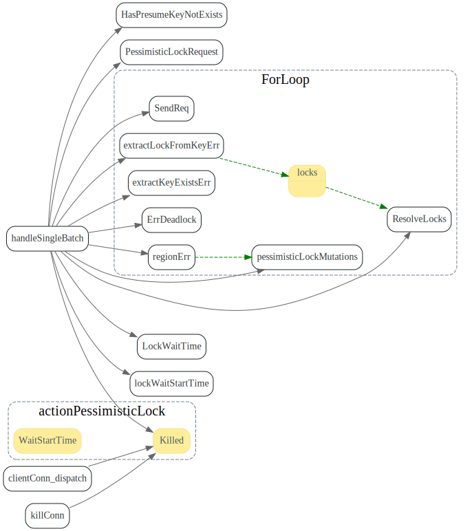

LockKeys中对于`ErrDeadlock`特殊处理，等待已经lock的key都被rollback之后并且sleep 5ms, 才会向上返回。

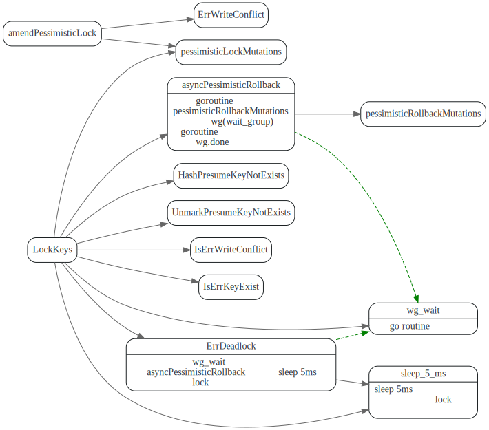

悲观事务对于`ErrDeadlock`和`ErrWriteConflict`重试，重新创建executor, 重试statementContext 状态，更新ForUpdateTS。

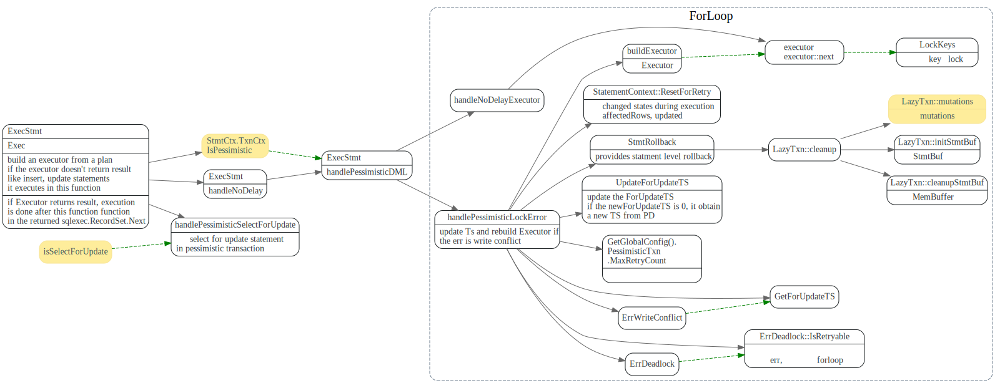

做selectForUpdate 做了特殊处理，没看明白没什么要这么干。

### TiKV处理PessimisticLock

TiKV端获取Pessimistic处理方法(摘自[TiDB 悲观锁实现原理][1])

* 检查 TiKV 中锁情况，如果发现有锁
  1. 不是当前同一事务的锁，返回 KeyIsLocked Error
  2. 锁的类型不是悲观锁，返回锁类型不匹配（意味该请求已经超时）
  3. 如果发现 TiKV 里锁的 for_update_ts 小于当前请求的 for_update_ts(同一个事务重复更新)， 使用当前请求的 for_update_ts 更新该锁
  4. 其他情况，为重复请求，直接返回成功
* 检查是否存在更新的写入版本，如果有写入记录
  1. 若已提交的 commit_ts 比当前的 for_update_ts 更新，说明存在冲突，返回 WriteConflict Error
  2. 如果已提交的数据是当前事务的 Rollback 记录，返回 PessimisticLockRollbacked 错误
  3. 若已提交的 commit_ts 比当前事务的 start_ts 更新，说明在当前事务 begin 后有其他事务提交过
  4. 检查历史版本，如果发现当前请求的事务有没有被 Rollback 过，返回 PessimisticLockRollbacked 错误


### PessimisticLockRollback 

TiDB从 事务的MemBuffer中获取所有被枷锁的key，向tikv发送rollback key lock请求。

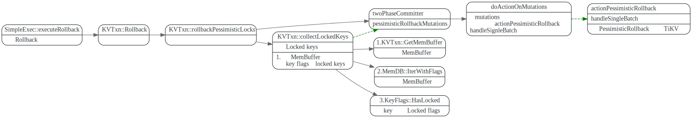

### TiKV处理PessimisticLockRollback


### 加锁规则

TiDB中加锁规则如下(摘自[TiDB 悲观锁实现原理][1])

* 插入（ Insert）
  * 如果存在唯一索引，对应唯一索引所在 Key 加锁
  * 如果表的主键不是自增 ID，跟索引一样处理，加锁。
* 删除（Delete）
  * RowID 加锁
* 更新 (update)
  * 对旧数据的 RowID 加锁
  * 如果用户更新了 RowID, 加锁新的 RowID
  * 对更新后数据的唯一索引都加锁

TODO: 没找到insert/delete/update这块的lock代码


## Wait Lock

Lock冲突事后，TiKV会将lock, StorageCallback, ProcessResult等打包成waiter.
放入等待队列中，等lock释放了，或者timeout了，再调用callback(ProcessResult)
回调通知client ProcessResult.  相当于延迟等待一段时间，避免client 无效的重试

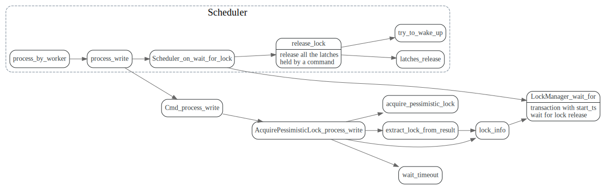


lock和cb还有ProcessResult会被打包成waiter, cb调用会触发向client返回结果吗？

```rust
/// If a pessimistic transaction meets a lock, it will wait for the lock
/// released in `WaiterManager`.
///
/// `Waiter` contains the context of the pessimistic transaction. Each `Waiter`
/// has a timeout. Transaction will be notified when the lock is released
/// or the corresponding waiter times out.
pub(crate) struct Waiter {
    pub(crate) start_ts: TimeStamp,
    pub(crate) cb: StorageCallback,
    /// The result of `Command::AcquirePessimisticLock`.
    ///
    /// It contains a `KeyIsLocked` error at the beginning. It will be changed
    /// to `WriteConflict` error if the lock is released or `Deadlock` error if
    /// it causes deadlock.
    pub(crate) pr: ProcessResult,
    pub(crate) lock: Lock,
    delay: Delay,
    _lifetime_timer: HistogramTimer,
}
```


### 加入等待队列


将请求放入等待队列中，直到lock被cleanup了，调用StorageCallback, cb中返回WriteConflict错误给
client 让client重试。

在放入前还会将wait lock信息放入dead lock scheduler, 检测死锁.

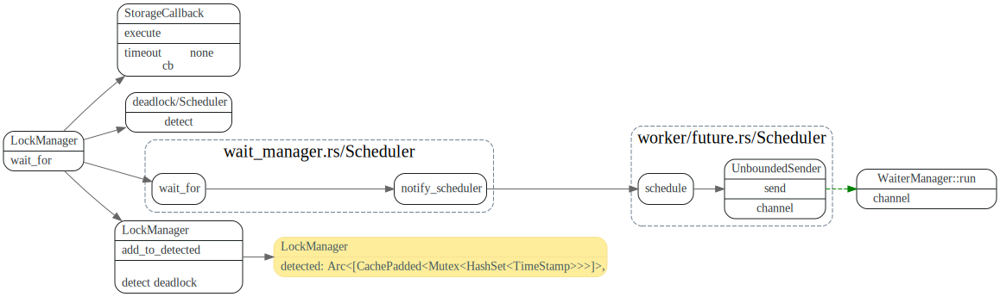

WaitManager 从channel中去取task, 放入lock的等待队列中。
并加个timeout, 等待超时了会调用cb。并从dead lock scheduler中去掉wait lock。


### WakeUp

lock被释放后, LockaManager::wake_up 唤醒等待该lock的waiter.

TODO: 需要对lock.hash做一些说明。
TODO: task的回调机制需要整理下。

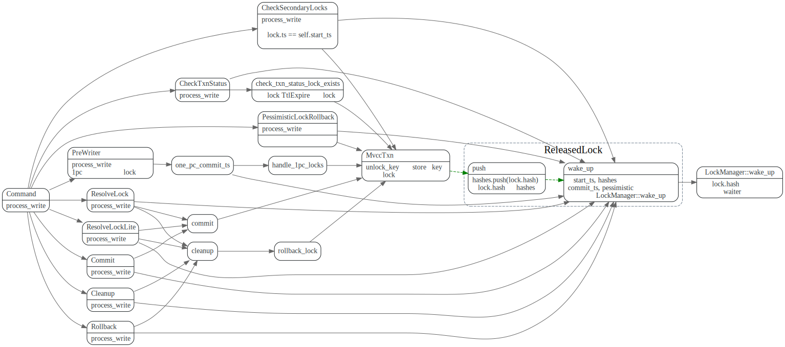

LockManager::Wakeup

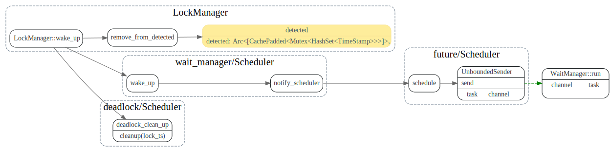

WaiterManager::handle_wake_up

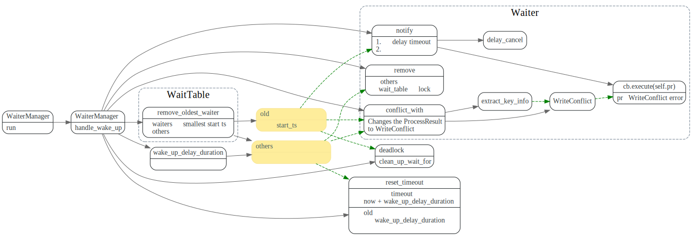

### 死锁检测

在事务被加到lock的等待队列之前，会做一发一个rpc请求, 到deadlock detector服务做deadlock检测。


TiKV 会动态选举出一个 TiKV node 负责死锁检测。

(下图摘自[TiDB 新特性漫谈：悲观事务][6]):

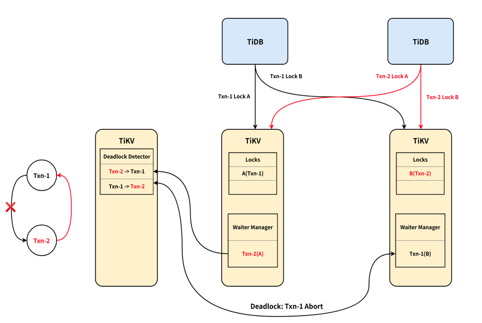

死锁检测逻辑如下(摘自[TiDB 悲观锁实现原理][1])

1. 维护全局的 wait-for-graph，该图保证无环。
2. 每个请求会尝试在图中加一条 `txn -> wait_for_txn` 的 edge，若新加的导致有环则发生了死锁。
3. 因为需要发 RPC，所以死锁时失败的事务无法确定。

#### deadlock leader本地detect

对应代码调用流程如下：

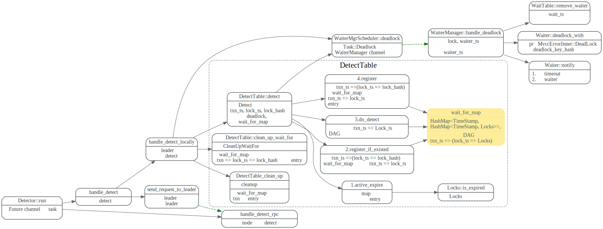

其中比较关键的是wait_for_map ，保存了txn 之间的依赖关系DAG图。

```rust
/// Used to detect the deadlock of wait-for-lock in the cluster.
pub struct DetectTable {
    /// Keeps the DAG of wait-for-lock. Every edge from `txn_ts` to `lock_ts` has a survival time -- `ttl`.
    /// When checking the deadlock, if the ttl has elpased, the corresponding edge will be removed.
    /// `last_detect_time` is the start time of the edge. `Detect` requests will refresh it.
    // txn_ts => (lock_ts => Locks)
    wait_for_map: HashMap<TimeStamp, HashMap<TimeStamp, Locks>>,

    /// The ttl of every edge.
    ttl: Duration,

    /// The time of last `active_expire`.
    last_active_expire: Instant,

    now: Instant,
}
```

#### 转发请求给Deadlock leader

如果当前Deadlock detector不是leader,则会把请求转发给Deadlock leader, 转发流程如下:

首先Deadlock client和leader 维持一个grpc stream, detect请求会发到一个channel中
然后由send_task异步的发送DeadlockRequest给Deadlock leader. 

recv_task则从stream接口中去获取resp, 然后调用回调函数，最后调用waiter_manager的
deadlock函数来通知等待的事务死锁了。


#### Deadlock Service

Deadlock leader会在`handle_detect_rpc`中处理deadlock detect请求，流程和leader处理本地的一样。

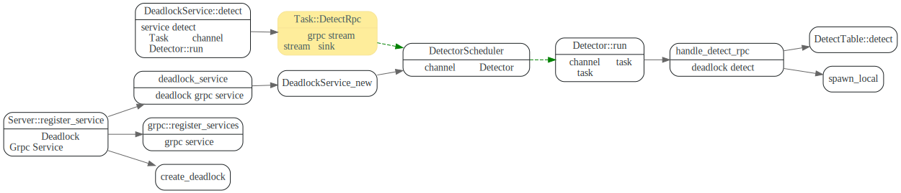

#### Deadlock Service的高可用

Detector在handle_detect,如果leader client为none,
则尝试先去pd server获取`LEADER_KEY`所在的region(Leader Key为空串，
所以leader region为第一region. 

然后解析出leader region leader的
store addr, 创建和deadlock detect leader的grpc detect接口的stream 连接

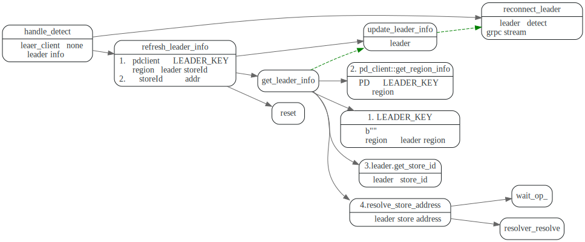

注册了使用Coprocessor的Observer, RoleChangeNotifier, 当leader
region的信息发变动时, RoleChangeNotifier会收到回调
会将leader_client和leader_inf清空，下次handle_detect时会重新
请求leader信息。

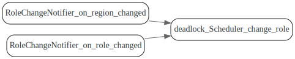


### 问题: DetectTable的wait_for_map需要保证高可用吗？

DetectTable的wait_for_map这个信息在deadlock detect leader
变动时候，是怎么处理的？看代码是直接清空呀？这个之前的依赖关系丢掉了，
这样不会有问题吗？


## Scheduler

### schedule_txn_cmd

从service/kv.rs grpc接口handler处理函数中，首先会将 req::into会将request 转换成
对应的cmd, 然后创建一个oneshot channel, 并await oneshot channel返回的future.

然后由`Scheduler::sched_txn_command`调度执行该cmd, cmd执行完毕，或者
遇到error后，会调用callback, callback触发onshot channel,
然后grpc handler 从await future中获取的resp 返回给client.


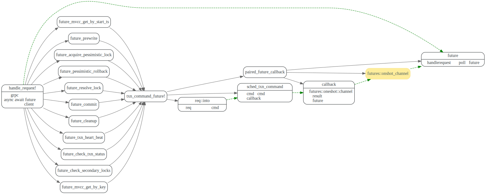

### TaskSlots

Scheduler command中，会将cmd 包装为一个TaskContext
TaskContext中则包含了Task, cb(向上的回到), ProcessResult cmd的执行结果.

对于每个cmd会分配一个唯一的cid, task_slot则用于从cid获取cmd 对应的taskContext.

task slots 会先找到cid 对应的的slot, 之后上mutex lock，获取slot中的hashmap，
做插入查找操作。这样的好处是检查mutex lock，增加了并发度。


### run_cmd

在run cmd之前，会尝试获取cmd的所有的key的latches, 如果成功了，就执行cmd
否则就放入latches等待队列中。latches和task slot一样，也对key hash做了slot.

在cmd执行结束或者遇到error了，会release lock，释放掉command获取的key laches.

然后唤醒等待key latch的command id.


### release lock

释放cid拥有的latches lock, 唤醒等待的task,
这些被唤醒的task 会尝试去获取lock
如果task的涉及的所有key 的latches都拿到了，
就去执行task.

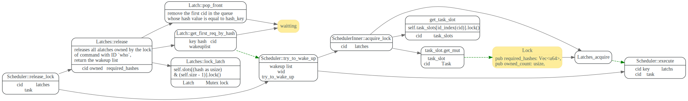

### Scheduler execute

Scheduler执行cmd


## 事务Recovery

Pecolator的coordinator在完成commit或者rollback之前crash了，
事务遗留的Lock，由后续事务的在处理lock冲突时，resolve lock.
将事务的lock提交了或者rollback。

写冲突时候，先检查lock的ttl，如果lock已经查超时了, 则会调用`getTxnStatus`，获取事务状态。


NormalCommit可以根据Primay key状态来确定整个事务的状态和commitTs(commitTs=0，表示
loc需要被rollback)

AsyncCommit则需要扫描所有的keys来确定事务的状态和minCommitTS.
如果所有的Key的lock都exsit，那么事务的commitTs 应该为所有key lock
的minCommitTS的最大值。


### resolveLocksForWrite

先调用`getTxnStatus`获取primary lock状态，然后和当前write事务冲突的secondary key做`commit`或者`rollback`.


### resolveLockAsync

在`addKeys`中，会根据lock的minCommitTS，更新事务的commitTS.
如果lock个数比key的个数少，说明有的key的lock已经被commit或者rollback了,
则会用返回的commitTS作为事务的commitTS 
(如果被rollback了，TiKV返回的CommitTs为0).


```go
// addKeys adds the keys from locks to data, keeping other fields up to date. startTS and commitTS are for the
// transaction being resolved.
//
// In the async commit protocol when checking locks, we send a list of keys to check and get back a list of locks. There
// will be a lock for every key which is locked. If there are fewer locks than keys, then a lock is missing because it
// has been committed, rolled back, or was never locked.
//
// In this function, locks is the list of locks, and expected is the number of keys. asyncResolveData.missingLock will be
// set to true if the lengths don't match. If the lengths do match, then the locks are added to asyncResolveData.locks
// and will need to be resolved by the caller.
func (data *asyncResolveData) addKeys(locks []*kvrpcpb.LockInfo, expected int, startTS uint64, commitTS uint64) error {
  //...
	// Check locks to see if any have been committed or rolled back.
	if len(locks) < expected {
		// A lock is missing - the transaction must either have been rolled back or committed.
		if !data.missingLock {
			// commitTS == 0 => lock has been rolled back.
			if commitTS != 0 && commitTS < data.commitTs {
				return errors.Errorf("commit TS must be greater or equal to min commit TS: commit ts: %v, min commit ts: %v", commitTS, data.commitTs)
			}
			data.commitTs = commitTS
		}
		data.missingLock = true

		if data.commitTs != commitTS {
			return errors.Errorf("commit TS mismatch in async commit recovery: %v and %v", data.commitTs, commitTS)
		}
    //...
```


### resolveRegionLocks
 resolveRegionLocks is essentially the same as resolveLock, but we resolve all keys in the same region at the same time.


## 批量提交

TiDB 提交事务时，会先将mutation按照key的region做分组，
然 每个分组会分批并发的提交。

doActionOnBatches 这个对primaryBatch的commit操作做了特殊处理。


### groupMutations: 按照region分组

先对mutations做分组，如果某个region的mutations 太多。
则会先对那个region先做个split, 这样避免对单个region
too much write workload.

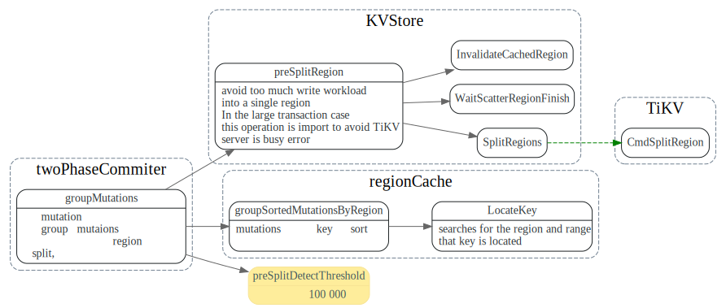

### doActionOnGroupMutations: 分批

doActionOnGroupMutations 会对每个group的mutations 做进一步的分批处理。
对于actionCommit做了特殊处理，如果是NormalCommit, primay Batch要先提交，
然后其他的batch可以新起一个go routine在后台异步提交。

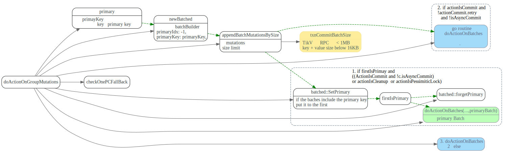

### batchExecutor: 并发的处理batches

`batchExecutor::process` 每个batch会启动一个go routine来并发的处理,
并通过channel等待batch的处理结果。当所有batch处理完了，再返回给调用者。

其中会使用令牌做并发控制, 启动goroutine前先去获取token, goroutine运行
完毕，归还token。


## CommitterMutations

数据结构引用关系如下:


## 参考文献

[TiDB 悲观锁实现原理](https://asktug.com/t/topic/33550)
2. [async commit design spec](https://github.com/tikv/sig-transaction/blob/master/design/async-commit/spec.md)
3. [async commit and replica read](https://tikv.github.io/sig-transaction/design/async-commit/replica-read.html)
4. [support checking memory locks at read index](https://github.com/pingcap/kvproto/pull/665)

[1]: https://asktug.com/t/topic/33550
[async-commit]: https://pingcap.com/blog-cn/async-commit-principle/
[3]: https://book.tidb.io/session1/chapter6/pessimistic-txn.html
[6]: https://pingcap.com/blog-cn/pessimistic-transaction-the-new-features-of-tidb/


# draft


### KeyFlags

### MemDB


## Questions:

1. 如果某个prewrite batch失败了，其他正在执行，或者已经执行的Prewrite batch是怎么rollback的？
2. async commit, one pc commit, minCommitTS, PessimisticLock 这几单独拿出来专题研究。
3. 同一个事物只能在同一个TiDB上跑吗？
4. ForUpdateTS 这个是干什么用的？

```rust
        // The isolation level of pessimistic transactions is RC. `for_update_ts` is
        // the commit_ts of the data this transaction read. If exists a commit version
        // whose commit timestamp is larger than current `for_update_ts`, the
        // transaction should retry to get the latest data.
```


## Timestamp

### commitTS

事务提交的commitTs, 在commit之前去time oracle 服务获取timestamp.

### MinCommitTs/MaxCommitTs

>线性一致性实际上有两方面的要求：

>循序性（sequential）

>实时性（real-time）

>实时性要求在事务提交成功后，事务的修改立刻就能被新事务读取到。新事务的快照时间戳是向 PD 上的 TSO 获取的，这要求 Commit TS 不能太大，最大不能超过 TSO 分配的最大时间戳 + 1。

async commit会用到minCommitTs, 省去了一次去Time服务获取tso的操作。

每个TiKV server有个ConcurrencyManager 记录了max_ts

> 对于 Async Commit 事务的每一个 key，prewrite 时会计算并在 TiKV 记录这个 key 的 Min Commit TS，事务所有 keys 的 Min Commit TS 的最大值即为这个事务的 Commit TS。
> TiDB 的每一次快照读都会更新 TiKV 上的 Max TS。Prewrite 时，Min Commit TS 会被要求至少比当前的 Max TS 大2，也就是比所有先前的快照读的时间戳大，所以可以取 Max TS + 1 作为 Min Commit TS。


```rust
	// If we want to use async commit or 1PC and also want linearizability across
	// all nodes, we have to make sure the commit TS of this transaction is greater
	// than the snapshot TS of all existent readers. So we get a new timestamp
	// from PD and plus one as our MinCommitTS.
	if commitTSMayBeCalculated && c.needLinearizability() {
		failpoint.Inject("getMinCommitTSFromTSO", nil)
		latestTS, err := c.store.oracle.GetTimestamp(ctx, &oracle.Option{TxnScope: oracle.GlobalTxnScope})
		// If we fail to get a timestamp from PD, we just propagate the failure
		// instead of falling back to the normal 2PC because a normal 2PC will
		// also be likely to fail due to the same timestamp issue.
		if err != nil {
			return errors.Trace(err)
		}
		// Plus 1 to avoid producing the same commit TS with previously committed transactions
		c.minCommitTS = latestTS + 1
	}

	// Calculate maxCommitTS if necessary
	if commitTSMayBeCalculated {
		if err = c.calculateMaxCommitTS(ctx); err != nil {
			return errors.Trace(err)
		}
	}
```

maxCommitTs的作用是什么？

Tikv 在async_commit_timestamps 中会检查min_commit_ts和max_commit_ts
如果min_commit_ts > max_commit_ts 会返回CommitTsTooLarge


### onePCCommitTS

## cleanup

事务回滚？


finishStmt

## SimpleExec

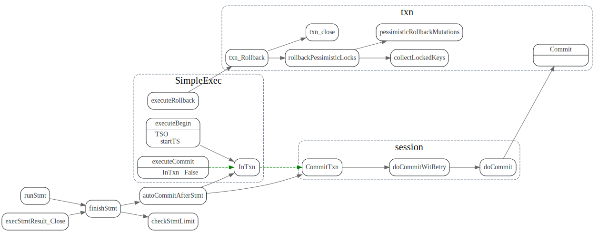
### 获取悲观锁: LockKeys


KeyFlags

```go
	flagPresumeKNE KeyFlags = 1 << iota
	flagKeyLocked
	flagNeedLocked
	flagKeyLockedValExist
	flagNeedCheckExists
	flagPrewriteOnly
	flagIgnoredIn2PC
	persistentFlags = flagKeyLocked | flagKeyLockedValExist
```

