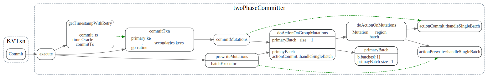
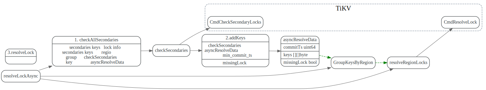
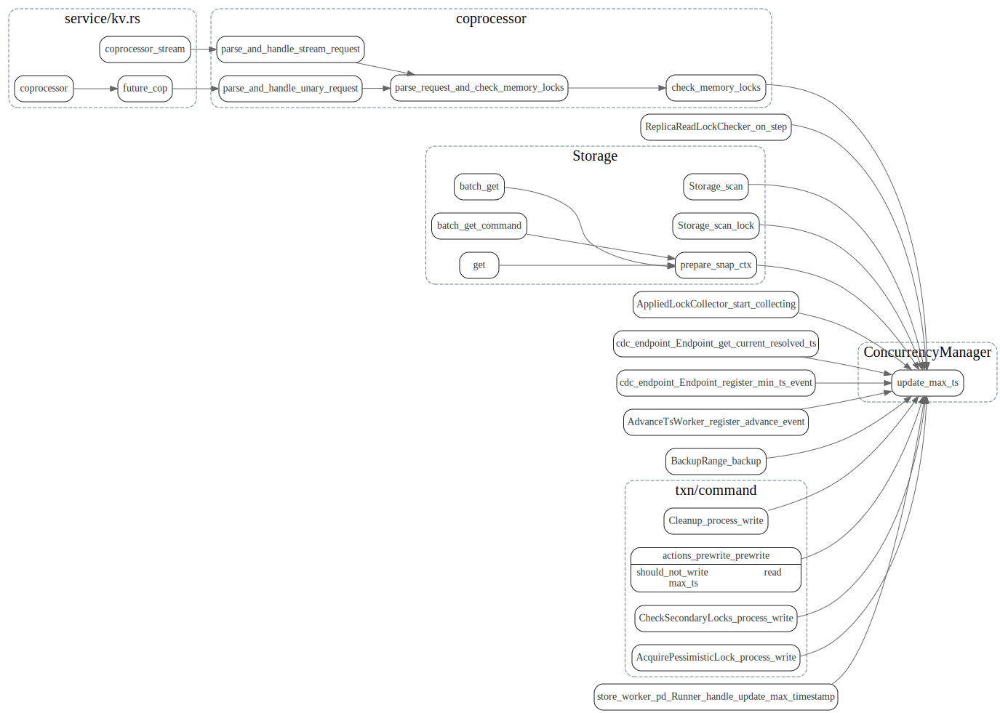
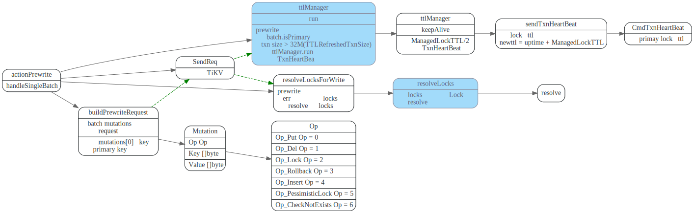
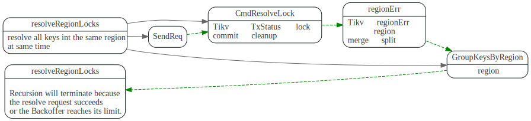
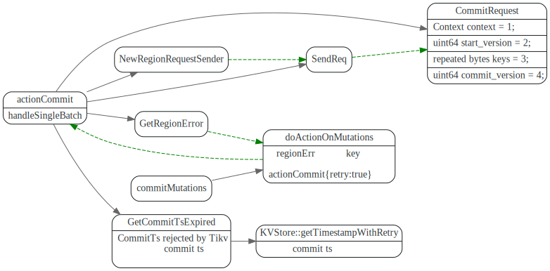
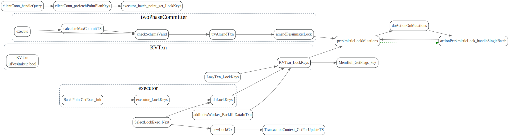
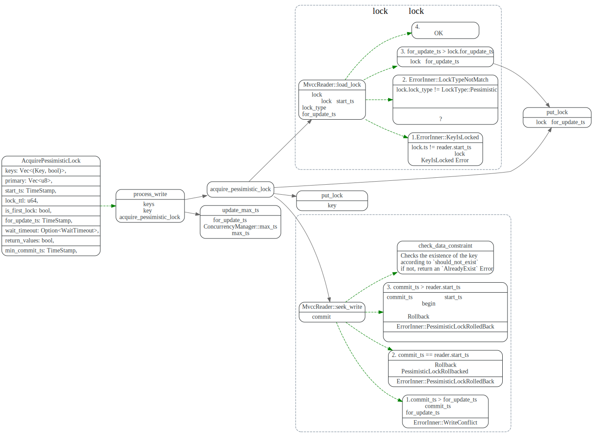
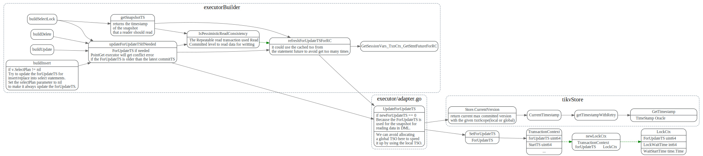

# TiDB txn

> * TiDB的修改会先保存在MemDB中, 在两阶段提交中会batch的提交这些修改。
> * commit/prewrite/resolvelock等都需要处理regionError

<!-- toc -->

## CommitterMutations

基本数据流程如下：

KVTxn的write操作(Set, Delete)  会现将操作
保存在MemDB中。然后在`KVTxn::Commit`时
创建`twoPhaseCommitter`, 并调用`twoPhaseCommitter::initKeysAndMutations`
遍历`MemDB`, 初始化`memBufferMutations`.

在`twoPhaseCommitter::execute`中，首先对`memBufferMutations`先按照region做分组，
, 分为groupMutations, 其次每个分组内，按照size limit，分成batchMutations。

最后调用不同action的`handleSingleBatch`, 发送对应的cmd
到TiKV。


数据结构引用关系如下:


### KeyFlags

### MemDB


## 事务提交协议：twoPhaseCommitter::execute

### NormalCommit

像pecolator论文中描述的协议一样，
1. 先Prewrite，TiDB中可以并发的prewrite.
2. 去TSO 服务获取commit ts， 
3. commit primary key, 提交完primary key后，就可以返回给client事提交成功了。
4. 其他的secondaries keys 异步提交。

下图摘自[Async Commit 原理介绍][async-commit]


对应代码调用流程如下:




在`doActionOnGroupMutations`中，先执行primary Batch的，这样保证primaryBatch会被先commit.

```go
func (c *twoPhaseCommitter) doActionOnGroupMutations(bo *Backoffer, action twoPhaseCommitAction, groups []groupedMutations) error {
//...
	if firstIsPrimary &&
		((actionIsCommit && !c.isAsyncCommit()) || actionIsCleanup || actionIsPessimiticLock) {
		// primary should be committed(not async commit)/cleanup/pessimistically locked first
		err = c.doActionOnBatches(bo, action, batchBuilder.primaryBatch())
    //...
		batchBuilder.forgetPrimary()
	}
//...
```

然后在`doActionOnBatches`决定是否`noNeedFork`，
对于primay Batch会直接,同步的调用`handleSignleBatch`
其他的则由batchExecutor异步并发的执行。

```go
// doActionOnBatches does action to batches in parallel.
func (c *twoPhaseCommitter) doActionOnBatches(bo *Backoffer, action twoPhaseCommitAction, batches []batchMutations) error {
	if len(batches) == 0 {
		return nil
	}

  //直接调用handleSignleBatch
	noNeedFork := len(batches) == 1
	if !noNeedFork {
		if ac, ok := action.(actionCommit); ok && ac.retry {
			noNeedFork = true
		}
	}
	if noNeedFork {
		for _, b := range batches {
			e := action.handleSingleBatch(c, bo, b)
      /...
    }
    return nil
  }

  //由batchExecutor并发的执行
	batchExecutor := newBatchExecutor(rateLim, c, action, bo)
	err := batchExecutor.process(batches)
	return errors.Trace(err)
}
```


### AsyncCommit

AsyncCommit 等所有的key prewrite之后，就算成功了，TiDB即可返回告诉client事务提交成功了。
primary key 可以异步的commit.其流程如下(摘自[Async Commit 原理介绍][async-commit])


对应代码流程如下, 关键是minCommitTS的更新。


#### minCommitTS

PreWrite前从TSO获取ts, 更新成员变量`minCommitTS`

```go
func (c *twoPhaseCommitter) execute(ctx context.Context) (err error) {
//...
	if commitTSMayBeCalculated && c.needLinearizability() {
		latestTS, err := c.store.oracle.GetTimestamp(ctx, &oracle.Option{TxnScope: oracle.GlobalTxnScope})
    //...
		// Plus 1 to avoid producing the same commit TS with previously committed transactions
		c.minCommitTS = latestTS + 1
	}
//...
}
```

TiDB发送给TiKV的prewrite请求中带上minCommitTS.

```go
func (c *twoPhaseCommitter) buildPrewriteRequest(batch batchMutations, txnSize uint64) *tikvrpc.Request {
 //...
	c.mu.Lock()
	minCommitTS := c.minCommitTS
	c.mu.Unlock()
	if c.forUpdateTS > 0 && c.forUpdateTS >= minCommitTS {
		minCommitTS = c.forUpdateTS + 1
	} else if c.startTS >= minCommitTS {
		minCommitTS = c.startTS + 1
	}
  //...
```

根据prewriteResp.minCommitTS 更新commiter的`minCommitTS`

```go
func (action actionPrewrite) handleSingleBatch(c *twoPhaseCommitter, bo *Backoffer, batch batchMutations) error {
//...
			if c.isAsyncCommit() {
				if prewriteResp.MinCommitTs == 0 {
        // fallback到normal commit
        }else {
					c.mu.Lock()
					if prewriteResp.MinCommitTs > c.minCommitTS {
						c.minCommitTS = prewriteResp.MinCommitTs
					}
					c.mu.Unlock()
        }
```

#### txn recovery

asycn commit txn 的恢复
如果TiDB在async commit 返回给client成功，
但是后台async commit primay key
都失败了，这时候该recovery txn呢？

1. 获取primay key 的txn status
2. checkAllSecondaries
3. 是否有key没有被lock(addKeys), 没有则说明需要rollback ?
4. resolve lock

missingLock 可能是被rollback了，或者被commit了。有Tikv自己处理



#### TiKV端处理AsyncCommit


##### 计算min_commit_ts

> TiDB 的每一次快照读都会更新 TiKV 上的 Max TS。Prewrite 时，Min Commit TS 会被要求至少比当前的 Max TS 大，也就是比所有先前的快照读的时间戳大，所以可以取 Max TS + 1 作为 Min Commit TS

这个地方为什么要lock_key ?

```rust
// The final_min_commit_ts will be calculated if either async commit or 1PC is enabled.
// It's allowed to enable 1PC without enabling async commit.
fn async_commit_timestamps(/*...*/) -> Result<TimeStamp> {
    // This operation should not block because the latch makes sure only one thread
    // is operating on this key.
    let key_guard = CONCURRENCY_MANAGER_LOCK_DURATION_HISTOGRAM.observe_closure_duration(|| {
        ::futures_executor::block_on(txn.concurrency_manager.lock_key(key))
    });

    let final_min_commit_ts = key_guard.with_lock(|l| {
        let max_ts = txn.concurrency_manager.max_ts();
        fail_point!("before-set-lock-in-memory");
        let min_commit_ts = cmp::max(cmp::max(max_ts, start_ts), for_update_ts).next();
        let min_commit_ts = cmp::max(lock.min_commit_ts, min_commit_ts);

        lock.min_commit_ts = min_commit_ts;
        *l = Some(lock.clone());
        Ok(min_commit_ts)
    }
    ...
}
```

##### max_ts更新

TiKV的每次读操作，都会更新max_ts



值得注意的是replica read index 这块也会更新max_ts

replica reader 在read之前会发readIndex消息给leader吗？

follower reader在发送ReadIndex 请求给leader 会附带上start_ts,
然后leader在处理reader index消息时，会回调`ReplicaReadLockChecker::on_step`

在该函数中更新concurrency_manager的max_ts。


check memory locks in replica read #8926

addition_request
locked
ReadIndexContext
ReplicaReadLockChecker

### OnePC(一阶段提交)

只涉及一个region，且一个batch就能完成的事务，不使用分布式提交协议，只使用一阶段完成事务，
和AsyncCommit相比， 省掉了后面的commit步骤。


对于batchCount > 1的事务不会使用OnePC.

```go
func (c *twoPhaseCommitter) checkOnePCFallBack(action twoPhaseCommitAction, batchCount int) {
	if _, ok := action.(actionPrewrite); ok {
		if batchCount > 1 {
			c.setOnePC(false)
		}
	}
}
```

#### Tikv端 处理OnePC

在TiKV端，OnePC 直接向Write Column 写write record, 提交事务，
省掉了写lock, 以及后续commit时候cleanup lock这些操作了。


## doActionOnMutations


## actionPrewrite::handleSingleBatch

tries to send a signle request to as single region.




### resolveLocksForWrite


先getTxnSta获取primary lock状态，然后和当前write事务冲突的secondary key做`commit`或者`rollback`.


#### resolveLockAsync

由于Async commit的 primay lock中保留了Secondaries locks列表，
所以这块可一次性的把这个lock的所有secondary lock都resolve掉。


#### resolveRegionLocks
 resolveRegionLocks is essentially the same as resolveLock, but we resolve all keys in the same region at the same time.




## actionCommit::handleSingleBatch

TiDB中提交primay key 然后就返回，其他的seconaries keys
异步提交的，这个过程体现在哪里？

在`doActionOnMutations`中，会做检查，NoNeedFork就会以同步的方式提交查询。

```go
  actionCommit::handleSingleBatch
	// Group that contains primary key is always the first.
	// We mark transaction's status committed when we receive the first success response.
	c.mu.committed = true
```



## Pessimestic Lock(悲观锁)

### 悲观事务步骤:

1. 从 PD 获取当前 tso 作为当前锁的 for_update_ts
2. TiDB 将写入信息写入 TiDB 的内存中（与乐观锁相同）
3. 使用 for_update_ts 并发地对所有涉及到的 Key 发起加悲观锁（acquire pessimistic lock）请求，
4. 如果加锁成功，TiDB 向客户端返回写成功的请求
5. 如果加锁失败
6. 如果遇到 Write Conflict， 重新回到步骤 1 直到加锁成功。
7. 如果超时或其他异常，返回客户端异常信息

LockCtx

for_update_ts是什么？表示tidb的写入ts? 用来做冲突检测的？




### 加锁规则

* 插入（ Insert）
如果存在唯一索引，对应唯一索引所在 Key 加锁
如果表的主键不是自增 ID，跟索引一样处理，加锁。
* 删除（Delete）
RowID 加锁
* 更新 (update)
对旧数据的 RowID 加锁
如果用户更新了 RowID, 加锁新的 RowID
对更新后数据的唯一索引都加锁


### LockKeys

KeyFlags

```go
	flagPresumeKNE KeyFlags = 1 << iota
	flagKeyLocked
	flagNeedLocked
	flagKeyLockedValExist
	flagNeedCheckExists
	flagPrewriteOnly
	flagIgnoredIn2PC
	persistentFlags = flagKeyLocked | flagKeyLockedValExist
```


TiKV端获取Pessimistic处理方法:

* 检查 TiKV 中锁情况，如果发现有锁
  * 不是当前同一事务的锁，返回 KeyIsLocked Error
  * 锁的类型不是悲观锁，返回锁类型不匹配（意味该请求已经超时）
  * 如果发现 TiKV 里锁的 for_update_ts 小于当前请求的 for_update_ts(同一个事务重复更新)， 使用当前请求的 for_update_ts 更新该锁
  * 其他情况，为重复请求，直接返回成功
* 检查是否存在更新的写入版本，如果有写入记录
  * 若已提交的 commit_ts 比当前的 for_update_ts 更新，说明存在冲突，返回 WriteConflict Error
  * 如果已提交的数据是当前事务的 Rollback 记录，返回 PessimisticLockRollbacked 错误
  * 若已提交的 commit_ts 比当前事务的 start_ts 更新，说明在当前事务 begin 后有其他事务提交过
  * 检查历史版本，如果发现当前请求的事务有没有被 Rollback 过，返回 PessimisticLockRollbacked 错误




#### caller of lock keys

TODO: 没找到insert/delete/update这块的lock代码


## cleanup


## Questions:

1. 如果某个prewrite batch失败了，其他正在执行，或者已经执行的Prewrite batch是怎么rollback的？
2. async commit, one pc commit, minCommitTS, PessimisticLock 这几单独拿出来专题研究。
3. 同一个事物只能在同一个TiDB上跑吗？
4. ForUpdateTS 这个是干什么用的？

```rust
        // The isolation level of pessimistic transactions is RC. `for_update_ts` is
        // the commit_ts of the data this transaction read. If exists a commit version
        // whose commit timestamp is larger than current `for_update_ts`, the
        // transaction should retry to get the latest data.
```

## 参考文献

1. [TiDB 悲观锁实现原理](https://asktug.com/t/topic/33550)
2. [async commit design spec](https://github.com/tikv/sig-transaction/blob/master/design/async-commit/spec.md)
3. [async commit and replica read](https://tikv.github.io/sig-transaction/design/async-commit/replica-read.html)
4. [support checking memory locks at read index](https://github.com/pingcap/kvproto/pull/665)

[async-commit]: https://pingcap.com/blog-cn/async-commit-principle/


# draft


## Timestamp

### startTs

在执行start transaction时，会去Oracle服务获取时间戳，作为事务的startTS,
startTs会保存在TransactionContext中


### forUpdateTS

forUpdateTS 是每个write的sql stmt都会更一次吗？

TODO: 解释ForUpdateTS的作用，是什么时候更新的.
UpdateForUpdateTS

```go
// UpdateForUpdateTS updates the ForUpdateTS, if newForUpdateTS is 0, it obtain a new TS from PD.
func UpdateForUpdateTS(seCtx sessionctx.Context, newForUpdateTS uint64) error {
```



### commitTS

事务提交的commitTs, 在commit之前去time oracle 服务获取timestamp.

### MinCommitTs/MaxCommitTs

>线性一致性实际上有两方面的要求：

>循序性（sequential）

>实时性（real-time）

>实时性要求在事务提交成功后，事务的修改立刻就能被新事务读取到。新事务的快照时间戳是向 PD 上的 TSO 获取的，这要求 Commit TS 不能太大，最大不能超过 TSO 分配的最大时间戳 + 1。

async commit会用到minCommitTs, 省去了一次去Time服务获取tso的操作。

每个TiKV server有个ConcurrencyManager 记录了max_ts

> 对于 Async Commit 事务的每一个 key，prewrite 时会计算并在 TiKV 记录这个 key 的 Min Commit TS，事务所有 keys 的 Min Commit TS 的最大值即为这个事务的 Commit TS。
> TiDB 的每一次快照读都会更新 TiKV 上的 Max TS。Prewrite 时，Min Commit TS 会被要求至少比当前的 Max TS 大2，也就是比所有先前的快照读的时间戳大，所以可以取 Max TS + 1 作为 Min Commit TS。


```rust
	// If we want to use async commit or 1PC and also want linearizability across
	// all nodes, we have to make sure the commit TS of this transaction is greater
	// than the snapshot TS of all existent readers. So we get a new timestamp
	// from PD and plus one as our MinCommitTS.
	if commitTSMayBeCalculated && c.needLinearizability() {
		failpoint.Inject("getMinCommitTSFromTSO", nil)
		latestTS, err := c.store.oracle.GetTimestamp(ctx, &oracle.Option{TxnScope: oracle.GlobalTxnScope})
		// If we fail to get a timestamp from PD, we just propagate the failure
		// instead of falling back to the normal 2PC because a normal 2PC will
		// also be likely to fail due to the same timestamp issue.
		if err != nil {
			return errors.Trace(err)
		}
		// Plus 1 to avoid producing the same commit TS with previously committed transactions
		c.minCommitTS = latestTS + 1
	}

	// Calculate maxCommitTS if necessary
	if commitTSMayBeCalculated {
		if err = c.calculateMaxCommitTS(ctx); err != nil {
			return errors.Trace(err)
		}
	}
```

maxCommitTs的作用是什么？

Tikv 在async_commit_timestamps 中会检查min_commit_ts和max_commit_ts
如果min_commit_ts > max_commit_ts 会返回CommitTsTooLarge


### onePCCommitTS

