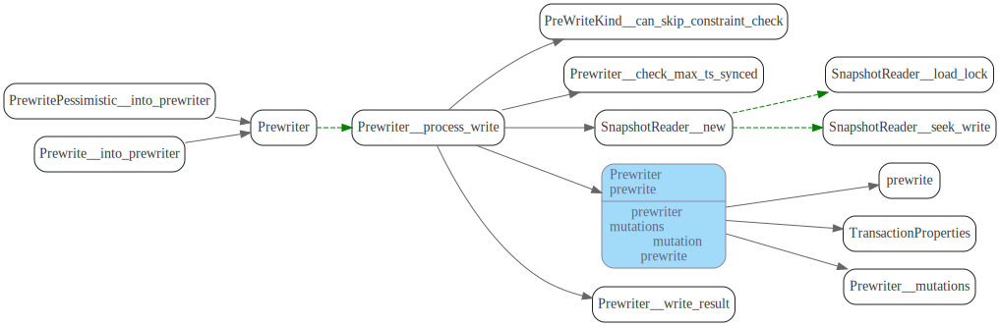
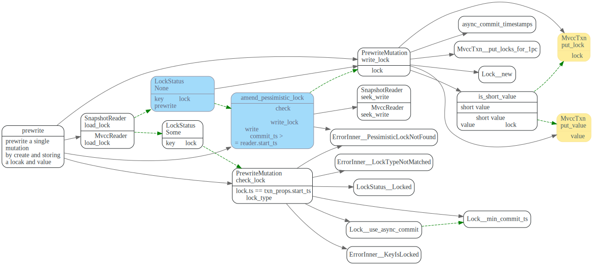

# 2pc

<!-- toc -->

## 数据流程

TiDB中乐观事务提交流程如下(摘自[TiDB 新特性漫谈：悲观事务][6]):


1. 首先Begin 操作会去TSO服务获取一个timestamp，作为事务的`startTS`.
2. DML阶段先KVTxn将写(Set, Delete)操作保存在`MemDB`中。
3. 如果是悲观事务，在DML阶段去TiKV获取悲观lock。
4. 2PC提交阶段在`KVTxn::Commit`时创建`twoPhaseCommitter`, 并调用它的`initKeysAndMutations`
遍历`MemDB`, 初始化`memBufferMutations`.
5. 在`twoPhaseCommitter::execute`中，首先对`memBufferMutations`先按照region做分组，
6. 每个分组内，按照size limit分批。
7. 每批mutations,调用对应的action的`handleSignleBatch`，发送相应命令到TiKV.


## 事务startTS

在执行start transaction时，会去TimmStamp Oracle服务获取时间戳，作为事务的startTS,
startTs会保存在TransactionContext中
startTS 是单调递增的，这样startT标识事务, 也可以用来表示事务之间的先后关系。


## Prewrite-Commit

像pecolator论文中描述的协议一样，两阶段提交步骤如下：

1. 先Prewrite获取Lock, TiDB中可以并发的发起Prewrite请求.
2. 去TSO 服务获取commit ts, 保证获取的`commit_ts`比之前的事务的`start_ts`都大。
3. commit primary key, 提交完primary key后，就可以返回给client，事务提交成功了。
4. 其它剩下的keys由go routine在后台异步提交。

下图摘自[Async Commit 原理介绍][async-commit]


在TiDB中，对应流程如下:


在`doActionOnGroupMutations`中，先对每个group的进行分批，
然后对于actionCommit，先提交primary key 所在的batch
其它的key由go routine在后台异步提交。

```go
func (c *twoPhaseCommitter) doActionOnGroupMutations(bo *Backoffer, action twoPhaseCommitAction, groups []groupedMutations) error {
  // 1.每个分组内的再分批
	for _, group := range groups {
		batchBuilder.appendBatchMutationsBySize(group.region, group.mutations, sizeFunc, txnCommitBatchSize)
  }

  //2.commit先同步的提交primary key所在的batch
	if firstIsPrimary &&
		((actionIsCommit && !c.isAsyncCommit()) || actionIsCleanup || actionIsPessimiticLock) {
		// primary should be committed(not async commit)/cleanup/pessimistically locked first
		err = c.doActionOnBatches(bo, action, batchBuilder.primaryBatch())
    //...
		batchBuilder.forgetPrimary()
	}
  //...

  //3. 其它的key由go routine后台异步的提交
	// Already spawned a goroutine for async commit transaction.
	if actionIsCommit && !actionCommit.retry && !c.isAsyncCommit() {
    //..
		go func() {
      //其它的action异步提交
			e := c.doActionOnBatches(secondaryBo, action, batchBuilder.allBatches())
    }
  }else {
		err = c.doActionOnBatches(bo, action, batchBuilder.allBatches())
  }
//...
```

### actionPrewrite

tries to send a signle request to as single region.

ttlManager会定期的向TiKV发送txnHeartbeat, 更新lock的ttl.


#### TiKV端处理Prewrite




对单个key Muation的prewrite操作。



constraint check

should not write

PrewriteMutation

#### TiKV端处理TxnHeartBeat

直接更新primary key lock的ttl.

```rust
//txn_heart_beat.rs
impl<S: Snapshot, L: LockManager> WriteCommand<S, L> for TxnHeartBeat {
    fn process_write(self, snapshot: S, context: WriteContext<'_, L>) -> Result<WriteResult> {
    //...
    let lock = match reader.load_lock(&self.primary_key)? {
        Some(mut lock) if lock.ts == self.start_ts => {
           if lock.ttl < self.advise_ttl {
              lock.ttl = self.advise_ttl;
              txn.put_lock(self.primary_key.clone(), &lock);
            }
            lock
        }
```

### actionCommit

TiDB向Tikv发起commit请求，CommitRequest中的Keys即为要提交的key.


#### TiKV端处理commit

TiKV会遍历Commit请求中的每个key, 尝试去commit key, 然后调用ReleasedLocks唤醒等待这些key的事务。


单个key处理逻辑如下，这个地方的rollback没怎么看明白。


## Draft

### tikv 处理prewrite


