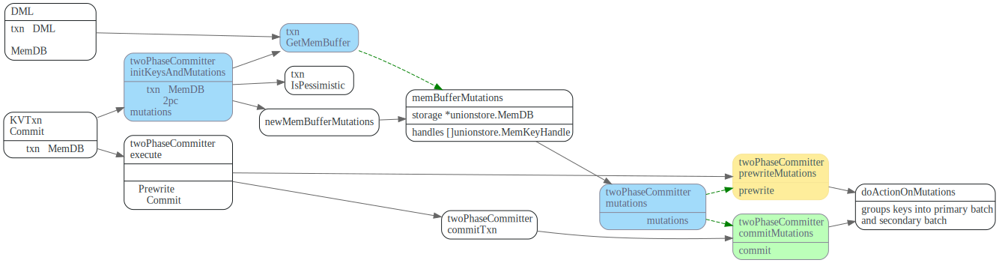
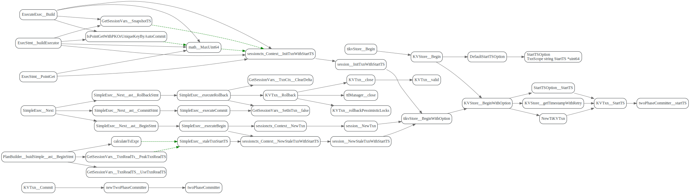

# 2pc

<!-- toc -->

## 数据流程

TiDB中乐观事务提交流程如下(摘自[TiDB 新特性漫谈：悲观事务](https://pingcap.com/blog-cn/pessimistic-transaction-the-new-features-of-tidb/))


1. 首先Begin 操作会去TSO服务获取一个timestamp，作为事务的`startTS`，同时startTs也是事务的唯一标识。
2. DML阶段先KVTxn将写(Set, Delete)操作保存在`MemDB`中。
3. 2PC提交阶段在`KVTxn::Commit`时创建`twoPhaseCommitter`, 并调用它的`initKeysAndMutations`
遍历`MemDB`, 初始化`memBufferMutations`.
4. 在`twoPhaseCommitter::execute`中，首先对`memBufferMutations`先按照region做分组，然后每个分组内，按照size limit分批。
5. 每批mutations，调用对应的action的`handleSignleBatch`，发送相应命令到TiKV.


## Begin Transaction

每个client connection 对应着一个session, 事务相关数据的放在了session中，
它包含了对kv.Storage和Txn接口的引用。

`kv.Storage`接口定义了`Begin/BeginWithOption`接口，用来创建开始一个事务，它
主要实现者为`KVStore`。

`kv.Transaction`定义了事务的接口，txn可以commit/rollback.
它主要实现者为`KVTxn`。

每个KVTxn有个对MemDB的引用，每个事务的set/delete等修改会先存放到`MemDB`中。


kv.Storage的Begin/BeginWithOption 调用图如下：如果startTS为nil, 则会去TOS(timestamp oracle service)也就是
PD服务获取一个时间戳，作为事务的startTS，同时也是事务的唯一标识。


## 数据DML: 先保存到txn的MemDB

table row的增删改，最终会调用`Table`的AddRecord, RemoveRecord, UpdateRecord接口来更新数据。


而Table的这些接口，会将改动保存在Txn.KVUnionStore.MemDB中。


## twoPhaseCommitter

像pecolator论文中描述的协议一样，两阶段提交步骤如下：

1. 先Prewrite获取Lock, TiDB中可以并发的发起Prewrite请求.
2. 去TSO 服务获取commit ts, 保证获取的`commit_ts`比之前的事务的`start_ts`都大。
3. commit primary key, 提交完primary key后，就可以返回给client，事务提交成功了。
4. 其它剩下的keys由go routine在后台异步提交。

下图摘自[Async Commit 原理介绍][async-commit]


TiDB中会先根据region对MemDB中的keys做分组，然后每个分组内做分批，最后一批一批的向TiKV发请求。

### mutations

上面保存在txn的MemDB中的修改，在txn commit时，会被转变为`twoPhaseCommitter::mutations`，在两阶段提交的
Prewrite/Commit阶段会提交这些`mutations`.




### doActionOnMutations

```go
// doActionOnMutations groups keys into primary batch and secondary batches, if primary batch exists in the key,
// it does action on primary batch first, then on secondary batches. If action is commit, secondary batches
// is done in background goroutine.
```
先调用groupMutations, 将mutations按照region分组，然后`doActionOnGroupMutations`对每个group分别做处理。


### groupMutations: 按照region分组

先对mutations按照region分组，如果某个region的mutations 太多。
则会先发送CmdSplitRegion命令给TiKV, TiKV对那个region先做个split, 然后再开始提交，
这样避免对单个region too much write workload, 避免了不必要的重试。


### doActionOnGroupMutations: 分批

doActionOnGroupMutations 会对每个group的mutations 做进一步的分批处理。
对于actionCommit做了特殊处理，如果是NormalCommit, primay Batch要先提交，
然后其他的batch可以新起一个go routine在后台异步提交。


关键代码如下：

```go
func (c *twoPhaseCommitter) doActionOnGroupMutations(bo *Backoffer, action twoPhaseCommitAction, groups []groupedMutations) error {
  // 1.每个分组内的再分批
	for _, group := range groups {
		batchBuilder.appendBatchMutationsBySize(group.region, group.mutations, sizeFunc, txnCommitBatchSize)
  }

  //2.commit先同步的提交primary key所在的batch
	if firstIsPrimary &&
		((actionIsCommit && !c.isAsyncCommit()) || actionIsCleanup || actionIsPessimiticLock) {
		// primary should be committed(not async commit)/cleanup/pessimistically locked first
		err = c.doActionOnBatches(bo, action, batchBuilder.primaryBatch())
    //...
		batchBuilder.forgetPrimary()
	}
  //...

  //3. 其它的key由go routine后台异步的提交
	// Already spawned a goroutine for async commit transaction.
	if actionIsCommit && !actionCommit.retry && !c.isAsyncCommit() {
    //..
		go func() {
      //其它的action异步提交
			e := c.doActionOnBatches(secondaryBo, action, batchBuilder.allBatches())
    }
  }else {
		err = c.doActionOnBatches(bo, action, batchBuilder.allBatches())
  }
//...
```

### doActionOnBatches: 并发的处理batches

`batchExecutor::process` 每个batch会启动一个go routine来并发的处理,
并通过channel等待batch的处理结果。当所有batch处理完了，再返回给调用者。

其中会使用令牌做并发控制, 启动goroutine前先去获取token, goroutine运行
完毕，归还token。


## actionPrewrite

发送prewrite命令到TiKV, 如果prewrite阶段，遇到了lock error，
则尝试Resole lock， 然后重试；如果遇到了regionError， 则需要重新
调用doActionONMutations,重新分组，重新尝试。

如果没有keyError，并且Batch是primary. 则启动一个tllManager，给txn的
primary lock续命，ttlManager会定期的向TiKV发送txnHeartbeat, 更新primary lock的ttl。


### TiKV端处理Prewrite

TiKV端PreWriteKind，分为悲观事务和乐观事务。


对单个key Muation的prewrite操作。


constraint check

should not write

PrewriteMutation

### TiKV端处理TxnHeartBeat

直接更新primary key lock的ttl.

```rust
//txn_heart_beat.rs
impl<S: Snapshot, L: LockManager> WriteCommand<S, L> for TxnHeartBeat {
    fn process_write(self, snapshot: S, context: WriteContext<'_, L>) -> Result<WriteResult> {
    //...
    let lock = match reader.load_lock(&self.primary_key)? {
        Some(mut lock) if lock.ts == self.start_ts => {
           if lock.ttl < self.advise_ttl {
              lock.ttl = self.advise_ttl;
              txn.put_lock(self.primary_key.clone(), &lock);
            }
            lock
        }
```

## actionCommit

TiDB向Tikv发起commit请求，CommitRequest中的Keys即为要提交的key.


### TiKV端处理commit

TiKV会遍历Commit请求中的每个key, 尝试去commit key, 然后调用ReleasedLocks唤醒等待这些key的事务。


单个key的commit过程如下, 分两种case:
1. `lock match`:  lock仍然被txn 所持有，则继续尝试提交, 提交如果commit_ts < lock.min_commit_ts则报错，
`ErrorInner::CommitTsExpired`，如果lock.rollback_ts中有和commit_ts相同的ts, 则需要将
要写入的write.set_overlapped_rollback。最后unlock key, 提交write。
2. `lock mismatch`: lock为None或者Lock已经被其他事务所持有，则需要`get_txn_commit_record`
读取commit record来判断事务的commit状态.


## 参考文献
1 [TiDB 新特性漫谈：悲观事务](https://pingcap.com/blog-cn/pessimistic-transaction-the-new-features-of-tidb/)

# Draft
## 事务startTS

在执行start transaction时，会去TimmStamp Oracle服务获取时间戳，作为事务的startTS,
startTs会保存在TransactionContext中
startTS 是单调递增的，这样startT标识事务, 也可以用来表示事务之间的先后关系。




在TiDB中，对应流程如下:


