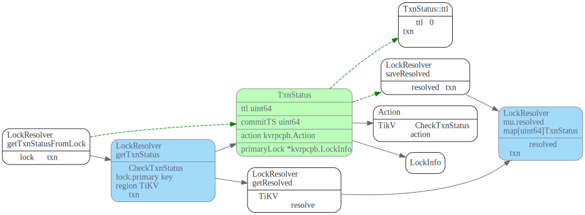
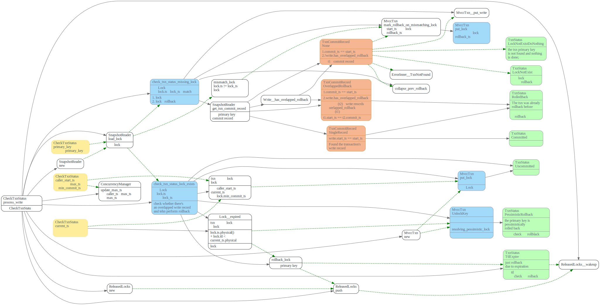
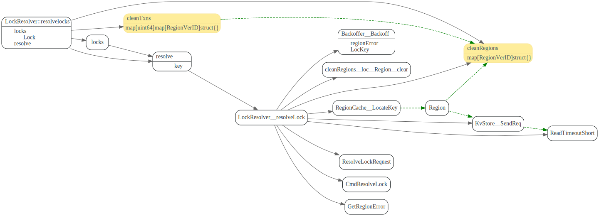
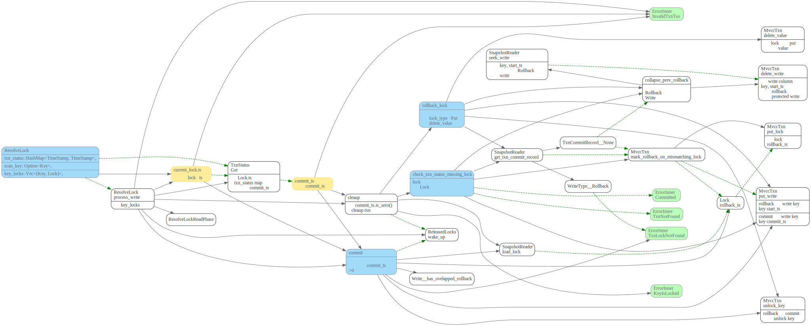
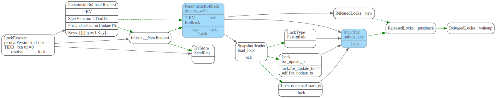

# Resolve Lock

<!-- toc -->

## Prewrite 阶段处理lock冲突

在TiDB prewrite阶段，如果遇到lock，会尝试resolveLocks，resolveLocks会尝试获取
持有lock的事务的状态，然后去resolve lock. 如果lock 没有被resolve, 还被其他
事务所持有，则返回要sleep的时间。prewite BackoffWithMaxSleep后，重新尝试去resolve locks

```go
func (action actionPrewrite) handleSingleBatch(c *twoPhaseCommitter, bo *Backoffer, batch batchMutations) error {
  for {
   //other codes
		msBeforeExpired, err := c.store.lockResolver.resolveLocksForWrite(bo, c.startTS, locks)
		if err != nil {
			return errors.Trace(err)
		}
		atomic.AddInt64(&c.getDetail().ResolveLockTime, int64(time.Since(start)))
		if msBeforeExpired > 0 {
			err = bo.BackoffWithMaxSleep(retry.BoTxnLock, int(msBeforeExpired), errors.Errorf("2PC prewrite lockedKeys: %d", len(locks)))
			if err != nil {
				return errors.Trace(err)
			}
		}
  }
}
```


### TiDB resolveLocks

```go
// ResolveLocks tries to resolve Locks. The resolving process is in 3 steps:
// 1) Use the `lockTTL` to pick up all expired locks. Only locks that are too
//    old are considered orphan locks and will be handled later. If all locks
//    are expired then all locks will be resolved so the returned `ok` will be
//    true, otherwise caller should sleep a while before retry.
// 2) For each lock, query the primary key to get txn(which left the lock)'s
//    commit status.
// 3) Send `ResolveLock` cmd to the lock's region to resolve all locks belong to
//    the same transaction.
```

## 获取事务状态

### TiDB getTxnStatusFromLock

resolveLocks 首先会根据lock.primarykey, 调用`LockResolver::getTxnStatus`去获取持有这些lock的txns的状态。




对于TxnStatus.ttl 为0，已经过期的事务，则尝试去resolve locks，根据事务类型，有不同的
resolve 方法
1. `resolveLock`: resolve正常提交的乐观事务lock
2. `resolveLocksAsync`: 处理async commit的乐观事务txn locks。 由于async commit的primary lock包含所有secondaires lock信息，
所以可以把secondaires lock也resolve掉，避免后续冲突再resolve.
3. `resolvePessimisticLock`: resolve 悲观事务lock


### TiKV CheckTxnStatus

TiDB的`LockResolver::getTxnStatus` 最后会发GRPC请求到TiKV, TiKV执行Cmd CheckTxnStatus.

该Cmd主要功能在代码中注释如下：

```rust
    /// checks whether a transaction has expired its primary lock's TTL, rollback the
    /// transaction if expired, or update the transaction's min_commit_ts according to the metadata
    /// in the primary lock.
    /// When transaction T1 meets T2's lock, it may invoke this on T2's primary key. In this
    /// situation, `self.start_ts` is T2's `start_ts`, `caller_start_ts` is T1's `start_ts`, and
    /// the `current_ts` is literally the timestamp when this function is invoked; it may not be
    /// accurate.
```


CheckTxnStatus 根据`lock.primary_key`检查某个事务txn状态在检查过程中，可能会rollback txn, 
主要会调用`check_txn_status_lock_exists`和`check_txn_status_missing_lock`来处理lock的各种case.

1. `check_txn_status_lock_exists`: 如果Lock存在且事务还持有该lock的话， 如果lock 已经过期了，这时候会<b>清理掉lock</b>, 并返回TxnStatus::Expire状态，
否则就更新lock的`min_commit_ts`, 返回TxnStatus::Uncommitted状态。

2. `check_txn_status_missing_lock`: lock不存在，或者lock.ts已经不是txn了，说明txn可能被commited了，也可能被rollback了。
这时候要去seek `primary_key`的write record，来推算txn状态。

调用流程图如下，其中黄色的是GRPC请求中带上来的数据。



上图中绿色的就是最后返回的txn status, 对应的enum如下,在TiDB中对应于返回字段中的Action.

```rust
/// Represents the status of a transaction.
#[derive(PartialEq, Debug)]
pub enum TxnStatus {
    /// The txn was already rolled back before.
    RolledBack,
    /// The txn is just rolled back due to expiration.
    TtlExpire,
    /// The txn is just rolled back due to lock not exist.
    LockNotExist,
    /// The txn haven't yet been committed.
    Uncommitted {
        lock: Lock,
        min_commit_ts_pushed: bool,
    },
    /// The txn was committed.
    Committed { commit_ts: TimeStamp },
    /// The primary key is pessimistically rolled back.
    PessimisticRollBack,
    /// The txn primary key is not found and nothing is done.
    LockNotExistDoNothing,
}
```

```go
type Action int32

const (
	Action_NoAction                     Action = 0
	Action_TTLExpireRollback            Action = 1
	Action_LockNotExistRollback         Action = 2
	Action_MinCommitTSPushed            Action = 3
	Action_TTLExpirePessimisticRollback Action = 4
	Action_LockNotExistDoNothing        Action = 5
)
```

## 清理过期lock

### resolveLock

请求中的txn_status和key_lock 这两个是怎么构造出来的？



TiKV CmdResolveLock

Resolve locks according to `tnx_status`.

CmdResolveLock请求中，会带上`txn_status`, 保存了`txn -> commit_ts`的映射
如果txn对应的`commit_ts`为0, 则cleaup, rollback_lock, 回滚事务。
如果txn对应的`commit_ts`不为0，则尝试commit 提交事务。

这里`scan_key`起什么作用？




ResolveLockLite?


### resolveLocksAsync

TiDB


TiKV CmdCheckSecondaryLocks


```rust
    /// Check secondary locks of an async commit transaction.
    ///
    /// If all prewritten locks exist, the lock information is returned.
    /// Otherwise, it returns the commit timestamp of the transaction.
    ///
    /// If the lock does not exist or is a pessimistic lock, to prevent the
    /// status being changed, a rollback may be written.
    CheckSecondaryLocks:
```


```rust
#[derive(Debug, PartialEq)]
enum SecondaryLockStatus {
    Locked(Lock),
    Committed(TimeStamp),
    RolledBack,
}
```
不太明白这个地方悲观事务为什么可以unlokc_key;


### resolvePessimisticLock

PessimisticLock事务的悲观锁，多了一个forUpdateTs, 而且是直接清理lock，不像乐观锁那样，要写入rollback 类型的Write， 这个是为什么呀？




# TODO

研究下这个rollback must be protected。
// The rollback must be protected, see more on

 OverlappedRollback 和overlapped write代表什么意思？

// [issue #7364](https://github.com/tikv/tikv/issues/7364)

> Assume that we have three clients {c1, c2, c3} and two keys {k1, k2}:
> 
> 1. Pessimistic client c1 acquires a pessimistic lock on k1(primary), k2. But the command for k1 is lost at this point.
> 2. Optimistic client c2 requires to clean up the lock on k2
> 3. k1 is rollbacked and a write record ("rollback", c1_start_ts, not_protected) is written into k1 (not_protected because the lock on k1 is missing), and a cleanup(primary=k1, ts=c1_start_ts)(*1) is sent but lost at this point.
> 4. Client c3 prewrites k1
> 5. Client c2 requires to clean up the lock on k1
> 6. k1 is rollbacked and the rollback write record is collapsed to ("rollback", c3_start_ts, protected/not_protected)
> 7. Client c1 retries to lock on k1
> 8. k1 is locked by c1
> 9. Client c1 prewrites k1, k2
> 10. k1, k2 are prewrited by c1, and c1 received the prewrite succeed response
> 11. The lost cleanup command (*1) in step 3 is received by k2, therefore k2 is rollbacked
> 12. Client c1 commit k1
> 13. k1 is committed, while k2 is rollbacked
> 
> Then atomic guarantee is broken.

`get_txn_commit_record` 这方法需要仔细研究下。

rollback, make_rollback, collapse_prev_rollback 这几个关系是啥？

### lock rollback ts

`commit_ts`和`start_ts` 相等的时候会出现的情况。

为什么会出现相等呢？

写WriteType::Rollback时候，用的是start_ts, 而key被commit时候，write record的
key为`key commit_ts`, 当`start_ts == commit_ts`时，事务的rollback可能被
`commit_ts`所覆盖掉。


按照pecolator论文，commit时候，commit_ts一定比之前所有的start_ts大呀，为什么还会出现
被覆盖掉的情况呢？

是不是和Pingcap引入了并发的prewrite有关呢？


