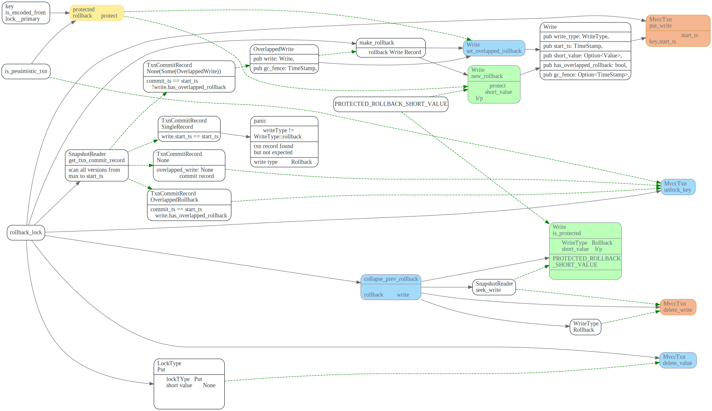
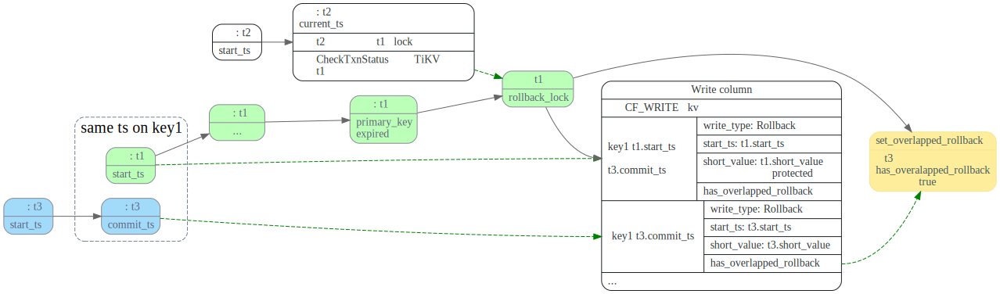
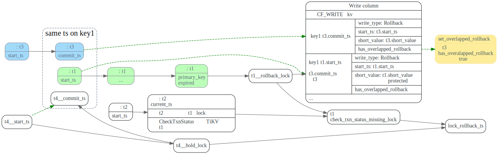
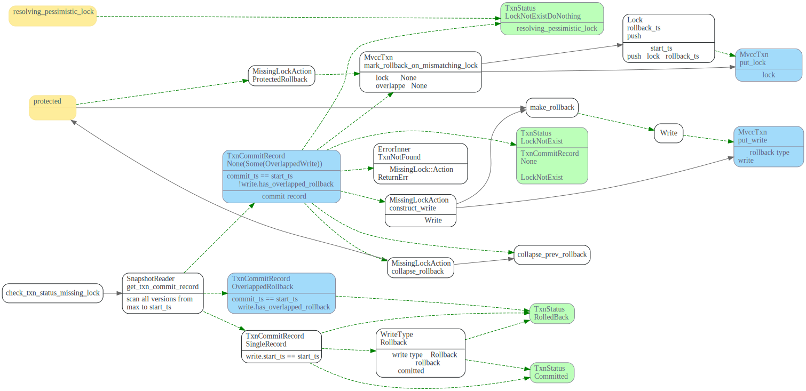
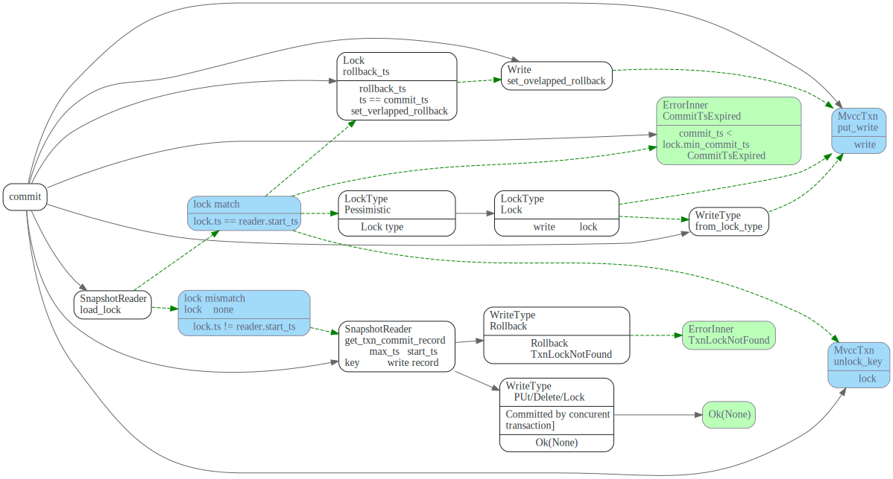
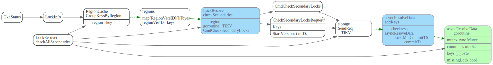
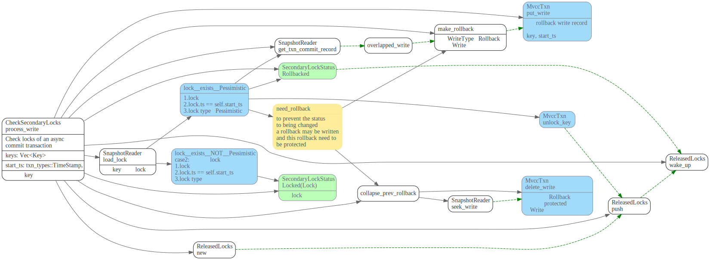

# Resolve Lock

> * 在事务(假定为t1) 在Prewrite阶段执行时，如果遇到Lock冲突，首先会先根据Lock.primaryKey
   获取持有该lock事务（假定为t2) > 状态，如果primary key的lock已过期， 则尝试清理t2遗留的lock(cleanup或者commit).
> * Asncy commit 需要check所有的secondaris keys判断事务(t2)的`commit_ts`
> * WriteType::Rollback类型的Write,写入的key ts为事务的`start_ts`,可能和其他事务的`commit_ts`相等，
>   因此在commit或者rollback_lock时，需要特殊处理。

<!-- toc -->

## Prewrite 阶段处理lock冲突

在TiDB prewrite阶段，如果遇到lock，会尝试resolveLocks，resolveLocks会尝试获取
持有lock的事务的状态，然后去resolve lock. 如果lock 没有被resolve, 还被其他
事务所持有，则返回要sleep的时间。prewite BackoffWithMaxSleep后，重新尝试去resolve locks。


TiDB resolve lock 流程如下

```go
// ResolveLocks tries to resolve Locks. The resolving process is in 3 steps:
// 1) Use the `lockTTL` to pick up all expired locks. Only locks that are too
//    old are considered orphan locks and will be handled later. If all locks
//    are expired then all locks will be resolved so the returned `ok` will be
//    true, otherwise caller should sleep a while before retry.
// 2) For each lock, query the primary key to get txn(which left the lock)'s
//    commit status.
// 3) Send `ResolveLock` cmd to the lock's region to resolve all locks belong to
//    the same transaction.
```


对于primary key已经过期的事务，则尝试去resolve locks，根据事务类型有不同的resolve 方法
1. `resolveLock`: resolve正常提交的乐观事务lock
2. `resolveLocksAsync`: 处理async commit的乐观事务txn locks，需要checkAllSecondaris key的
    `min_commit_ts`来计算最终的`commit_ts`.
3. `resolvePessimisticLock`: resolve 悲观事务lock

## 获取事务状态


### client getTxnStatusFromLock

resolveLocks 首先会根据`lock.primarykey`, 调用`LockResolver::getTxnStatus`去获取持有这个lock的事务的状态。


### TiKV CheckTxnStatus

事务(假定为t2)，prewrite阶段遇到Lock(假定为事务t1的lock)冲突时，会发CheckTxnStatus GRPC请求到TiKV
该Cmd主要功能如下：

```rust
    /// checks whether a transaction has expired its primary lock's TTL, rollback the
    /// transaction if expired, or update the transaction's min_commit_ts according to the metadata
    /// in the primary lock.
    /// When transaction T1 meets T2's lock, it may invoke this on T2's primary key. In this
    /// situation, `self.start_ts` is T2's `start_ts`, `caller_start_ts` is T1's `start_ts`, and
    /// the `current_ts` is literally the timestamp when this function is invoked; it may not be
    /// accurate.
```


CheckTxnStatus 根据`lock.primary_key`检查事务t1的状态，在检查过程中，如果t1的lock过期，则可能会rollback t1。

主要会调用`check_txn_status_lock_exists`和`check_txn_status_missing_lock`来处理lock的几种可能情况:

1. `check_txn_status_lock_exists`： 如果Lock存在且t1还持有该lock， 如果lock没过期，更新lock的`min_commit_ts`, 返回TxnStatus::Uncommitted状态；如果lock已过期，会<b>rollback_lock</b>, 并返回TxnStatus::Expire状态.

2. `check_txn_status_missing_lock`：lock不存在或者lock.ts已经不是t1了，t1可能已经commited了，也可能被rollback了。
需要调用`get_txn_commit_record`，扫描从`max_ts`到`t1.start_ts`之间key的write record来判断t1状态。

调用流程图如下，其中黄色的是GRPC请求中带上来的数据。

1. `primary_key` lock的primary key
2. `caller_start_ts`  如果lock没被提交或者rollback，会用它来更新lock的min_commit_ts
3. `current_ts` 调用getTxnStat接口时，传入的当前ts.


#### rollback_lock

t1的primary lock过期时，rollback_lock调用流程如下:


如果locktype 为put, 并且value没有保存在Lock的short_value字段中，则需要删掉之前写入的value.



主要是提交了Rollback类型的Write, 注意此处的key为 `key t1.start_ts`, 而不是`key t1.commit_ts`
这是和pecolator论文中不一样的地方，可能会出现t1.start_ts和其他事务commit_ts一样的情况。


#### get_txn_commit_record

事务t2遇到持有lock时t1时，调用`get_txn_commit_record`  扫描从max_ts到t2.start_ts的所有write record，
获取事务t1的状态。

##### `TxnCommitRecord::SingleRecord`

找到了`write.start_ts = t1.ts1`的WriteRecord，可以根据
该record的WriteType来判断事务状态，如果为Rollback则事务状态为rollback. 否则就是Committed。

##### `TxnCommitRecord::OverlappedRollback`

找到了`t1.start_ts == t3.commit_ts`，t3的write record，并且t3 write record中
`has_overlapped_write`为<b>true</b>，这时候可以确定事务的状态为Rollback

事务t1.start_ts和事务t3.commit_ts相同，并且write columns中，t3的write已经提交了。如果
直接写入t1的rollback，会覆盖掉t3之前的提交。为了避免该情况，只用将t3 write record中的
`has_overlapped_rollback` 设置为true即可。



##### `TxnCommitRecord::None(Some(write))`

找到了`t1.start_ts == t3.commit_ts` t3的write record，并且
t3 WriteRecord的`has_overlapped_write` 为<b>false</b>，后续rollback_lock和check_txn_status_missing_lock 
会将该字段设置为true.

t1先写入write rollback, 然后t3 commit时，会覆盖掉t1的write rollback.



##### `TxnCommitRecord::None(None)`

如果状态为`TxnCommitRecord::None(None)`,并且Lock 现在被t4所持有，则将t1.start_ts
加入到Lock.rollback_ts数组中，这样在t4被commit时，如果t4.commit_ts == t1.start_ts
会将t4的write record的has_overlapped_write设置为true.

从max_ts到`t2.start_ts`没找到相关的write record.


#### `check_txn_status_missing_lock`

check_txn_status_missing_lock会调用`get_txn_commit_record`计算t1的commit状态，




另外一种情形是，t1.start_ts == t3.commit_ts, 并且t1先被rollback了, t3 commit时，
会覆盖掉t1的rollback write record，这种check_txn_status_missing_lock 更新t3 
commit 的has_overalpped rollback设为为true.


上图中绿色的就是最后返回的txn status, 对应的enum如下,在TiDB中对应于返回字段中的Action.

```rust
/// Represents the status of a transaction.
#[derive(PartialEq, Debug)]
pub enum TxnStatus {
    /// The txn was already rolled back before.
    RolledBack,
    /// The txn is just rolled back due to expiration.
    TtlExpire,
    /// The txn is just rolled back due to lock not exist.
    LockNotExist,
    /// The txn haven't yet been committed.
    Uncommitted {
        lock: Lock,
        min_commit_ts_pushed: bool,
    },
    /// The txn was committed.
    Committed { commit_ts: TimeStamp },
    /// The primary key is pessimistically rolled back.
    PessimisticRollBack,
    /// The txn primary key is not found and nothing is done.
    LockNotExistDoNothing,
}
```

```go
type Action int32

const (
	Action_NoAction                     Action = 0
	Action_TTLExpireRollback            Action = 1
	Action_LockNotExistRollback         Action = 2
	Action_MinCommitTSPushed            Action = 3
	Action_TTLExpirePessimisticRollback Action = 4
	Action_LockNotExistDoNothing        Action = 5
)
```


## 清理expired lock

### resolveLock

TiDB 获取根据Lock.primary key获取完txn状态后，
开始resolve secondary key的lock.向TiKV
发起resolve Lock request.


#### TiKV 执行CmdResolveLock
TiKV收到ResolveLock Request后，有三种case

1. `commit_ts > 0`, 并且txn还持有该lock，则commit
2. `commit_ts == 0`, 并且txn还持有该lock, 则rollback.
3. 如果lock为None, 或者lock.ts已经发生改变了，则`check_txn_status_missing_lock`


其中rollback和 check_txn_status_missing_lock 逻辑和上面 CheckTxnStatus中的一致。

#### TiKV commit 处理流程:




### resolveLocksAsync

TiDB 中首先调用`checkAllSecondaries`来获取txn的Status, 然后对所有的secondaries keys按照region分组，并且每个分组启动一个go routine,  并发的发送CmdResolveLock 请求给TiKV


#### client checkAllSecondaries



#### TiKV CmdCheckSecondaryLocks


```rust
    /// Check secondary locks of an async commit transaction.
    ///
    /// If all prewritten locks exist, the lock information is returned.
    /// Otherwise, it returns the commit timestamp of the transaction.
    ///
    /// If the lock does not exist or is a pessimistic lock, to prevent the
    /// status being changed, a rollback may be written.
```

```rust
#[derive(Debug, PartialEq)]
enum SecondaryLockStatus {
    Locked(Lock),
    Committed(TimeStamp),
    RolledBack,
}
```
##### lock match
如果txn还持有该lock，对于乐观事务，会返回lock信息，而悲观事务，则会unlock key? 向write column
写入rollback信息。(为什么？）



##### lock mismatch

如果lock已经被其他事务所持有。或者Lock已经被resolve.


### resolvePessimisticLock

PessimisticLock事务的悲观锁，多了一个forUpdateTs, 而且是直接清理lock，不像乐观锁那样，要写入rollback 类型的Write， 这个是为什么呀？


# TODO

研究下这个rollback must be protected。
// The rollback must be protected, see more on

 OverlappedRollback 和overlapped write代表什么意思？

// [issue #7364](https://github.com/tikv/tikv/issues/7364)

> Assume that we have three clients {c1, c2, c3} and two keys {k1, k2}:
> 
> 1. Pessimistic client c1 acquires a pessimistic lock on k1(primary), k2. But the command for k1 is lost at this point.
> 2. Optimistic client c2 requires to clean up the lock on k2
> 3. k1 is rollbacked and a write record ("rollback", c1_start_ts, not_protected) is written into k1 (not_protected because the lock on k1 is missing), and a cleanup(primary=k1, ts=c1_start_ts)(*1) is sent but lost at this point.
> 4. Client c3 prewrites k1
> 5. Client c2 requires to clean up the lock on k1
> 6. k1 is rollbacked and the rollback write record is collapsed to ("rollback", c3_start_ts, protected/not_protected)
> 7. Client c1 retries to lock on k1
> 8. k1 is locked by c1
> 9. Client c1 prewrites k1, k2
> 10. k1, k2 are prewrited by c1, and c1 received the prewrite succeed response
> 11. The lost cleanup command (*1) in step 3 is received by k2, therefore k2 is rollbacked
> 12. Client c1 commit k1
> 13. k1 is committed, while k2 is rollbacked
> 
> Then atomic guarantee is broken.

`get_txn_commit_record` 这方法需要仔细研究下。

rollback, make_rollback, collapse_prev_rollback 这几个关系是啥？

### lock rollback ts

`commit_ts`和`start_ts` 相等的时候会出现的情况。

为什么会出现相等呢？

写WriteType::Rollback时候，用的是start_ts, 而key被commit时候，write record的
key为`key commit_ts`, 当`start_ts == commit_ts`时，事务的rollback可能被
`commit_ts`所覆盖掉。


按照pecolator论文，commit时候，commit_ts一定比之前所有的start_ts大呀，为什么还会出现
被覆盖掉的情况呢？

是不是和Pingcap引入了并发的prewrite有关呢？


