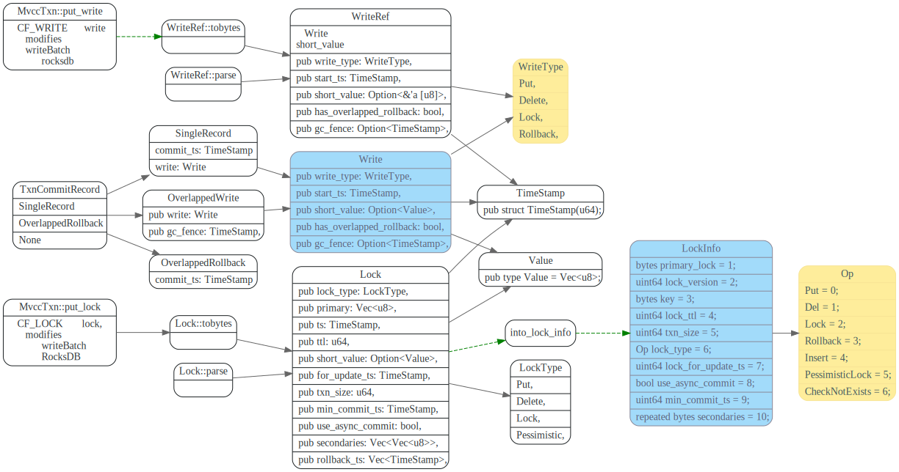
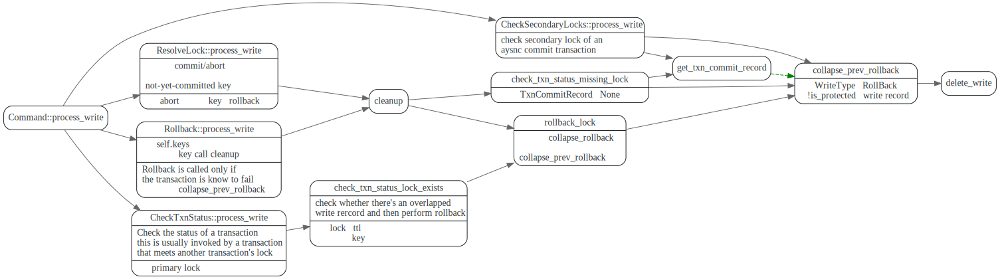
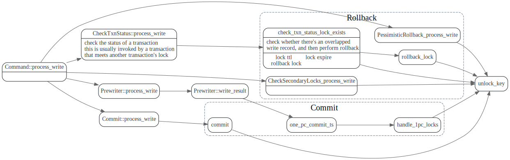

# Txn Types

> * 关键数据类型为Write/Lock
> * 使用MvccTxn来写Write/Lock, MvccReader来读lock/write

<!-- toc -->

## 基本数据结构

核心的数据结构为`Write`和`Lock`, `WriteRef`中的short value是
引用，其他的都和`Write`一样。

Write结构在`to_bytes`后，会写到column family `CF_WRITE`中，
key 为`{user_key}{commit_ts}`.

Lock结构在`to_bytes`序列化后，会写到column family `CF_LOCK`中，
key为 `{user_key}`

### Write
Write有四种类型, 包含了正常的Put/Delete，TiKV新增了RollBack和Lock.
* Put: 新增或者修改key，value
* Delete删除某个key对应的value.
* RollBack ?
* Lock ?

### Lock

Lock也有四种类型:

* Put
* Delete
* Lock
* Pessimistic: 悲观锁？

### TxnCommitRecord

这个作用是什么？
t2.commit_ts == t1.start_ts, 这个会发生吗？
不是说commit_ts要大于所有之前的start_ts吗？

### MvccTxn

TiKV会使用MvccTxn来修改lock和Write,  MvccTxn首先会将这些修改
放到成员变量`modifies`中，然后被转换成WriteResult，最后调用
store engine的 async_write_ext将修改写入raft engine。

## Write

### MvccTxn::put_write

对Write column写入主要分两类，一类是commit, 一类是rollback.

#### commit

commit分两种，一种是1pc commit, 这个是TiKV对2pc commit的优化，
如果涉及的key只有一个？就可以用1pc commit, 另外一种是正常的
commit

#### rollback
写入Rollback是因为TiKV 做了prewrite 并行化，如果某个key需要rollback,
其他的并发执行时候，看到write record为rollback，就自动rollback了，
不等到超时。

>The Rollback record is a mark to indicate that the transaction with start_ts in the record has been rolled back, and if a prewrite request arrives later than the rollback request, the prewrite will not succeed. This situation may be caused by network issues. The correctness won’t be broken if we allow the prewrite to succeed. However, the key will be locked and unavailable until the lock’s TTL expires.

那这个rollback记录什么时候删掉呢？

write record有个protected标记

### MvccTxn::delete_write

delete write record主要删除write type 为RollBack类型的

#### GC

GC 这个满足什么标准才能删掉呢?

## Lock

### MvccTxn::put_lock

在prewrite阶段上锁, 不太明白为啥其他check之类的也会去put lock?

这里面的lock中的rollback_ts 作用是啥?

### MvccTxn::unlock

CheckSecondaryLocks 里面为啥要把lock rollblack掉？
谁会调用CheckSecondaryLocks ?
谁会调用CheckTxnStatus?

## 1pc lock

## pessimistic lock

## Questions

* Lock_type的作用是什么？每个种类都是干嘛用的
* WriteType中的Lock和RollBack呢？
* 什么是overlapped write, 什么是OverlappedRollback ?
* min_commit_ts
* ttl 执行时间很长的事务，是怎么给自己的lock续命的？expire lock是在哪里被清理掉的？
* gc_fence 是什么？是干什么用的
* 1pc lock为什么可以1pc? 因为只有一个参与者吗？
* async commit这块涉及了哪些代码？增加了哪些属性和check?
* MissingLockAction  什么叫MissingLockAction?自己的lock 已经被别人清理掉了？
* Percolator 论文中的rollback forward 在TiKV中对应的代码是?
* SecondaryLockStatus
* CheckTxnStatus 和CheckSecondaryLocks 区别是什么?

### overlapped write/rollback

has_overlapped_rollback
get_txn_commit_record

>TiDB 的悲观锁实现的原理确实如此，在一个事务执行 DML (UPDATE/DELETE) 的过程中，TiDB 不仅会将需要修改的行在本地缓存，同时还会对这些行直接上悲观锁，这里的悲观锁的格式和乐观事务中的锁几乎一致，但是锁的内容是空的，只是一个占位符，待到 Commit 的时候，直接将这些悲观锁改写成标准的 Percolator 模型的锁，后续流程和原来保持一致即可，唯一的改动是：
>对于读请求，遇到这类悲观锁的时候，不用像乐观事务那样等待解锁，可以直接返回最新的数据即可（至于为什么，读者可以仔细想想）

## 参考

1. [TiDB 新特性漫谈: 悲观事务](https://pingcap.com/blog-cn/pessimistic-transaction-the-new-features-of-tidb/)
