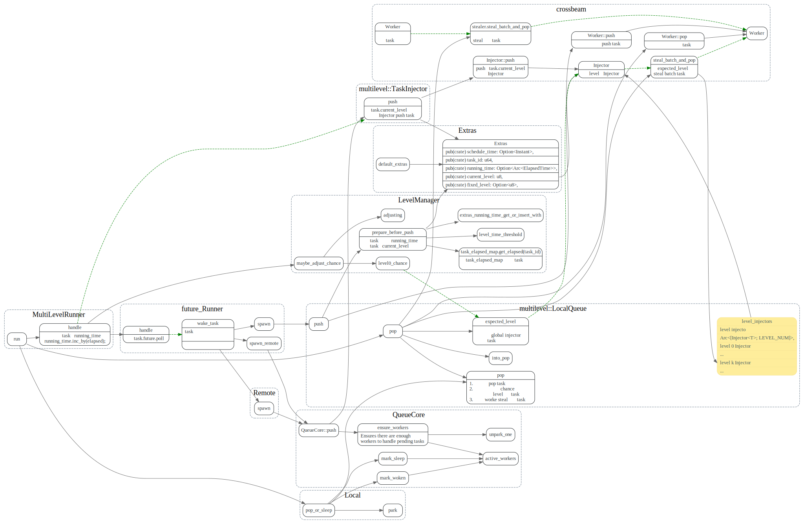

# yatp

<!-- toc -->

## 数据结构关系


## worker thread

### run

`WorkerThread::run` 线程主循环, 不断的去队列中
获取task, handle task。


## callback

## future

### task status

```rust
const NOTIFIED: u8 = 1;
const IDLE: u8 = 2;
const POLLING: u8 = 3;
const COMPLETED: u8 = 4;
```

如果`task.poll`调用了`ctx.wake`, 并且返回了`Pending`，就会出现poll结束后，task
的`NOTIFIED`状态, 这时候可以重新调用`task.poll`，如果超过了`repoll_limit`
则会调用`wake_task`, 把任务放入调度队列中。


### reschedule

yatp 提供了reschedule, task自己主动让出time slice.

比如下面, while循环中会自己计算自己的time_slice
如果超过了`MAX_TIME_SLICE`就会调用`reschedule.await`
并重置`time_slice_start`

```rust
//src/coprocessor/statistics/analyze.rs#L101
async fn handle_index( //...
//...
let mut time_slice_start = Instant::now();
while let Some((key, _)) = scanner.next()? {
    row_count += 1;
    if row_count >= BATCH_MAX_SIZE {
        if time_slice_start.elapsed() > MAX_TIME_SLICE {
            reschedule().await;
            time_slice_start = Instant::now();
        }
        row_count = 0;
    }
//...
```

`reschedule` async 定义如下

```rust
/// Gives up a time slice to the task scheduler.
///
/// It is only guaranteed to work in yatp.
pub async fn reschedule() {
    Reschedule { first_poll: true }.await
}
```


### waker

实现了`RawWakerVtable`中的几个函数, 最后都会调用`wake_task` 
将task队列中.

这里面`RawWaker.data` data指针指向的是`task_cell`

`task_cell`中包含了指向`QueueCore`的weake指针.


###  wake_task
如果是在`polling`中被wake的，可使用
thread 局部变量`LOCAL` 指针，它指向了worker自己的`Local`。

该指针由`Scope`来设置, 在进入`future::Runner:handle`时
会被设置好,离开该函数时 由`Scope`的drop函数将LOCAL指针设置为`null`.


## LocalQueue


### SingleLevel::LocalQueue


`spawn` 和`pop` task过程

task 的`spawn`有两处，一处是`ThreadPool::spawn` 外部线程
来执行async task，另一处是Future等待的事件ready后
调用的ctx.wake 将task 放回到队列中。

在`WorkerThread`主线程中会不断地去pop task, 先从
自己本地的local queue取task，为空的话，再去
global queue steal 一个batch的task.

如果还是没有的话， 就去别的worker那steal一批task.
最后如果没有可执行的task, 就进入sleep状态.


### Multilevel::LocalQueue

multilevel 为了避免long run的task阻塞了其他async task的执行。
使用了多个Injector level。Injector level越高，injector 会被pop的
优先级(概率）就越低。

在task被reschedule时，会根据task的`running_time` 放到不同的level injector中。
task运行时越长，被放入的level就越高

默认level0 用于跑小任务，时间在`<5ms`, level1 是 `5ms ~ 100ms`, level2是`>100ms`的
```rust
impl Default for Config {
    fn default() -> Config {
        Config {
            name: None,
            level_time_threshold: [Duration::from_millis(5), Duration::from_millis(100)],
            level0_proportion_target: 0.8,
        }
    }
}
```

在worker去Injector获取任务时，会根据一定概率来选择某个level的injector, 计算方式如下:

`expected_level`的计算
先根据`level0_chance` 概率level0，
然后从level1 ~ Level_NUM -1 依次按照概率 `CHANCE_RATIO/(CHANCE_RATIO +1)`
选择level.

```rust
let expected_level = if rng.gen::<f64>() < level0_chance {
    0
} else {
    (1..LEVEL_NUM - 1)
        .find(|_| rng.gen_ratio(CHANCE_RATIO, CHANCE_RATIO + 1))
        .unwrap_or(LEVEL_NUM - 1)
};

const LEVEL_NUM: usize = 3;
/// The chance ratio of level 1 and level 2 tasks.
const CHANCE_RATIO: u32 = 4;
```

`prepare_before_push`, 会根据task的running_time, 和每个level的level_time_threshold,
设置task的`current_level`, 后面task 会push到`current_level`对应的injector.
```rust
let running_time = extras
    .running_time
    .get_or_insert_with(|| self.task_elapsed_map.get_elapsed(task_id));
let running_time = running_time.as_duration();
self.level_time_threshold
    .iter()
    .enumerate()
    .find(|(_, &threshold)| running_time < threshold)
    .map(|(level, _)| level)
    .unwrap_or(LEVEL_NUM - 1) as u8
```


在每次`MultilevelRunner::handle` task时，都会更新task的`running_time`

也会每隔一段时间调用`maybe_adjust_chance` 更新level0_chance.

```rust
impl<R, T> Runner for MultilevelRunner<R>
    fn handle(&mut self, local: &mut Local<T>, mut task_cell: T) -> bool {
        let extras = task_cell.mut_extras();
        let running_time = extras.running_time.clone();
        //...
        let begin = Instant::now();
        let res = self.inner.handle(local, task_cell);
        let elapsed = begin.elapsed();

        //更新task的runnig_time
        if let Some(running_time) = running_time {
            running_time.inc_by(elapsed);
        }

        //...
        if local_total > FLUSH_LOCAL_THRESHOLD_US {
        //...
        //调整level0_chance
            self.manager.maybe_adjust_chance();
        }

```


multilevel spawn 和pop




## 参考文献

1. [Futures Explained in 200 Lines of Rust](https://cfsamson.github.io/books-futures-explained/introduction.html)
2. [optimizing-await-1](https://tmandry.gitlab.io/blog/posts/optimizing-await-1/)
