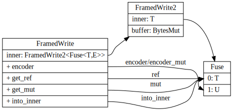

# codec

## Transport

Codec

This is often known as “framing”: instead of viewing your connections as consisting of just bytes in/bytes out, you view them as “frames” of application data that are received and sent. A framed stream of bytes is often referred to as a “transport”.

## Encode/Decode Trait

有点像序列化和反序列化

Encoder
```rust
pub trait Encoder {
    /// The type of items consumed by the `Encoder`
    type Item;

    /// The type of encoding errors.
    ///
    /// `FramedWrite` requires `Encoder`s errors to implement `From<io::Error>`
    /// in the interest letting it return `Error`s directly.
    type Error: From<io::Error>;

    /// Encodes a frame into the buffer provided.
    ///
    /// This method will encode `item` into the byte buffer provided by `dst`.
    /// The `dst` provided is an internal buffer of the `Framed` instance and
    /// will be written out when possible.
    fn encode(&mut self, item: Self::Item, dst: &mut BytesMut) -> Result<(), Self::Error>;
}
```

Decoder
```rust
pub trait Decoder {
    type Item;
    type Error: From<io::Error>;
    fn decode(&mut self, src: &mut BytesMut) -> Result<Option<Self::Item>, Self::Error>;
    fn decode(&mut self, src: &mut BytesMut) -> Result<Option<Self::Item>, Self::Error>;
    fn framed<T: AsyncRead + AsyncWrite + Sized>(self, io: T) -> Framed<T, Self>
}
```


## framed

frame write


