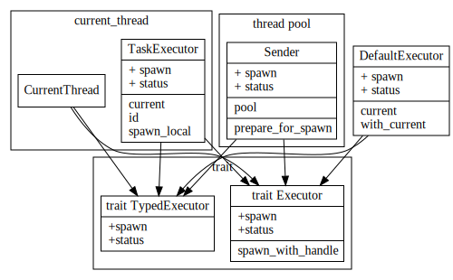
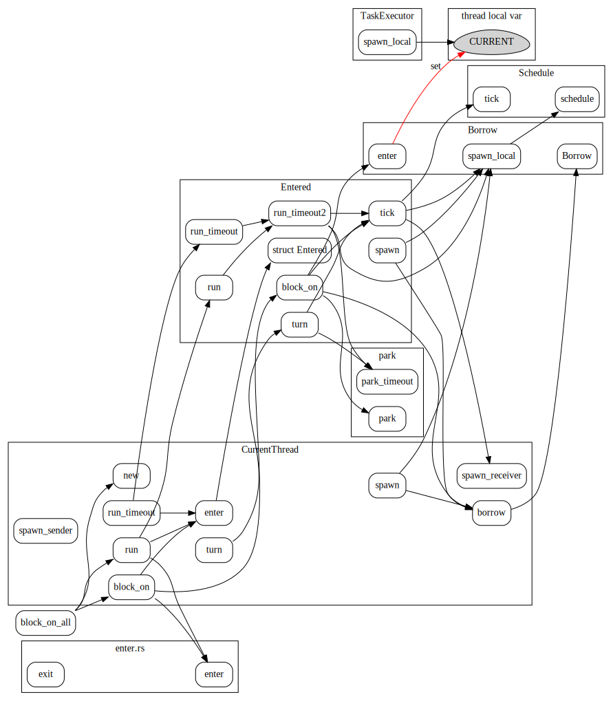

# Executor

Executor中主要有``Executor``, ``TypedExecutor``, ``enter``, ``DefaultExecutor``, ``Park``

1. ``Executor``, ``TypedExecutor``主要作用是spawn future，转换为相应的任务，然后去执行该任务，不断的poll future,直到future complete.

2. ``DefaultExecutor``作用，是将``tokio::spawn``的future转给当前默认的executor.

3. ``enter``　用于阻止在当前executor context中，再start一个executor

4. ``park``　是对线程``block/unblock``操作的抽象.

原文如下（摘自tokio-executor/src/lib.rs)

* The [`Executor`] trait spawns future object onto an executor.

* The [`TypedExecutor`] trait spawns futures of a specific type onto an
  executor. This is used to be generic over executors that spawn futures
  that are either `Send` or `!Send` or implement executors that apply to
  specific futures.

* [`enter`] marks that the current thread is entering an execution
  context. This prevents a second executor from accidentally starting from
  within the context of one that is already running.

* [`DefaultExecutor`] spawns tasks onto the default executor for the current
  context.

* [`Park`] abstracts over blocking and unblocking the current thread.


## Executor impl

实现Executor接口的主要有current thread，task executor, default executor还有thread pool的executor.



### DefaultExecutor

DefaultExecutor 扮演了入口的角色，会将spawn调用转发给thread local storage var的Executor;


### current thread

current thread executor 是单线程的executor。task spwan和execute是在同一线程上完成的。

代码中Entered和Borrow的作用是干啥的不太明白，感觉这块代码有点绕.

Entered和Borrow定义如下:
```rust
/// A `CurrentThread` instance bound to a supplied execution context.
pub struct Entered<'a, P: Park> {
    executor: &'a mut CurrentThread<P>,
}
```

```rust
/// This is mostly split out to make the borrow checker happy.
struct Borrow<'a, U> {
    id: u64,
    scheduler: &'a mut Scheduler<U>,
    num_futures: &'a atomic::AtomicUsize,
}
```




### thread pool sender

thread pool的sender使用future创建相应的task, 然后调用pool的``submit_external``提交任务
```rust
    fn spawn(
        &mut self,
        future: Pin<Box<dyn Future<Output = ()> + Send>>,
    ) -> Result<(), SpawnError> {
        self.prepare_for_spawn()?;

        // At this point, the pool has accepted the future, so schedule it for
        // execution.

        // Create a new task for the future
        let task = Arc::new(Task::new(future));

        // Call `submit_external()` in order to place the task into the global
        // queue. This way all workers have equal chance of running this task,
        // which means IO handles will be assigned to reactors more evenly.
        self.pool.submit_external(task, &self.pool);

        Ok(())
    }
```


## Executor setup

thread local var ``EXECUTOR``的设置过程

```rust
thread_local! {
    /// Thread-local tracking the current executor
    static EXECUTOR: Cell<State> = Cell::new(State::Empty)
}
```


在调用``tokio::spawn``时，会通过DefaultExecutor调用相应的Thread local storage中设置好的Executor

```rust
//tokio-executor/src/global.rs
pub fn spawn<T>(future: T)
where
    T: Future<Output = ()> + Send + 'static,
{
    DefaultExecutor::current().spawn(Box::pin(future)).unwrap()
}
```

```rust
//tokio-executor/src/global.rs
impl DefaultExecutor {
    #[inline]
    fn with_current<F: FnOnce(&mut dyn Executor) -> R, R>(f: F) -> Option<R> {
        EXECUTOR.with(
            |current_executor| match current_executor.replace(State::Active) {
                State::Ready(executor_ptr) => {
                    let executor = unsafe { &mut *executor_ptr };
                    let result = f(executor);
                    current_executor.set(State::Ready(executor_ptr));
                    Some(result)
                }
                State::Empty | State::Active => None,
            },
        )
    }
}
```
