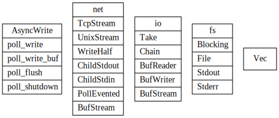

# tokio io


Core I/O abstractions for the Tokio stack.

AsyncRead/AsyncWrite use nonblock IO

**non-blocking**. All non-blocking I/O objects must return an error when
bytes are unavailable instead of blocking the current thread.

Would block error to future Not Ready poll

## AsyncRead

- `poll_read`: Attempt to read from the `AsyncRead` into `buf`.
- `poll_read_buf`: Pull some bytes from this source into the specified `BufMut`, returning how many bytes were read.

AsyncReadExt An extension trait which adds utility methods to `AsyncRead` types.

This trait inherits from std::io::Read and indicates that an I/O object is non-blocking. All non-blocking I/O objects must return an error when bytes are unavailable instead of blocking the current thread.


## AsyncWrite

- `poll_write`:  Attempt to write bytes from `buf` into the object.
- `poll_write_buf`: Write a `Buf` into this value, returning how many bytes were written.
- `poll_flush`: Attempt to flush the object, ensuring that any buffered data reach their destination.
- `poll_shutdown`: Initiates or attempts to shut down this writer, returning success when the I/O connection has completely shut down.



### tcp stream

/// An I/O object representing a TCP stream connected to a remote endpoint.


## Split

Split a single value implementing `AsyncRead + AsyncWrite` into separate
`AsyncRead` and `AsyncWrite` handles. 还不是太明白这个地方为啥需要lock ?类似与rw lock？

将一个stream分为reader, write部分，解决需要两次mut引用问题（src, dst)


调用``poll_read``, ``poll_write``都会调用``poll_lock``, 此处的``poll_lock``并不会block线程。类似于spin lock。
```rust
// 类似与Spin Lock.
impl<T> Inner<T> {
    fn poll_lock(&self, cx: &mut Context<'_>) -> Poll<Guard<'_, T>> {
        if !self.locked.compare_and_swap(false, true, Acquire) {
            Poll::Ready(Guard { inner: self })
        } else {
            // Spin... but investigate a better strategy

            ::std::thread::yield_now();
            cx.waker().wake_by_ref();

            Poll::Pending
        }
    }
}

// 用于Mutex 
impl<T> Guard<'_, T> {
    fn stream_pin(&mut self) -> Pin<&mut T> {
        // safety: the stream is pinned in `Arc` and the `Guard` ensures mutual
        // exclusion.
        unsafe { Pin::new_unchecked(&mut *self.inner.stream.get()) }
    }
}
```


## Copy

future copy实现了从reader异步write到write逻辑

```rust
impl<R, W> Future for Copy<'_, R, W>
where
    R: AsyncRead + Unpin + ?Sized,
    W: AsyncWrite + Unpin + ?Sized,
{
    type Output = io::Result<u64>;

    fn poll(mut self: Pin<&mut Self>, cx: &mut Context<'_>) -> Poll<io::Result<u64>> {
        loop {
            // If our buffer is empty, then we need to read some data to
            // continue.
            if self.pos == self.cap && !self.read_done {
                let me = &mut *self;
                // 从reader中异步读取n个字节
                let n = ready!(Pin::new(&mut *me.reader).poll_read(cx, &mut me.buf))?;
                if n == 0 {
                    self.read_done = true;
                } else {
                    self.pos = 0;
                    self.cap = n;
                }
            }

            // If our buffer has some data, let's write it out!
            while self.pos < self.cap {
                let me = &mut *self;
                // 异步写n个字节到writer中
                let i = ready!(Pin::new(&mut *me.writer).poll_write(cx, &me.buf[me.pos..me.cap]))?;
                if i == 0 {
                    return Poll::Ready(Err(io::Error::new(
                        io::ErrorKind::WriteZero,
                        "write zero byte into writer",
                    )));
                } else {
                    self.pos += i;
                    self.amt += i as u64;
                }
            }

            // If we've written al the data and we've seen EOF, flush out the
            // data and finish the transfer.
            // done with the entire transfer.
            if self.pos == self.cap && self.read_done {
                let me = &mut *self;
                // 最后写完了等待flush
                ready!(Pin::new(&mut *me.writer).poll_flush(cx))?;
                return Poll::Ready(Ok(self.amt));
            }
        }
    }
}
```

## Transport

Codec

This is often known as “framing”: instead of viewing your connections as consisting of just bytes in/bytes out, you view them as “frames” of application data that are received and sent. A framed stream of bytes is often referred to as a “transport”.


### buf reader/writer/sream
