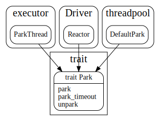
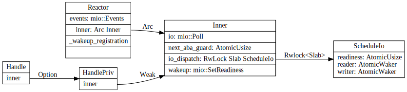
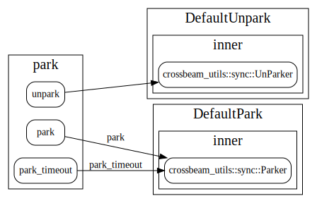
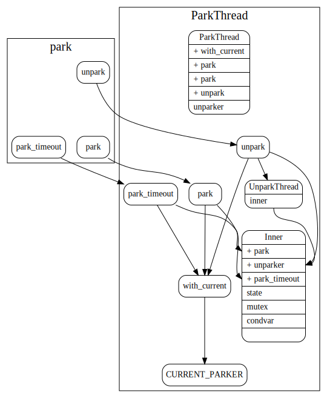

# park

park是对当前线程block和unblock操作的抽象, 和std的park/unpark操作来比，在线程被blocked的时候，可以去调用一些定制化的功能。

## Park impl

### Reactor Park

Reactor 相关数据结构如下, 

Par接口的park/unpark操作主要依赖于mio的poll和SetReadness。

### Thread pool default park

线程池的default park主要依赖于croess beam的park和unpark

### ParkThread

数据结构之间关系

接口调用关系

