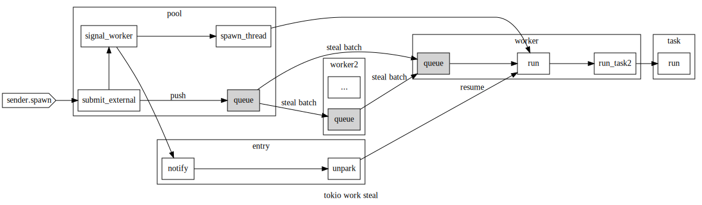

# tokio thread pool

## schedule

tokio 使用了crossbeam中的Queue, Stealer, Worker等来实现线程池，其中觉得有意思的地方时work stealing策略

每个task被分给worker的过程如下：有个pool.queue作为全局的task队列入口每次spawn task都会将task push到pool.queue中

worker run函数取task的逻辑如下：
1. 从自己的worker队列中去取任务.
2. 如果自己队列中没任务，则从全局队列中，获取一批任务。
3. 如果全局队列中也没任务，则随机的从其他的worker中steal一批任务。

这样做的好处是，降低对全局队列的频繁加锁等操作，而且有steal机制，使得worke可以比较均匀的被调度。

