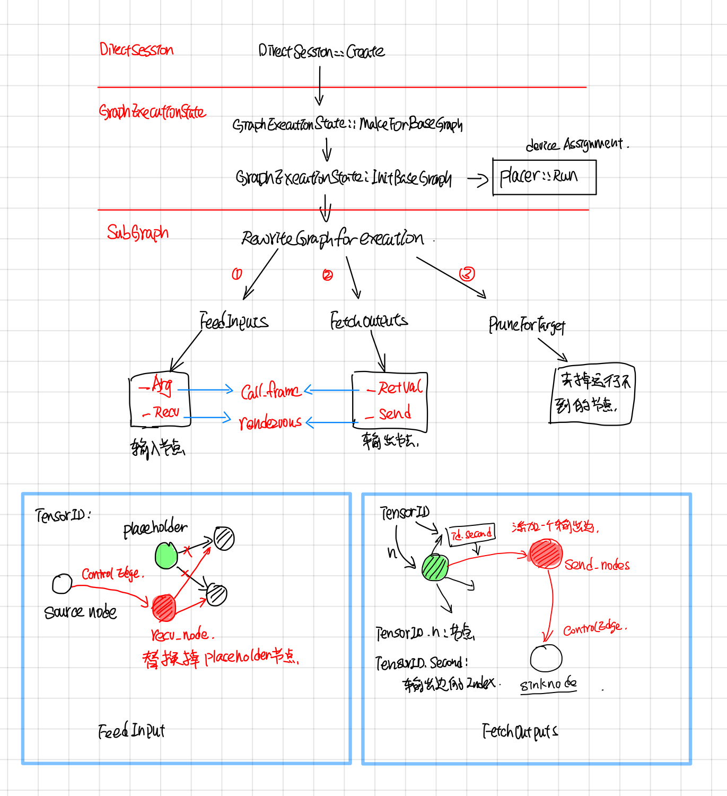
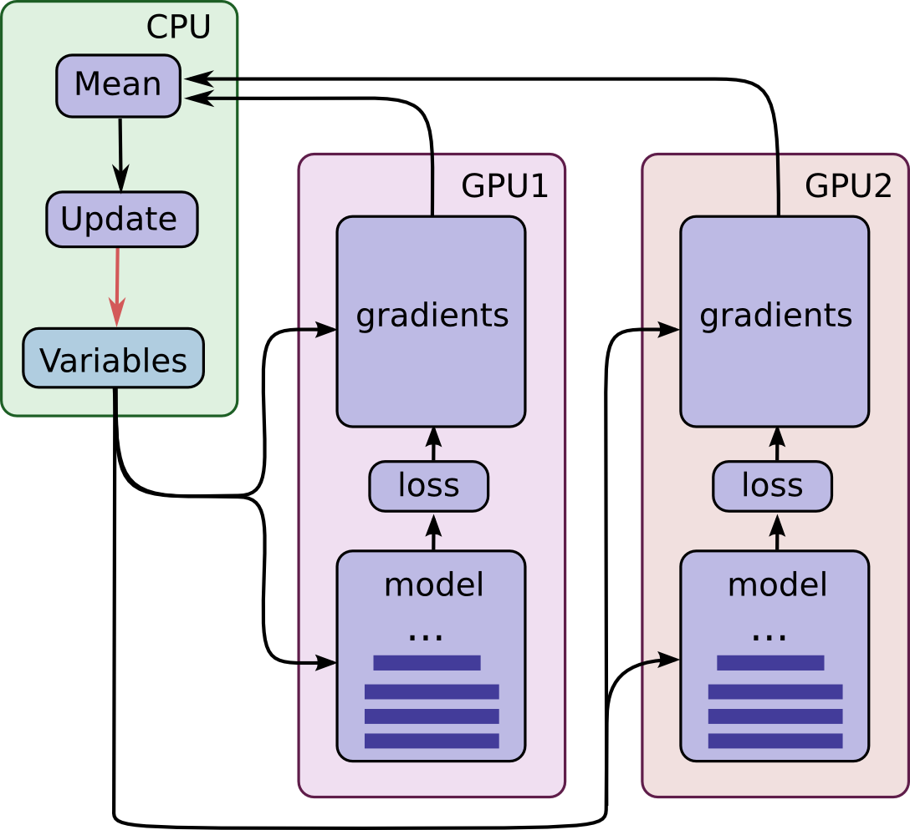

Tensorflow Direct Session (Draft)
--------------------------------

### 摘要

本文主要分析了tensorflow 中DirectSession部分的代码。如果把executor 执行graph当成一个函数的话，那么Tensorflow中Session主要功能是把用户传过来的一些参数Feeds到compute graph中，然后运行到graph target node，最后在graph computation完成之后，取出用户指定名字的一些tensor。

DirectSession 则主要工作以下几方面：

1. Rewrite Graph： 将FeedInputs和FetchOutputs节点加到graph中，然后去掉graph中运行不到的节点，最后采用并查集的方式，给graph中每个node分配一个device。
2. Graph partition：根据每个node所device，将node划分成不同的subgraph, subgraph之间添加send和recv节点做不同device之间的通信。
3. CeateExecutors：每个device的subgraph会创建一个Executor来执行graph computation。
4. Fetch outputs：对于DirectSession来说，FeedInputs和FetchOutputs 所添加的节点是``_Arg``和``_RetVal``，这两个节点会通过directSession的callframe来读写input，output。


### RewriteGraph

RewriteGraph这块的callstack如下图所示，主要主要涉及到 GraphExecutionState, SubGraph, Placer这三块。

GraphExecutionState据文档所说(graph_execution_state.h)，其主要作用是按照BuildGraphOptions选项将Graph转换成可执行的Client Graph。

> GraphExecutionState is responsible for generating an
> executable ClientGraph from the original GraphDef that specifies
> the complete graph and from BuildGraphOptions which specifies
> input/output nodes.

ClientGraph与GraphDef的区别是： ClientGraph中每个node都被Assign了某个Device，这部分由Placer完成；另外添加了input/output nodes, 去掉了执行不到的node, 这部分由subgraph完成。

> An executable Graph differs from a GraphDef by being Placed,
> meaning that each Node is assigned to a single Device in the
> available set.



### Call frame: feed and fetch

DirectSession中采用了call frame的方式读写compution graph中的inputs/outputs 


DirectSession::Run的时候，首先会创建一个FunctionCallFrame, 把要feed的tensor填充到``FunctionCallFrame::args_``。

```cpp
// In DirectSession::Run

  FunctionCallFrame call_frame(executors_and_keys->input_types,
                               executors_and_keys->output_types);
  gtl::InlinedVector<Tensor, 4> feed_args(inputs.size());
  for (const auto& it : inputs) {
    if (it.second.dtype() == DT_RESOURCE) {
      Tensor tensor_from_handle;
      TF_RETURN_IF_ERROR(
          ResourceHandleToInputTensor(it.second, &tensor_from_handle));
      feed_args[executors_and_keys->input_name_to_index[it.first]] =
          tensor_from_handle;
    } else {
      feed_args[executors_and_keys->input_name_to_index[it.first]] = it.second;
    }
  }
  const Status s = call_frame.SetArgs(feed_args);
```


在创建Executor的时候，通过Executor::Args.call_frame把call_frame放到OpkernalContext中。

```cpp
//## DirectSessioin::Runinternal

  Executor::Args args;
  args.step_id = step_id;
  args.call_frame = call_frame;

  //other code...
  //每个device subgraph对应一个item, item.executor为这个subgraph的exeuctor.
  item.executor->RunAsync(args, barrier->Get());


//## ExecutorState::Process
  OpKernelContext::Params params;
  params.step_id = step_id_;
  params.call_frame = call_frame_;

  //other code ...
  // Synchronous computes.
  OpKernelContext ctx(&params, item.num_outputs);
  nodestats::SetOpStart(stats);
  device->Compute(CHECK_NOTNULL(op_kernel), &ctx);

```


当所有的subgraph Executor执行完毕后，通过FunctionCallFrame::ConsumeRetVals的方式把输出的tensor取出来。

```cpp
// DirectSession::Run

  if (outputs) {
    std::vector<Tensor> sorted_outputs;
    const Status s = call_frame.ConsumeRetvals(&sorted_outputs);
    if (errors::IsInternal(s)) {
 //other code
```

### Device placer


Placer 在初始的时候，用户会指定某些节点的device, 比如有的节点是gpu:0, 有的cpu:0, 有的node是gpu:1, 然后将有相同``class_``属性``@loc:xxx``的node节点放到一个集合里面，随后根据以下约束, 采用并查集的方式，对node集合进行进一步的划分:

1. 用户指定了device，就将node放到用户指定的device上
2. Generateo node 和output node放到同一个device上
3. Meta node（比如cast操作) 和input node放到同一个device上
4. Reftype 的Input, input和output节点尽量放到同一个device上
5. 采用并查集的方式将node place给device
6. 对于stateful的node, 不改变它的device assign。

stateful node 在placed之后，就不能移到别的device上了, 对于这种node，GraphExecutionState的做法是在placer run之前将stateful node的device assign保存以下，在placer run 之后再恢复回去。

>  Map of placed stateful nodes, i.e. nodes for which is_stateful()
>  is true, such as "params" and "queue" nodes.  Once placed these
>  nodes can not be moved to a different device.  Maps node names to
>  device names.

可以通过打开``log_device_placement``的方式让placer在stderr中把node的device place情况打出来:

```py
config=tf.ConfigProto(log_device_placement=True)
sess = tf.Session(config=config)
```


### Graph partition

Graph partition根据上面Placemnet的结果，将graph partition成不同的子图，子图之间添加send 和recv节点，send和recv节点会用rendzvous来传送tensor。有时候除了send和recv node还需要添加一些control flow node。


（这个地方需要看下tf implement那个文档，了解下具体情况）

### Executor Cache

提交给DirectSessoin在经过Graph Partition之后，会划分成不同的子图，比如下图将一个大的graph划分成了3个subgraph分别放置在了在CPU, GPU1, GPU2上，device之间通过rendezvous来通信，每个subgraph都会创建一个executor去执行。




在模型的训练通常会多次迭代run, 因此要加一层cache避免多次做graph的parition，多次创建executor。


```py
with tf.Session(config=config) as sess:
    sess.run([merge, gd_step], feed_dict={x: batch_xs, y_label: batch_ys})
```

cache的key为input, output，target tensor的names 连起来的。还有一个key是吧input, output, target的names分别sort之后再连起来。

DirectSession::Run中cache的key很有意思，有两个key,  首先去是未排序的，另外一个是排序的。未排序的为了快速查找，而排序的key是为了避免由于input_names中names顺序不一样导致cache miss。


```
  // Fast lookup path, no sorting.
  // Fast查询的key, 没排序
  const string key = strings::StrCat(
      str_util::Join(inputs, ","), "->", str_util::Join(outputs, ","), "/",
      str_util::Join(target_nodes, ","), "/", run_state_args->is_partial_run,
      "/", debug_tensor_watches_summary);


 // 将names分别排序然后concat起来.
  std::vector<string> inputs_sorted(inputs.begin(), inputs.end());
  std::sort(inputs_sorted.begin(), inputs_sorted.end());
  std::vector<string> outputs_sorted(outputs.begin(), outputs.end());
  std::sort(outputs_sorted.begin(), outputs_sorted.end());
  std::vector<string> tn_sorted(target_nodes.begin(), target_nodes.end());
  std::sort(tn_sorted.begin(), tn_sorted.end());

  const string sorted_key = strings::StrCat(
      str_util::Join(inputs_sorted, ","), "->",
      str_util::Join(outputs_sorted, ","), "/", str_util::Join(tn_sorted, ","),
      "/", run_state_args->is_partial_run, "/", debug_tensor_watches_summary);
  // Set the handle, if its needed to log memory or for partial run.
```

