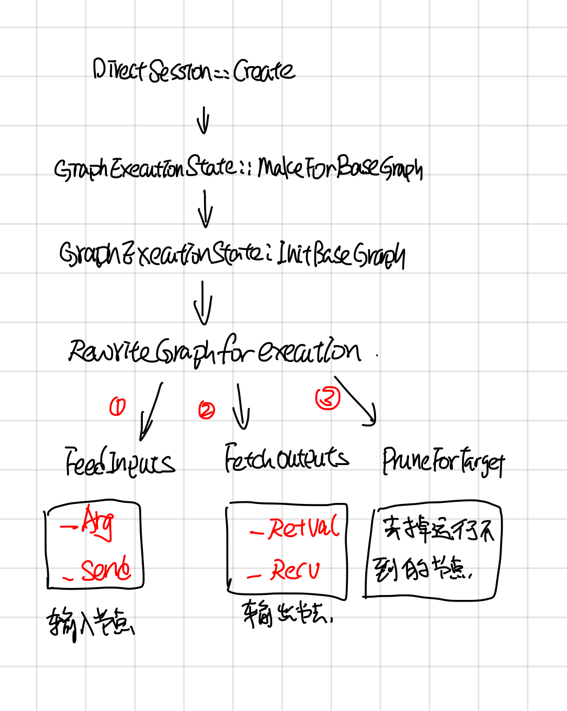
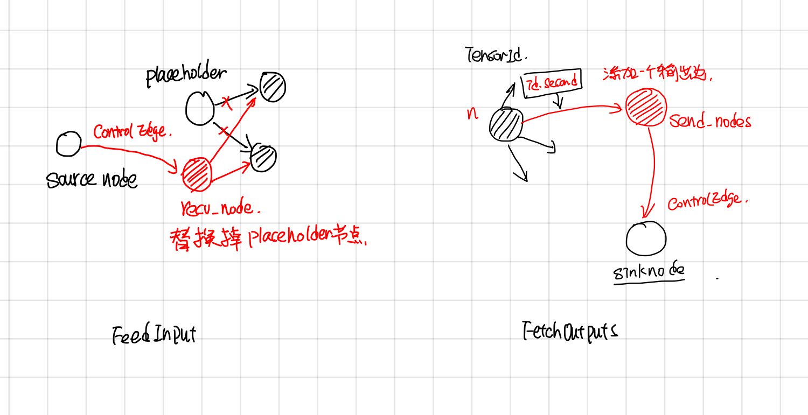

Tensorflow Direct Session
-------------------------

## 摘要

本文主要分析了tensorflow 中DirectSession部分的代码。如果把executor 执行graph当成一个函数的话，那么Tensorflow中Session主要功能是把用户传过来的一些参数(Feeds)传到到compute graph中，然后指定运行到graph的target节点，最后再graph compute完成之后，取出用户指定名字的一些tensor。

DirectSession 则主要工作以下几方面：

1. 解决feed tensor和fetch tensor问题, 如果把graph compute当成一个函数的话，那么feed tensor相当于参数，而fetch tensor则相当于返回值了。
2. Graph 剪枝
4. Graph partition
5. graph按device划分之后，graph之间的通信问题。（IntraProcessRandezvous)
6. graph多次run的step id和信息

### graph的转变过程

Graphdef --> GraphExecutionState

1. node device placement
2. add feed and fetch nodes

### RewriteGraph

### Graph device placement

### graph partition

Graph partition根据上面Placemnet的结果，将graph partition成不同的子图，子图之间添加send 和recv节点，send和recv节点会用rendzvous来传送tensor

### IntraProcessRandezvous

### Run
