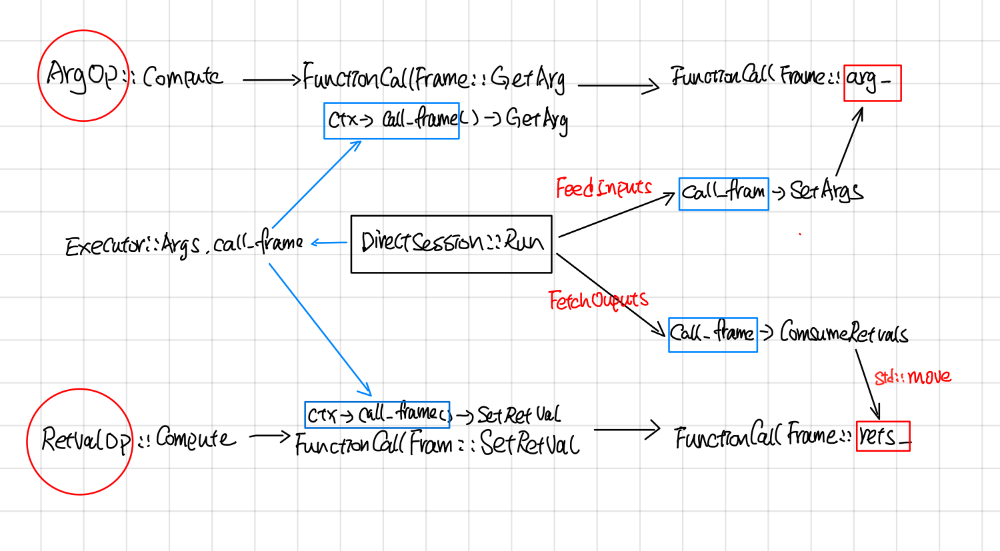

Tensorflow Direct Session (Draft)
--------------------------------

## 摘要

本文主要分析了tensorflow 中DirectSession部分的代码。如果把executor 执行graph当成一个函数的话，那么Tensorflow中Session主要功能是把用户传过来的一些参数Feeds到compute graph中，然后运行到graph的target节点，最后在graph compute完成之后，取出用户指定名字的一些tensor。

DirectSession 则主要工作以下几方面：

1. Rewrite Graph： 将FeedInputs和FetchOutputs节点加到graph中，然后去掉graph中运行不到的节点，最后采用并查集的方式，给graph中每个node分配一个device。
2. Graph partition：根据每个node所device，将node划分成不同的subgraph, subgraph之间添加send和recv节点做不同device之间的通信。
3. CeateExecutors：每个device的subgraph会创建一个Executor来执行graph computation。
4. Fetch outputs：对于DirectSession来说，FeedInputs和FetchOutputs 所添加的节点是``_Arg``和``_RetVal``，这两个节点会通过directSession的callframe来读写input，output。


### RewriteGraph

RewriteGraph这块的callstack如下图所示，主要主要涉及到 GraphExecutionState, SubGraph, Placer这三块。

GraphExecutionState据文档所说(graph_execution_state.h)，其主要作用是按照BuildGraphOptions选项将Graph转换成可执行的Client Graph。

> GraphExecutionState is responsible for generating an
> executable ClientGraph from the original GraphDef that specifies
> the complete graph and from BuildGraphOptions which specifies
> input/output nodes.

ClientGraph与GraphDef的区别是： ClientGraph中每个node都被Assign了某个Device，这部分由Placer完成；另外添加了input/output nodes, 去掉了执行不到的node, 这部分由subgraph完成。

> An executable Graph differs from a GraphDef by being Placed,
> meaning that each Node is assigned to a single Device in the
> available set.


### Call frame: feed and fetch
DirectSession中采用了call frame的方式读写compution graph中的inputs/outputs 



DirectSession::Run的时候，首先会创建一个FunctionCallFrame, 把要feed的tensor填充到``FunctionCallFrame::args_``。

```cpp
// In DirectSession::Run

  FunctionCallFrame call_frame(executors_and_keys->input_types,
                               executors_and_keys->output_types);
  gtl::InlinedVector<Tensor, 4> feed_args(inputs.size());
  for (const auto& it : inputs) {
    if (it.second.dtype() == DT_RESOURCE) {
      Tensor tensor_from_handle;
      TF_RETURN_IF_ERROR(
          ResourceHandleToInputTensor(it.second, &tensor_from_handle));
      feed_args[executors_and_keys->input_name_to_index[it.first]] =
          tensor_from_handle;
    } else {
      feed_args[executors_and_keys->input_name_to_index[it.first]] = it.second;
    }
  }
  const Status s = call_frame.SetArgs(feed_args);
```


在创建Executor的时候，通过Executor::Args.call_frame把call_frame放到OpkernalContext中。

```cpp
//## DirectSessioin::Runinternal

  Executor::Args args;
  args.step_id = step_id;
  args.call_frame = call_frame;

  //other code...
  //每个device subgraph对应一个item, item.executor为这个subgraph的exeuctor.
  item.executor->RunAsync(args, barrier->Get());


//## ExecutorState::Process
  OpKernelContext::Params params;
  params.step_id = step_id_;
  params.call_frame = call_frame_;

  //other code ...
  // Synchronous computes.
  OpKernelContext ctx(&params, item.num_outputs);
  nodestats::SetOpStart(stats);
  device->Compute(CHECK_NOTNULL(op_kernel), &ctx);

```


当所有的subgraph Executor执行完毕后，通过FunctionCallFrame::ConsumeRetVals的方式把输出的tensor取出来。

```cpp
// DirectSession::Run

  if (outputs) {
    std::vector<Tensor> sorted_outputs;
    const Status s = call_frame.ConsumeRetvals(&sorted_outputs);
    if (errors::IsInternal(s)) {
 //other code
```

### Device placer

### graph partition

Graph partition根据上面Placemnet的结果，将graph partition成不同的子图，子图之间添加send 和recv节点，send和recv节点会用rendzvous来传送tensor


### IntraProcessRandezvous

### Run
