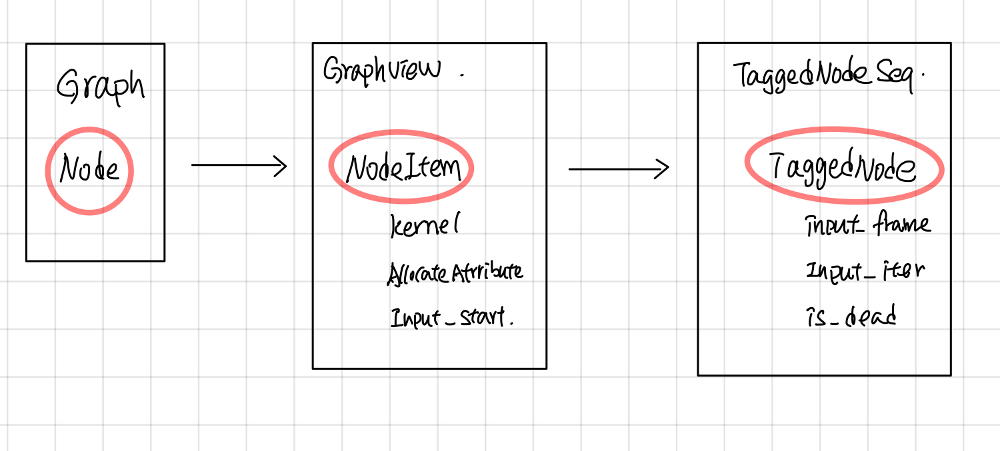

## Sub Graph 预处理: Node => NodeItem => TaggedNode (Draft)

### 引言

下图是一个graph中每个node被处理的过程，首先在ExecutorImpl::Initialize的时候，将node 处理成NodeItem,创建node对应的kernal, 然后在node ready可执行的时候，会创建一个TaggedNode放入Ready队列中，最后交给ExecutorState::Process去执行这个Node。



### NodeItem

NodeItem的主要作用是将Graph中每个node的op，转换成可以在device上执行的kernal, 另一方面，记录该node输入tensor的位置，并且使用PendingCount来记录Node的执行状态。 Gview可以看成是NodeItem的容器，根据node的id就可以找到相应的NodeItem, 对于graph中的每个node, 在ExecutorImpl::Initialize中都会创建一个NodeItem，放到Gview中。

#### NodeItem 主要包含的字段

1. <b>kernel</b>:  由params.create_kernel创建，kernel是在device上执行的主要对象，kerenl 并将在ExecutorImpl的析构函数被params.delete_kernel删除。

```cpp
  // The kernel for this node.
  OpKernel* kernel = nullptr;
```

2. <b>input_start</b>：纪录了在当前IteratorState的input_tensors中开始的index。这个node的输入为：input_tensors[input_start: input_start + num_inputs]这部分对应的Tensors。

```cpp
  // Cached values of node->num_inputs() and node->num_outputs(), to
  // avoid levels of indirection.
  int num_inputs;
  int num_outputs;

  // ExecutorImpl::tensors_[input_start] is the 1st positional input
  // for this node.
  int input_start = 0;

  // Number of output edges.
  size_t num_output_edges;

```

3. <b>pending_id</b>: 根据这个id在当前的IteratorState中找到对应的PendingCount，从而找到这个nodeItem的执行状态。

```cpp
  PendingCounts::Handle pending_id;
```

4. <b>expensive/async kernel</b>: 标志表明kernel是否是Async的和expensive的。

```
  bool kernel_is_expensive : 1;  // True iff kernel->IsExpensive()
  bool kernel_is_async : 1;      // True iff kernel->AsAsync() != nullptr
```

5. <b>control node</b> ，标志该node是否是Control flow node, 以及类型

```cpp

  bool is_merge : 1;             // True iff IsMerge(node)
  bool is_enter : 1;             // True iff IsEnter(node)
  bool is_exit : 1;              // True iff IsExit(node)
  bool is_control_trigger : 1;   // True iff IsControlTrigger(node)
  bool is_sink : 1;              // True iff IsSink(node)
  // True iff IsEnter(node) || IsExit(node) || IsNextIteration(node)
  bool is_enter_exit_or_next_iter : 1;
```

6. <b>allocate attribute</b>: 影响device所返回的allocator,从而影响kernal执行时候，申请内存时候的处理行为。

```cpp
  // Return array of per-output allocator attributes.
  const AllocatorAttributes* output_attrs() const { return output_attr_base(); }
```

InferAllocAttr主要根据device, send, recv等节点, 来设置是否是gpu_compatible的，

```cpp
      attr->set_nic_compatible(true);
      attr->set_gpu_compatible(true);
```

其中AllocatorAttributes主要影响GpuDevice所返回的allocator上。

```cpp
//common_runtime/gpu/gpu_device_factory.cc

  Allocator* GetAllocator(AllocatorAttributes attr) override {
    if (attr.on_host()) {
      if (attr.gpu_compatible() || force_gpu_compatible_) {
        ProcessState* ps = ProcessState::singleton();
        return ps->GetCUDAHostAllocator(0);
      } else {
        return cpu_allocator_;
      }
    } else {
      return gpu_allocator_;
    }
}
```


### TaggedNodeSeq
