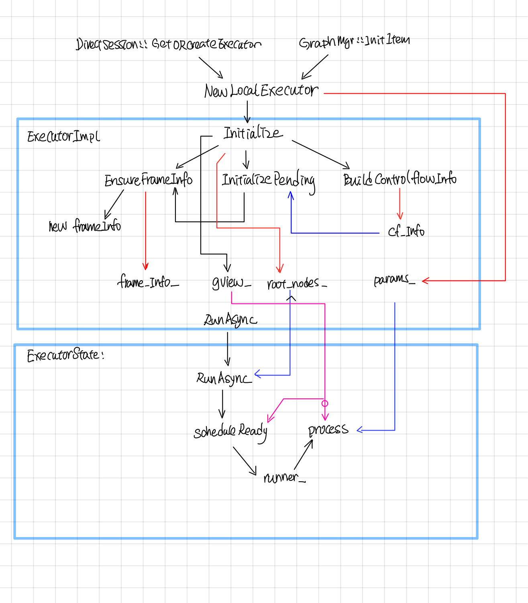

Tensorflow Graph Executor(草稿)
-------------------------
## 摘要

Tensorflow中无论单机版的(direct session)还是分布式版(GRPC, MPI, RMDA等）都先会对graph先划分成子图subgraph, 然后每个subgraph会交给一个execturo去执行，Tensorflow中的graph执行示意图如下(图片来自[tensorflow-talk-debugging](https://wookayin.github.io/tensorflow-talk-debugging/#1))。


本文主要分析了executor在执行graph时，Node的执行调度以及node的输入输出数据, 执行状态是如何保存的，最后结合代码和[Tensorflow control flow implemention](http://download.tensorflow.org/paper/white_paper_tf_control_flow_implementation_2017_11_1.pdf)这部分文档分析了的control flow的具体实现。主要涉及的代码有(common_runtime/executor.cc)

### Executor中主要类

#### Executor 
Executor为基类，对外提供了两个接口Run和RunAsync, 其中Run是对RunAsync简单的一层包装。

```cpp

  // Synchronous wrapper for RunAsync().
  Status Run(const Args& args) {
    Status ret;
    Notification n;
    RunAsync(args, [&ret, &n](const Status& s) {
      ret = s;
      n.Notify();
    });
    n.WaitForNotification();
    return ret;
  }
```

Executor基类只要去实现RunAsync就行。
```cpp
  virtual void RunAsync(const Args& args, DoneCallback done) = 0;
```

#### ExecutorImpl

ExecutorImpl继承实现了Executor，它的RunAsync实现转发给了ExecutorState::RunAsync, ExecutorImpl主要的工作是从Graph中解析出一些静态信息，比如FrameInfo, GraphView, 由后面的ExecutorState执行的时候使用。

~~~cpp
void ExecutorImpl::RunAsync(const Args& args, DoneCallback done) {
  (new ExecutorState(args, this))->RunAsync(std::move(done));
}
~~~
#### FrameInfo

struct FrameInfo由EnsureFrameInfo这个函数lazy创建，并在Intialize填充好它的字段。
~~~cpp
  FrameInfo* EnsureFrameInfo(const string& fname) {
    auto slot = &frame_info_[fname];
    if (*slot == nullptr) {
      *slot = new FrameInfo;
    }
    return *slot;
  }
~~~

FrameInfo包含的字段如下:

~~~cpp
    // The total number of inputs to a frame.
    int input_count;

    // The total number of input tensors of a frame.
    // == sum(nodes[*].num_inputs()) where nodes are the nodes in the frame.
    int total_inputs;

    // Used to determine the next place to allocate space in the
    // pending_counts data structure we'll eventually construct
    PendingCounts::Layout pending_counts_layout;

    // Each frame has its own PendingCounts only for the nodes in the frame.
    PendingCounts* pending_counts;  // Owned

    // The nodes in a frame. Used only for debugging.
    std::vector<const Node*>* nodes;  // Owned
~~~

1. pending_counts_layout在后面会用来创建Node的PendingCount, pending count会用来跟踪Node的状态（比如是否所有的input都已ready, Node是否已经执行过了，Node是否在Dead path)，

2. total_inputs会在ExecutorState::IteratorState中用到，用于创建InputTensors数组。

#### Gview和NodeItem

Gview可以看成是NodeItem的容器，根据node的id就可以找到相应的NodeItem, 对于graph中的每个node, 在ExecutorImpl::Initialize中都会创建一个NodeItem，放到Gview中。

NodeItem包含的主要字段如下：
```cpp
  // A graph node.
  const Node* node = nullptr;

  // The kernel for this node.
  OpKernel* kernel = nullptr;

  // Cached values of node->num_inputs() and node->num_outputs(), to
  // avoid levels of indirection.
  int num_inputs;
  int num_outputs;

  // ExecutorImpl::tensors_[input_start] is the 1st positional input
  // for this node.
  int input_start = 0;

  // Number of output edges.
  size_t num_output_edges;

  PendingCounts::Handle pending_id;
```

1. kernel:  由params.create_kernel创建，kernel是在device上执行的主要对象，并将在ExecutorImpl的析构函数中调用params.delte_kernel删除该对象。

2. input_start：纪录了在当前IteratorState的input_tensors中开始的index。这个node的输入为：input_tensors[input_start: input_start + num_inputs]这部分对应的Tensors。

3. pending_id: 根据这个id在当前的IteratorState中找到对应的PendingCount，从而找到这个nodeItem的执行状态。

NodeItem中包含了一些标志位，一些标志该node是否是Control flow node, 一些标志表明kernel是否是Async的和expensive的。

~~~cpp
  bool kernel_is_expensive : 1;  // True iff kernel->IsExpensive()
  bool kernel_is_async : 1;      // True iff kernel->AsAsync() != nullptr

  bool is_merge : 1;             // True iff IsMerge(node)
  bool is_enter : 1;             // True iff IsEnter(node)
  bool is_exit : 1;              // True iff IsExit(node)
  bool is_control_trigger : 1;   // True iff IsControlTrigger(node)
  bool is_sink : 1;              // True iff IsSink(node)
  // True iff IsEnter(node) || IsExit(node) || IsNextIteration(node)
  bool is_enter_exit_or_next_iter : 1;
~~~

另外NodeItem 所包含的AllocatorAttirbute也会影响device所返回的allocator。

```cpp
  // Return array of per-output allocator attributes.
  const AllocatorAttributes* output_attrs() const { return output_attr_base(); }
```

InferAllocAttr主要根据device, send, recv等节点, 来设置是否是gpu_compatible的，

```cpp
      attr->set_nic_compatible(true);
      attr->set_gpu_compatible(true);
```

其中AllocatorAttributes主要影响GpuDevice所返回的allocator上。

```cpp
//common_runtime/gpu/gpu_device_factory.cc

  Allocator* GetAllocator(AllocatorAttributes attr) override {
    if (attr.on_host()) {
      if (attr.gpu_compatible() || force_gpu_compatible_) {
        ProcessState* ps = ProcessState::singleton();
        return ps->GetCUDAHostAllocator(0);
      } else {
        return cpu_allocator_;
      }
    } else {
      return gpu_allocator_;
    }
}
```

#### ExecutorState


##### ExecutorState::FrameState

###### FrameState和IterationState创建地方:

1. 在ExecutorState的构造函数中会创建一个FrameState作为rootframe, 同时也会创建该frameState的第一个IterationState。

2. 在执行完一个Node之后，PropagateOutputs在遇到Enter节点的时候，会调用FindOrCreateChildFrame来创建一个新的FrameState,以及该FrameState的第一个IterationState

3. 在PropgateOutputs的时候，遇到NextIteration Node 会去调用FrameState::IncreatementIteration新增一个IterationState

4.所有的framesate都放在了outstanding_frames 这个map中，新建的framestate会插到这个map中，删除的时候会从这个map中去掉。


###### FrameState删除的地方

1.在PropgateOutputs中，如果is_frame_done，就会调用DeleteFrame, DeleteFrame会向parent frame传播dead_exits（TODO: 这部分描述细化）

IterationState删除的地方

1. CleanupFrameIterations
2. frame->CleanupIterations

##### ExecutorState::TaggedNode

TaggedNode, 把is_dead, input_frame, input_iter这个包了起来。

```cpp
    const Node* node = nullptr;
    FrameState* input_frame = nullptr;
    int64 input_iter = -1;
    bool is_dead = false;
```

##### IterationState

```cpp
    Entry* input_tensors;
    // The number of outstanding ops for each iteration.
    size_t outstanding_ops;
    int outstanding_frame_count;
    PendingCounts counts_;
```

### Node的转变过程


下图是一个graph中每个node被处理的过程，首先在ExecutorImpl::Initialize的时候，将node 处理成NodeItem,创建node对应的kernal, 然后在node ready可执行的时候，会创建一个TaggedNode放入Ready队列中，最后交给ExecutorState::Process去执行这个Node。


### Executor中的调用关系

### ExecutorImpl call flow

Executor被调用的入口为NewLocalExecutor, 在DirectSesion中会为每个subgraph创建一个executor, 然后交给ExecutorBarrier同时执行多个Executor。NewLocalExecutor在ExecutorImpl成员函数中的调用过程如下：



Exector::RunAsync这个会被转发给ExecutorState::RunAsync（这个函数的执行逻辑见下文）

### ExecutorImpl::Initialize

在ExecutorImpl::Initialize中，对于graph中的每个node, 创建对应的NodeItem, 主要包含了三块：

1. 调用params.create_kernal, 创建nodeItem->kernal.
2. 记录nodeItem.input_start, input_start 是该node在它所属frame的input_tensors中的偏移index, 这个在后面的ProcessInputs和ProcessOutputs中会用到。
3. 创建node对应的pending_id， pending_id用于找到记录它执行状态的pendingCount, 这个在后面的ActiveNode中会用到.

在BuildCtronlFlow中会建立好framename之间的父子关系, frameInfo是frame的静态信息（对应着执行时候的FrameState动态信息），并且建立了从node id找到node所属frame name的映射关系，包含了frame中的total inputs, 这个frame所包含的node.


## ExecutorState::RunAsync


### ExecutorImpl::Process


## Control Flow


后来在[1]中发现节点还有Switch, Merge, IterNext, Enter, Exit 五个flow control node，用来实现while循环，为此tensorflowe引入了frame的概念，可以粗略的认为和函数调用一样吧, 在遇到Enter node的时候，就新建一个child frame，把inputs(类似于函数函数调用时候参数入栈)一样，forward到child frame中，在遇到Exit node，就把输出放到parent frame 中(类似于将函数的return值入栈)。

未完待续

## Executor中数据流程

## 参考

1. [Tensorflow control flow implemention]
2. [tensorflow-talk-debugging](https://wookayin.github.io/tensorflow-talk-debugging/#1)
