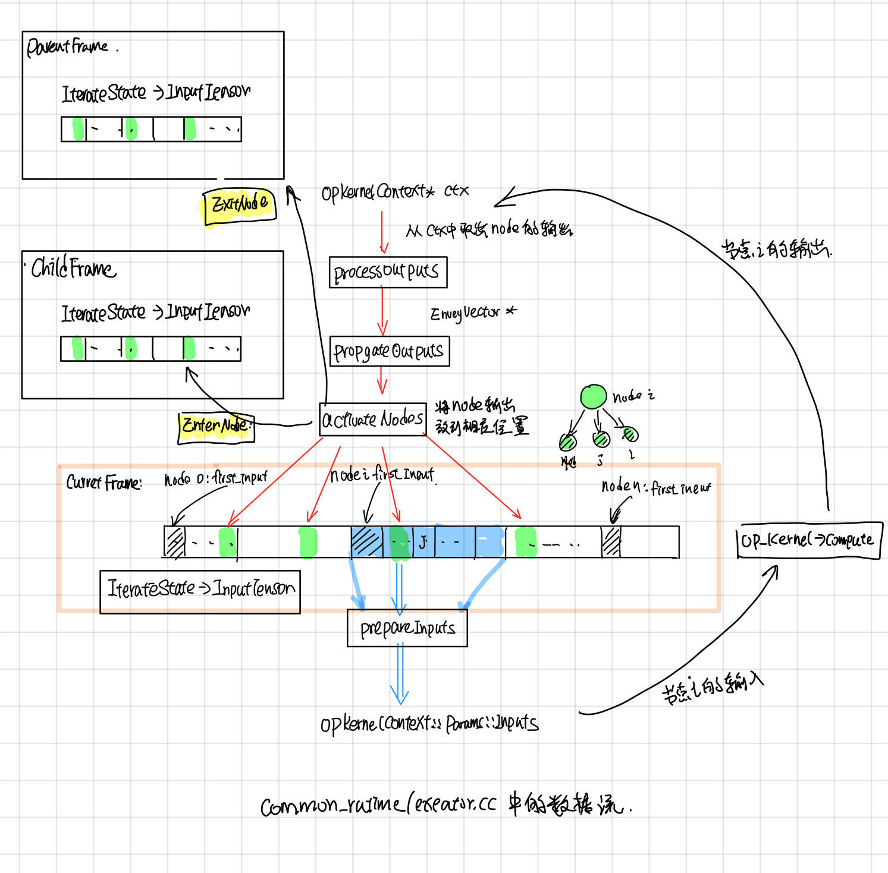

Tensorflow Graph Executor(草稿)
-------------------------
## 摘要

Tensorflow中无论单机版的(direct session)还是分布式版(GRPC, MPI, RMDA等）都先会对graph先划分成子图subgraph, 然后每个subgraph会交给一个execturo去执行，Tensorflow中的graph执行示意图如下(图片来自[tensorflow-talk-debugging](https://wookayin.github.io/tensorflow-talk-debugging/#1))。

本文主要分析了executor在执行graph时，Node的执行调度以及node的输入输出数据, 执行状态是如何保存的，最后结合代码和[Tensorflow control flow implemention](http://download.tensorflow.org/paper/white_paper_tf_control_flow_implementation_2017_11_1.pdf)这部分文档分析了的control flow的具体实现。主要涉及的代码有(common_runtime/executor.cc)

### ExecutorImpl call flow

Executor被调用的入口为NewLocalExecutor, 其后的调用的过程如下：

Exector::RunAsync这个会被转发给ExecutorState::RunAsync（这个函数的执行逻辑见下文）

### ExecutorImpl::Initialize

在ExecutorImpl::Initialize中，对于graph中的每个node, 创建对应的NodeItem, 主要包含了三块：

1. 调用params.create_kernal, 创建nodeItem->kernal.
2. 记录nodeItem.input_start, input_start 是该node在它所属frame的input_tensors中的偏移index, 这个在后面的ProcessInputs和ProcessOutputs中会用到。
3. 创建node对应的pending_id， pending_id用于找到记录它执行状态的pendingCount, 这个在后面的ActiveNode中会用到.

在BuildCtronlFlow中会建立好framename之间的父子关系, frameInfo是frame的静态信息（对应着执行时候的FrameState动态信息），并且建立了从node id找到node所属frame name的映射关系，包含了frame中的total inputs, 这个frame所包含的node.

## ExecutorState::RunAsync

### ExecutorImpl::Process

## Control Flow

后来在[1]中发现节点还有Switch, Merge, IterNext, Enter, Exit 五个flow control node，用来实现while循环，为此tensorflowe引入了frame的概念，可以粗略的认为和函数调用一样吧, 在遇到Enter node的时候，就新建一个child frame，把inputs(类似于函数函数调用时候参数入栈)一样，forward到child frame中，在遇到Exit node，就把输出放到parent frame 中(类似于将函数的return值入栈)。

未完待续

## Executor中数据流程

## 参考

1. [Tensorflow control flow implemention]
2. [tensorflow-talk-debugging](https://wookayin.github.io/tensorflow-talk-debugging/#1)
