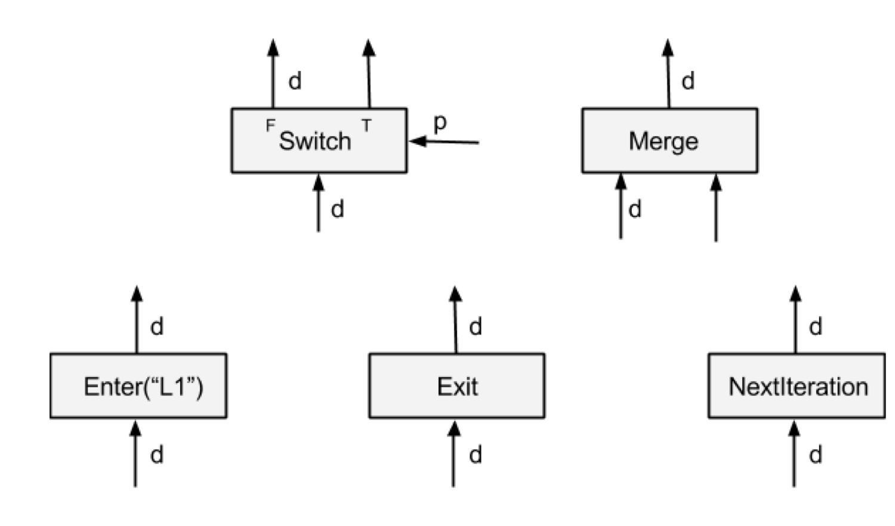
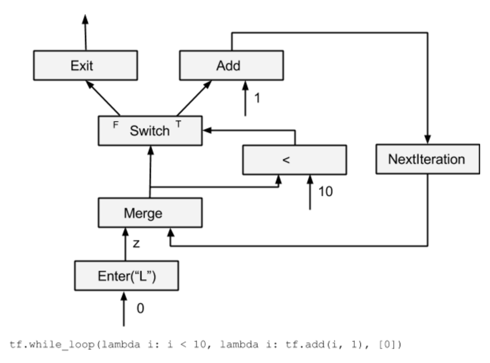

## Flow Control op

在Tensorflow中，graph中每个node的op，都在一个execution Frame中执行，Enter/Exit分别负责execution Frame的创建和删除，如果把execution frame和函数调用做类比的话，那么Enter有点类似于传参，而Exit则类似于return 返回值。
而switch/merge/nextIteration 则用于实现类似于while/if之类的分支跳转和循环。本节主要参照 [1](http://download.tensorflow.org/paper/white_paper_tf_control_flow_implementation_2017_11_1.pdf) 这篇文章。

### flow control op




Tensorflow中control flow op对应具体定义如下

#### switch

> A Switch operator forwards the input tensor d to one of its outputs depending on the boolean tensor of the control input p. A Switch is enabled for execution when both its inputs are available.

Switch 根据predict将输入tensor导出到相应的true/false输出。没获得输出的分支会被标记为dead状态(有点类似于if/else中没被执行到的代码), 这个dead状态会往下传播。


#### Merge
> A Merge operator forwards one of its available inputs to its output. A Merge is enabled for execution when any of its inputs is available. It is unspecified which available input it outputs if there are multiple inputs available.

Merge 将输入tensor中的一个导出到输出（先到先得）,一般配合switch用


#### Enter
> An Enter operator forwards its input to the execution frame that is uniquely identified by the given name. This Enter op is used to pass a tensor in one execution frame to a child execution frame. There can be multiple Enter ops to the same child execution frame, each making a tensor available (asynchronously) in that child execution frame. An Enter is enabled for execution when its input is available. A new execution frame is instantiated in the TensorFlow runtime when the first Enter op to that frame is executed 

Enter node将输入tensor导入到一个frame中。frame name是唯一的，可以根据frame name来找到对应的frame， 在执行的时候，如果frame不存在的话，Enter会创建相应的子frame, Enter node所在的frame是该frame的parent frame.


#### Exit

> An Exit operator forwards a value from an execution frame to its parent execution frame.  This Exit op is used to return a tensor computed in a child execution frame back to its parent frame. There can be multiple Exit ops to the parent frame, each asynchronously passing a tensor back to the parent frame. An Exit is enabled when its input is available.


Exit node 从Frame中导出一个tensor到parent frame中。

#### NextIteration

> A NextIteration operator forwards its input to the next iteration in the current execution frame. The TensorFlow runtime keeps track of iterations in an execution frame. Any op executed in an execution frame has a unique iteration id, which allows us to uniquely identify different invocations of the same op in an iterative computation. Note that there can be multiple NextIteration ops in an execution frame. The TensorFlow runtime starts iteration N+1 when the first NextIteration op is executed at iteration N. As more tensors enter an iteration by executing NextIteration ops, more ops in that iteration will be ready for execution. A NextIteration is enabled when its input is available.  

NextIteration将输入导出到下个iteration, NextIteration导出的应该是循环变量，比如下面代码中的j和sum

```cpp
for(int j=0, sum=0; j < 100;){
    int tmp = i + 1;
    j * = 2
    sum += j;
}
```

### While loop

可以通过上述的五个flow control node来实现tensorflow中的while loop

```python
tf.while_loop(lambda i: i < 10, lambda i: tf.add(i, 1), [0])
```



可以看到NextIteration导入导出的是循环变量i，merge node可以用来初始化变量, 类似于 ``i= i || 0``的效果, switch控制是否结束循环，Exit跳出循环。


在文献[1](http://download.tensorflow.org/paper/white_paper_tf_control_flow_implementation_2017_11_1.pdf)中还讲述了dead传播，分布式的whileloop，以及while loop对应的gradient op.讲的比较深，后面再补上吧。

### 参考文献：

1. [Tensorflow control flow implemention](http://download.tensorflow.org/paper/white_paper_tf_control_flow_implementation_2017_11_1.pdf)
