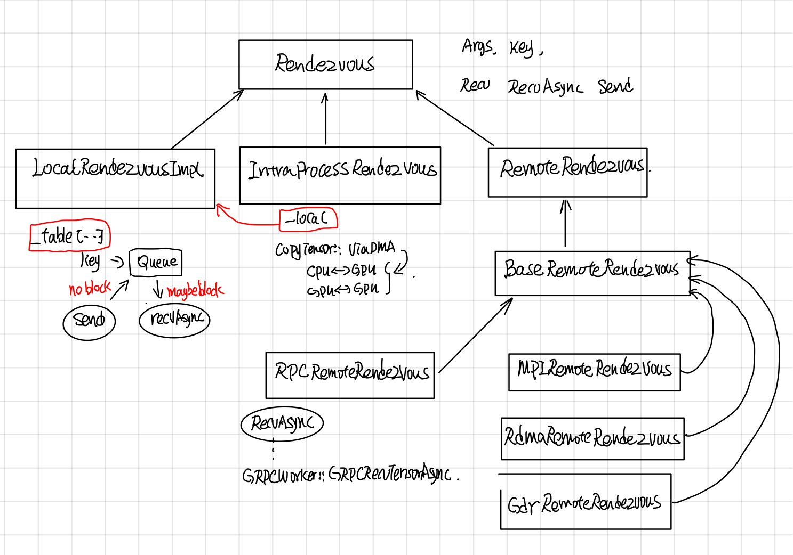
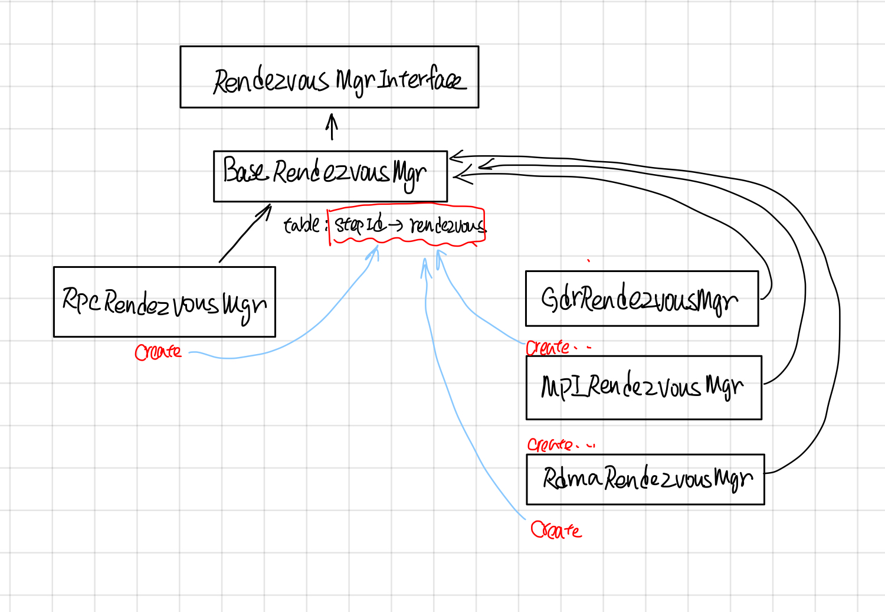

Tensorflow Rendezvous
---------------------

### 摘要

Rendezvous负责在Send和Recv node之间传递tensor, tensor的传递可能会跨设备(cross device), 也可能跨主机(GRPC，MPI，Rdam）等。如何提供统一简洁的接口，并同时实现不同场景下tensor高效传递是关键，Rendezvous功能上主要涉及以下两点：

1. Send操作不会被block，而Recv操作可能会block，一直等到有tensor，才会返回或者调用异步的callback。
2. 由于send 和recv node可能在同一个worker的不同device上，也有可能在不同worker的不同device上，所以Rendezvous又分为LocalRendezvous, IntraProcessRendezvous, RemoteRendezvous 以对应不同的场景。

### Rendezvous

#### 继承关系
Rendezvous中各个层级实现功能如下：
*  LocalRendezvor实现了核心Send和Recv操作，每个key对应了一个queue, send根据key放到相应的队列里，recv根据key去对应的队列取。
* IntraProcessRendezvou使用CopyTensor::ViaDMA处理了不同device间的copy问题，其send, recv还是会交由LocalRendezvous去做。 
* RpcProcessRendezvous实现了将woker的本地tensor(tensor如果在GPU上的话，需要先从GPu上copy到内存中）通过grpc buffer传递给调用者。



#### LocalRendezvous: Send and Recv

LocalRendezvous 实现了send和recv最基本的操作，按照send请求和recv请求顺序做了不同的处理：

1. 如果recv先到，就新创建一个item，把recv请求放到queue里面，等待send tensor抵达的时候，调用item.waiter回调函数通知recv， tensor已经到了。

2. 如果send先到，就新创建一个item, 把item放到queue里面，等recv请求到达的时候，从队列中取出最开头的一个，调用recv.waiter回调函数，通知tensor已经到了。这里send请求就是简单的把tensor放入key对应的队列中，并不会block住。


#### IntraProcessRendezvous

IntraProcessRendezvous 用于处理进程内的通信, 他的send和recv是委托给LocalRendezvous, 在Local的RecvAsync的回调函数中，它会调用SameWokerRecvDone, 使用CopyTensor::ViaDMA处理跨device通信问题。

```cpp
void IntraProcessRendezvous::SameWorkerRecvDone(...)
  //other code ...
  //case 1：都在内存中，直接用使用tensor的operator=
  if (src_host && dst_host) {
    *out = in;
    done(Status::OK());
    return;
  }
  //other code ...
  //case 2: 使用ViaDMA处理不同device之间的tensor通信
  CopyTensor::ViaDMA(parsed.edge_name, send_args.device_context,
```


#### CopyTensor::ViaDMA

CopyTensor::ViaDMA处理了device之间的copy tensor。 Tensor的copy有3个方向：

1. HOST_TO_DEVICE
2. DEVICE_TO_HOST
3. DEVICE_TO_DEVICE

 从下图可以看出这些操作最终调用的还是stream_executor的ThenMemcpy所封装的函数。 


VarientDeviceCopy这个处理数据是DT_VARIENT结构的Tensor的，最后调用的是TensorListeDeviceCopy函数，这个函数所对应的deviceCopyFn就是stream_executor所封装的Memcpy, 这里的VarientDeviceCopy和copyfn都采用了static registor的模式（这种模式在tensorflow中用的非常多）。

```cpp
static Status TensorListDeviceCopy(
    const TensorList& from, TensorList* to,
    const UnaryVariantOpRegistry::AsyncTensorDeviceCopyFn& copy) {
  to->element_shape = from.element_shape;
  to->element_dtype = from.element_dtype;
  to->tensors.reserve(from.tensors.size());
  for (const Tensor& t : from.tensors) {
    Tensor tmp(t.dtype());
    TF_RETURN_IF_ERROR(copy(t, &tmp));
    to->tensors.push_back(tmp);
  }
  return Status::OK();
}
```

#### BaseRemoteRendezvous

BaseRemoteRendezvous 的RecvAsync中会检查是否是同一个recv 和sender是否在同一个worker上。


```cpp
// 检查是否是同一个worker
bool BaseRemoteRendezvous::IsSameWorker(DeviceNameUtils::ParsedName src,
                                        DeviceNameUtils::ParsedName dst) {
  return DeviceNameUtils::IsSameAddressSpace(src, dst);
}
```

如果是同一个worker的话就采用类似IntraProcessRendezvous方式来处理，否则需要通过远程调RecvFromRemoteAsync。

```cpp
void BaseRemoteRendezvous::RecvAsync(const ParsedKey& parsed,
  //other code ..
  //case1: 是同一个worker, 说明在本地上
  if (IsSameWorker(parsed.src, parsed.dst)) {
    local_->RecvAsync(
        parsed, recv_args,
        [this, parsed, done](
        //other code ... 
        //in recv done callback
        SameWorkerRecvDone(parsed, send_args, recv_args, in, out,
  } else {
  //case2: 不是同一个worker需要用RPC 去取。
    RecvFromRemoteAsync(parsed, recv_args, std::move(done));
  }
```

RemoteRendezvous中加了个一个Initialize的接口, 这样绑定了一个WorkerSession, 然后在SameWorkerRecvDone的时候，通过这个workerSession去找到对应的device。
```cpp
Status BaseRemoteRendezvous::Initialize(WorkerSession* session) {
//other codes...
}
```
在SameWorkerRecvDone中通过workerSession找到src_device和dst_device
```cpp
void BaseRemoteRendezvous::SameWorkerRecvDone(
  //other code ...
  Status s = sess->device_mgr->LookupDevice(parsed.src_device, &src_device);
  //other code ...
  s = sess->device_mgr->LookupDevice(parsed.dst_device, &dst_device);
  //other code ..
  //通过ViaDMA实现各个device之间的copy
  CopyTensor::ViaDMA(parsed.edge_name, send_args.device_context,
```

#### RpcRemoteRendezvous

RpcRemoteRendezvous在BaseRemoteRendezvous的基础上，实现了RecvFromeRemoteAsync的功能, 首先找到send所在的src_worker, 
然后通过rpc调用去取的远程src_worker上的tensor。


```cpp
void RpcRemoteRendezvous::RecvFromRemoteAsync(
  //other code..
  RpcRecvTensorCall* call = get_call_freelist()->New();

  //1. 找到远程的src_worker
  WorkerSession* sess = session();
  WorkerInterface* rwi = sess->worker_cache->CreateWorker(call->src_worker_);

  //2. 找到要copy到的device
  s = sess->device_mgr->LookupDevice(parsed.dst_device, &dst_device);

 //other code ..
  //3. Grpc call
  call->Init(rwi, step_id_, parsed.FullKey(), recv_args.alloc_attrs, dst_device,
             recv_args, std::move(done));
  call->Start([this, call]() {
 //other code ..
```

在RpcRecvTensorCall中会call worker的RecvTensorAsync。

```cpp
  void StartRTCall(std::function<void()> recv_done) {
   //other code
    wi_->RecvTensorAsync(&opts_, &req_, &resp_, std::move(cb));
  }
```

中间经过worker service，最终会去call GrpcWorker::GrpcRecvTensorAsync.

```cpp
void GrpcWorker::GrpcRecvTensorAsync(CallOptions* opts,
    // Case 1: 如果目标tensor在GPU上的话，需要先cp到host上
    if (src_dev->tensorflow_gpu_device_info() && (!on_host)) {
        StatusCallback copy_ready = [response, done, copy, is_dead](const Status& s) {  
            //other code ..
            // copy到response buffer中
            grpc::EncodeTensorToByteBuffer(is_dead, *copy, response);
            done(s);
        }
        GPUUtil::CopyGPUTensorToCPU(src_dev, send_dev_context, &val, copy, copy_ready);
        } else {
        //Case 2: 在Host上直接cp到response的buffer中。
            grpc::EncodeTensorToByteBuffer(is_dead, val, response);
            done(Status::OK());
        }
    }
```

### RendezvousMgr

RendezvousMgr的作用是维护一个从step_id到Rendezvous的映射。

> RendezvousMgr keeps track of a set of local rendezvous instances.
> All tensors sent by this worker are buffered in a RendezvousMgr
> until the tensor is received.  Each global unique "step_id"
> corresponds to one local rendezvous instance managed by a
> RendezvousMgr.


RendezvousMgr的继承关系如下


 映射的table在BaseRendezvousMgr中。

```cpp
  //BaseRendezvousMgr的数据成员
  typedef gtl::FlatMap<int64, BaseRemoteRendezvous*> Table;
  mutex mu_;
  Table table_ GUARDED_BY(mu_);
```

它的派生类比如RpcRendezvousMgr通过override它的Create函数来创建自己版本的rendezvous。

```cpp
  //BaseRendezvousMgr 的CreateRendezvous的纯虚函数
 protected:
  virtual BaseRemoteRendezvous* Create(int64 step_id,
                                       const WorkerEnv* worker_env) = 0;
```


